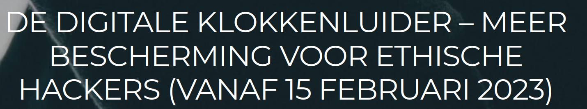
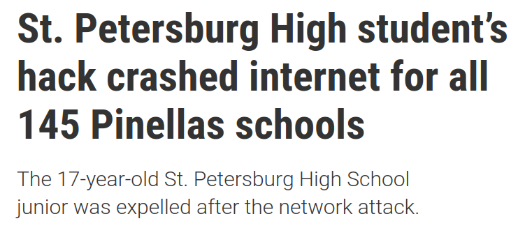
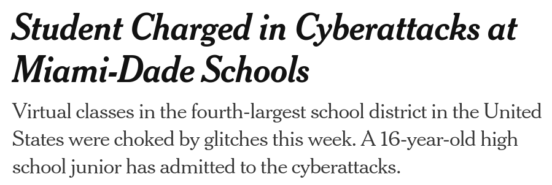
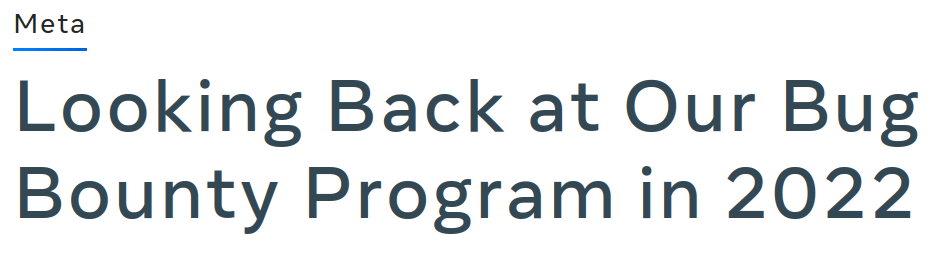
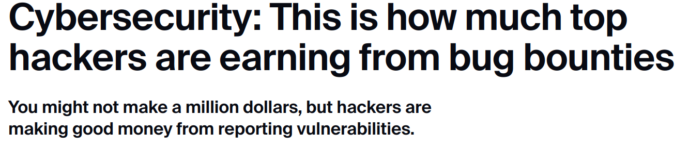
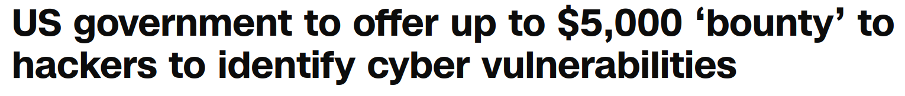
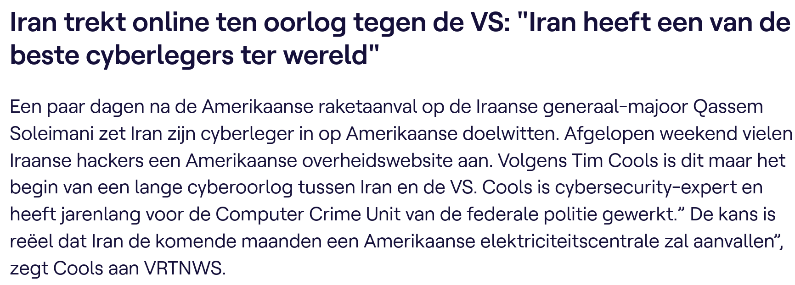
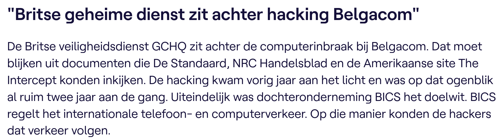

# Cybersecurity

## H2: een wereld van experten en criminelen.

---

# 2.1 Ethiek en cyberwetten

---

## Ethiek en cyberwetten

-   Is het **ethisch** om ...
    -   je wachtwoord van je studentenaccount even door te geven aan iemand anders, zodat deze persoon op eduroam gebruik kan maken van het internet?

---

-   Is het **ethisch** om ...
    -   in te loggen op een website met een account waarvan je toevallig de credentials te pakken hebt gekregen (bijvoorbeeld door het aflezen van een post-it)?
    -   wetende dat de website van je middelbare school een kwetsbaarheid heeft waarmee je data kan opvragen die niet mogelijk zou mogen zijn.
        -   Is het ethisch om het niet te vertellen aan de school?

---

Zijn deze zaken **legaal** of **illegaal**?

---

## Wetgeving in cybersecurity

-   Een van de basisprincipes binnen een samenleving of maatschappij is de **wetgeving**
-   Dit is geen gemakkelijke taak om uit te voeren
    -   Wetgeving loopt vaak achter op technologie
    -   Het "**op tijd**" invoeren van "de juiste" regelgevingen is essentieel
    -   Zie de [zaak Bistel](https://nl.wikipedia.org/wiki/Zaak-Bistel)

Notes:

-   https://nl.wikipedia.org/wiki/Legaliteitsbeginsel
-   https://nl.wikipedia.org/wiki/Zaak-Bistel

---

-   Er zijn **nationale** en **internationale** pogingen om dit te regulariseren
    -   In België: wetgeving rond "ethisch hacken"
    -   In Europa: NIS en NIS2 directives
    -   In VS: NIST framework
    -   Wereldwijd: ISO/IEC cybersecurity model

---

## Wet rond ethisch hacken

    

Notes:

-   https://www.ictrechtswijzer.be/cybersecurity-wat-is-het-wettelijk-kader/
-   https://www.vrt.be/vrtnws/nl/2023/02/14/ethische-hackers-mogen-meer-door-nieuwe-wet/
-   https://www.kpmglaw.be/news/posts/2023/july/versoepeling-voor-ethisch-hacken-en-bescherming-van-white-hat-hackers/
-   https://tweakers.net/nieuws/206706/belgische-ethische-hackers-zijn-niet-meer-strafbaar-als-ze-bugs-vinden-en-melden.html
-   https://www.advocaatdebruyne.be/de-digitale-klokkenluider-meer-bescherming-voor-ethische-hackers-vanaf-15-februari-2023/

---

-   Nieuwe wet vanaf 15 feb 2023 
    -   https://www.vrt.be/vrtnws/nl/2023/02/14/ethische-hackers-mogen-meer-door-nieuwe-wet/
-   Opgelet!
    -   Het openbaar ministerie interpreteert de wetgeving nog steeds **restrictief**. Dit wil zeggen dat "hacking" nog steeds **bij wet verboden** is en blijft.

---

-   Dit kader beschrijft ...
    -   **hoe** een natuurlijke of rechtspersoon ...
    -   **zonder frauduleuze bedoelingen** of de intentie om schade te berokkenen, ...
    -   bestaande kwetsbaarheden in netwerken en informatiesystemen in België kan opsporen ...
    -   en **moet melden**.

---

-   Meer informatie:
    -   https://ccb.belgium.be/nl/nieuws/nieuw-wettelijk-kader-voor-de-melding-van-it-kwetsbaarheden
    -   https://ccb.belgium.be/nl/faq-betreffende-het-beleid-voor-de-geco%C3%B6rdineerde-bekendmaking-van-kwetsbaarheden-en-bug-bounty
-   Meldingsformulier:
    -   https://ccb.belgium.be/nl/bekendmaking-van-kwetsbaarheden-aan-het-ccb

---

## Het NIS en NIS2 directive

Notes:

-   https://digital-strategy.ec.europa.eu/en/policies/nis2-directive
-   https://www.europarl.europa.eu/news/en/headlines/security/20221103STO48002/fighting-cybercrime-new-eu-cybersecurity-laws-explained

---

-   NIS 
    -   Eerste **EU-brede wetgeving** rond cybersecurity
    -   Ingevoerd in 2016
    -   Invoering ging (te) moeizaam

---

-   NIS 2 
    -   Meer verduidelijking
    -   Hoe omgaan met snelle technologische vernieuwingen
    -   Meer samenwerking tussen lidstaten bij grote bedreigingen
    -   Verplicht meer organisaties en sectoren om te werken rond cybersecurity
    -   Verplicht lidstaten om meer de wet te handhaven
    -   Ingevoerd op 16 jan 2023, moet in de nationale wetgevingen van EU-lidstaten staan tegen 17 okt 2024

Notes:

-   https://www.europarl.europa.eu/thinktank/en/document/EPRS_BRI(2021)689333
-   https://eur-lex.europa.eu/legal-content/EN/TXT/HTML/?uri=CELEX:32022L2555&from=EN#d1e40-80-1

---

## NIST Framework

-   National Institute of Standards and Technologies (**NIST**) 
-   Een **raamwerk** voor bedrijven en organisaties die cyberbeveiligingsprofessionals nodig hebben.
-   Stelt bedrijven in staat de belangrijkste soorten verantwoordelijkheden, functietitels en benodigde personeelsvaardigheden te identificeren.

---

Notes:

-   https://www.nist.gov/cyberframework

---

## Het ISO/IEC cybersecurity model

-   Het beveiligen van data is een enorme taak. Het is onmogelijk voor een persoon om alles van begin tot einde te weten.
-   Het International Organization for Standardization (ISO)/International Electrotechnical Commission (IEC)  heeft een volledig framework opgesteld om te helpen dit in goede banen te leiden. Dit framework noemt het **ISO/IEC cybersecurity model**.
-   Het ISO model is een **hulpmiddel** om complexe problemen te begrijpen en aan te pakken.

---

-   Het ISO/IEC 27000 is een **standaard** opgesteld in 2005 (en geupdated in 2013). Het is gepubliceerd door ISO.
-   Alhoewel de standaard **niet verplicht** is, wordt het door veel landen en organisaties gebruikt als het model voor cybersecurity.

---

-   Het ISO 27000 model is bruikbaar voor elk type organisatie en bevat controle doelstelling in de vorm van checklists.
-   De organisatie moet zelf bepalen welke controle doelstellingen voor hen van toepassing zijn.

---

---

# 2.2 Aanvallers

---

## Hackers

---

-   Een **hacker** (aanvaller) kan om verschillende redenen inbreken op computers of netwerken om toegang te verkrijgen
-   **White hat** hackers breken in op netwerken of computersystemen om zwakke punten te ontdekken en zo de beveiliging van deze systemen te verbeteren.

---

-   **Gray hat** hackers bevinden zich ergens tussen de 2 andere types aanvallers. Deze aanvallers kunnen een kwetsbaarheid vinden en deze melden aan de eigenaren van het systeem als die actie samenvalt met hun agenda.
-   **Black hat** hackers zijn onethische criminelen die de computer- en netwerkbeveiliging schenden voor persoonlijk gewin of om kwaadaardige redenen, zoals het aanvallen van netwerken.

---

## Scriptkiddies

-   Dit zijn meestal **tieners** of **hobbyisten**, en hun aanvallen zijn meestal beperkt tot grappen en vandalisme. Ze hebben **weinig of geen vaardigheid** en gebruiken vaak bestaande tools of instructies op internet om aanvallen uit te voeren.

---

Notes:

-   https://www.tampabay.com/news/crime/2021/05/28/st-petersburg-high-school-student-crashed-pinellas-schools-systems-internet-with-hack/
-   https://www.nytimes.com/2020/09/03/us/miami-dade-school-cyberattack.html
-   https://www.vice.com/en/article/3k58e5/a-bunch-of-kids-probably-pulled-off-the-biggest-ddos-hack-ever

---

    

Notes:

-   https://www.theregister.com/2001/02/21/virus_toolkits_are_skiddie_menace/
-   https://gizmodo.com/what-is-loic-5709630

---

## Vulnerability brokers

-   Dit zijn **gray hat** aanvallers die exploits proberen te ontdekken en deze aan leveranciers rapporteren, soms voor **geldprijzen** of **beloningen**.

    

Notes:

-   https://www.zdnet.com/article/a-mysterious-grey-hat-is-patching-peoples-outdated-mikrotik-routers/
-   https://about.fb.com/news/2022/12/metas-bug-bounty-program-2022/
-   https://www.zdnet.com/article/this-is-how-much-top-hackers-are-earning-from-bug-bounties/
-   https://edition.cnn.com/2021/12/14/politics/dhs-bug-bounty-hackers-cyber-vulnerabilities/index.html
-   https://www.pcmag.com/news/7-huge-bug-bounty-payouts

---

## hacktivisten

-   Dit zijn **gray hat** aanvallers die zich verzamelen en protesteren tegen verschillende **politieke en sociale ideeën**. Hacktivisten protesteren publiekelijk tegen organisaties of regeringen door artikelen en video's te plaatsen, gevoelige informatie te lekken en DDoS-aanvallen uit te voeren.

Notes:

-   https://www.theguardian.com/technology/2008/feb/04/news
-   https://www.attitude.co.uk/news/world/hackers-spam-isis-accounts-with-gay-porn-and-rainbows-in-response-to-orlando-shooting-289116/

---

## Cybercriminelen

-   **Black hat** hackers die ofwel als zelfstandige werken of voor grote cybercrime-organisaties werken. Elk jaar zijn cybercriminelen verantwoordelijk voor het **stelen van miljarden dollars** van consumenten en bedrijven.

Notes:

-   https://www.bbc.com/news/world-europe-24539417

---

Notes:

-   https://www.visualcapitalist.com/the-biggest-corporate-hacks-of-2021/

---

## State sponsored hackers

-   Afhankelijk van het perspectief van een persoon, zijn dit ofwel white hat ofwel black hat hackers die **overheidsgeheimen** stelen, **inlichtingen verzamelen** en netwerken **saboteren**. Hun doelwitten zijn buitenlandse regeringen, terroristische groeperingen en bedrijven. De meeste **landen** in de wereld nemen tot op zekere hoogte deel aan door de staat gesponsorde hacking.

---

Notes:

-   https://www.vrt.be/vrtnws/nl/2020/01/06/iran-trekt-ook-online-ten-oorlog-tegen-de-vs-iran-heeft-een-van/
-   https://www.vrt.be/vrtnws/nl/2014/12/13/_britse_geheime_dienstzitachterhackingbelgacom-1-2179792/

---

# 2.3 Verdedigers

---

## Cybersecurityspecialisten

-   Het dwarsbomen van de cybercriminelen is een moeilijke taak. Vele bedrijven, de overheden en internationale organisaties zijn daarom begonnen met het nemen van **gecoördineerde acties** om cybercriminelen te beperken of af te weren.

---

-   **Vulnerability Databases**: publiek beschikbare databases van gekende kwetsbaarheden.
-   **Early Warning Systems**: systemen voor vroegtijdige waarschuwing.
-   **Share cyberthreat intelligence**: delen van cyber intelligence, vaak door middel van samenwerking tussen de publieke en private sector.
-   **ISM-normen** (bv. ISO 27000): Standaarden en normen voor informatiebeveiligingsbeheer die een kader vormen voor het implementeren van beveiligingsmaatregelen binnen een organisatie.

Notes:

-   Vulnerability Databases (kwetsbaarheidsdatabases): De Nation Common Vulnerabilities and Exposures (CVE) -database is een voorbeeld van de ontwikkeling van een nationale database in de VS. Het doel van de CVE National Database is om een publiek beschikbare database aan te bieden met alle bekende kwetsbaarheden (zie https://www.cvedetails.com ).
    -   Early Warning Systems: Het Honeynet-project is een voorbeeld van van een system voor vroegtijdige waarschuwing (zie https://www.honeynet.org ). Andere voorbeelden zijn het EWS van het Centre for Cybersecurity Belgium (zie https://ccb.belgium.be/en/vital-sectors ) en het Belnet Threat Intelligence (https://belnet.be/en/belnet-threat-intelligence ).
-   Share Cyber Intelligence: InfraGard is een voorbeeld van het wijdverbreid delen van cyber intelligence. Het InfraGard-programma is een samenwerkingsverband tussen de en de private sector. De deelnemers zijn toegewijd aan het delen van informatie en intelligentie om vijandige cyberaanvallen te voorkomen (zie https://www.infragard.org ). Een ander voorbeeld is de overzichtspagina van Mitre voor alle mogelijke aanvallen (zie https://attack.mitre.org ) om samenwerking makkelijker te maken.
-   ISM Normen: De ISO 27000-normen zijn een voorbeeld van normen voor informatiebeveiligingsbeheer. De standaarden bieden een kader voor het implementeren van cyberbeveiligingsmaatregelen binnen een organisatie (zie https://www.27000.org ).

---

## Organisaties voor samenwerking

-   Cybersecurity-specialisten moeten regelmatig samenwerken met professionele collega's.
-   Internationale technologieorganisaties sponsoren vaak workshops en conferenties.

Notes:

- https://cert.be
- https://www.sans.org/

---

## Conferenties, CTF's, ...

-   Cybersecurity-specialisten moeten dezelfde vaardigheden hebben als hackers, vooral black hat-hackers, om zich te beschermen tegen aanvallen.
-   Hoe kan een individu de vaardigheden opbouwen en oefenen die nodig zijn om een cyberbeveiligingsspecialist te worden?
-   Conferenties en competities zijn een geweldige manier om kennis en vaardigheden op het gebied van cyberbeveiliging op te bouwen.

TODO

Notes:

-   https://www.brucon.org
-   https://cybersecuritychallenge.be/
-   https://www.cyberseceurope.com/
-   https://cybersecurityconvention.be/
-   https://www.enisa.europa.eu/events/ai-cybersecurity-conference
-   https://eucybersecurity.com/
-   https://www.sans.org/mlp/belgium-capture-the-flag/
-   https://www.mil.be/nl/agenda/evenementen/cyber-summerschool/

---

## Organisaties tegen computermisdaad

-   Er bestaan verschillende organisaties om computermisdaad te bestrijden
-   België: Federal Computer Crime Unit (FCCU), Centre for Cyber Security Belgium, ...
-   Wereldwijd: Europol, ENISA, Interpol, ...

TODO

---

# 2.4 Security vs. privacy

---

TODO

Notes:

-   https://tweakers.net/nieuws/98519/apple-wij-kunnen-niet-langer-passcodes-omzeilen.html
-   https://tweakers.net/nieuws/100971/terrorismebestrijder-eu-internetbedrijven-moeten-encryptiesleutels-afgeven.html
-   https://tweakers.net/nieuws/146611/australisch-parlement-stemt-in-met-omstreden-anti-encryptiewet.html
-   https://tweakers.net/nieuws/18451/congres-vs-verplicht-backdoors-in-encryptie-software.html
-   https://tweakers.net/nieuws/98779/vs-vraagt-techbedrijven-om-backdoors-open-te-houden.html
-   https://tweakers.net/nieuws/106121/voorstel-britse-spionagewet-bevat-wel-degelijk-een-verbod-op-encryptie.html
-   https://tweakers.net/nieuws/101670/amerikaanse-regering-is-niet-blij-met-backdoor-plannen-china.html
-   https://tweakers.net/nieuws/126383/australie-aanpakken-encryptiegebruik-criminelen-en-terroristen-is-prioriteit.html
-   https://tweakers.net/nieuws/103156/apple-en-google-verzoeken-obama-backdoors-in-software-niet-te-verplichten.html
-   https://tweakers.net/nieuws/109259/amerikaanse-autoriteiten-worstelen-ook-met-encryptie-in-whatsapp.html
-   https://tweakers.net/nieuws/126105/europarlement-wil-bescherming-tegen-backdoors-in-encryptie.html
-   https://tweakers.net/nieuws/161006/facebook-weigert-backdoor-voor-overheid-vs-in-te-bouwen-in-zijn-apps.html

Security vs. recht op privacy. Er zijn vaak 2 kanten in dit verhaal:

1. Personen die vinden dat iedereen een fundamenteel recht heeft op privacy.
2. Personen die vinden dat security belangrijker is dan privacy.

Vaak wordt hier het klassiek voorbeeld van terrorisme of kinderporno gebruikt: iedereen heeft recht op privacy en daardoor dus ook op encryptie van hun privé-informatie en -gesprekken ("briefgeheim"). Terroristen en kinderporno-verspreiders gebruiken deze technieken om zichzelf te beschermen. Dit maakt het voor de politie stukken moeilijker om zulke personen op te sporen. Daarom proberen veel politici af te dwingen dat encryptiesoftware achterpoortjes (backdoors) moeten inbouwen zodat politiediensten geëncrypteerde berichten toch kunnen lezen. Alleen kunnen die achterpoortjes ook misbruikt worden door politiediensten of cybercriminelen om gewone mensen hun encryptie te omzeilen. Ondertussen is door bijvoorbeeld het PRISM-schandaal gebleken dat overheden niet al te koosjer omgaan met zulke achterpoortjes ten opzichte van gewone gebruikers of zelfs gevoelige gebruikers zoals journalisten en minderheden (bv. in landen waar holebi's worden vervolgd). Daarnaast bestaat er ook al encryptie zonder achterpoortjes die door terroristen en kinderporno-verspreiders al gebruikt wordt. Veel technologiebedrijven staan dan ook niet achter het invoeren van backdoors en vinden dat de politici die dit beslissen te weinig kennis van zaken hebben om de impact ervan in te zien. Wie heeft er volgens jou gelijk? Meer achtergrondinformatie vind je op volgende links:

-   https://tutanota.com/blog/posts/why-a-backdoor-is-a-security-risk/
-   https://www.sophos.com/en-us/lp/nobackdoors.aspx
-   https://www.digitaleurope.org/resources/encryption-finding-the-balance-between-privacy-security-and-lawful-data-access/
-   https://www.weforum.org/agenda/2019/12/encryption-cybersecurity-privacy-explainer/

---

# Een eeuwig strijdtoneel

-   Politie strijdt tegen criminaliteit
    -   Bv. terrorisme, kinderporno, mensensmokkel, fraude, drugshandel, ...
-   Burgers hebben recht op briefgeheim en privacy
    -   Hoe kunnen politiediensten criminelen vatten als er bv. encryptie wordt gebruikt?

---

-   Overheid verzamelt data
    -   Bv. belastingsdienst, boetes, ...
-   Hoe ver mag de overheid hierin gaan?
    -   Wat als de data voor iets anders wordt gebruikt?
    -   Wat als er een fout in de data zit?
    -   Wat als de definitie van "fout" verandert?

TODO

Notes:

-   https://www.vrt.be/vrtnws/nl/2017/02/08/anpr-camera_s_fotograferennietenkelnummerplaat-1-2886393/
-   https://www.rtlnieuws.nl/nieuws/nederland/artikel/5407752/terreurlijst-reizen-spanje-interpol-politie-pijnlijk-grenscontrole
-   https://www.vpro.nl/argos/speel~PREPR_VPRO_16885149~argos~.html
-   https://www.demorgen.be/nieuws/en-toen-werden-camera-s-tegen-terreurdreiging-plots-gebruikt-voor-coronaovertredingen~bebac1aa/
-   https://www.npostart.nl/de-kennis-van-nu/23-12-2020/VPWON_1322820

---

## Ik heb niets te verbergen

<iframe width="1280" height="720" src="https://www.youtube.com/embed/YNPI6B-BUW4?si=R7Vp47xtZD0xwldT" title="YouTube video player" frameborder="0" allow="accelerometer; autoplay; clipboard-write; encrypted-media; gyroscope; picture-in-picture; web-share" referrerpolicy="strict-origin-when-cross-origin" allowfullscreen></iframe>

---

TODO

Notes:

-   https://www.mediawijsheid.nl/video/heb-jij-iets-te-verbergen/

---

-   Waar woon je?
-   Op wie stem je?
-   Hoeveel verdien je?
-   Pikante gesprekken, foto's, video's
-   Sekspartners, seksuele voorkeur, ...
-   "Niet-dagelijkse" hobbies
-   Medische problemen, behandeling, verslavingen, therapie, doktersgeheim, ...
-   Financiele moeilijkheden, schulden, veel geërfd of lotto gewonnen, ...
-   Omstreden meningen
-   ...

Notes:

-   https://www.vrt.be/vrtnws/nl/2019/06/18/u-heeft-nog-altijd-iets-te-verbergen/

---

TODO

Notes:

-   https://gathering.tweakers.net/forum/list_messages/1975036

---

TODO

Notes:

-   https://www.wired.co.uk/article/chinese-government-social-credit-score-privacy-invasion

---

TODO

Notes:

-   https://www.forbes.com/sites/kashmirhill/2012/02/16/how-target-figured-out-a-teen-girl-was-pregnant-before-her-father-did/

---

TODO

Notes:

-   https://www.businessinsider.com/police-getting-help-social-media-to-prosecute-people-seeking-abortions-2023-2?r=US&IR=T

---

<iframe width="1280" height="720" src="https://www.youtube.com/embed/-9KkkzAwQd8?si=JR5NDz_KQ6UQBfrp" title="YouTube video player" frameborder="0" allow="accelerometer; autoplay; clipboard-write; encrypted-media; gyroscope; picture-in-picture; web-share" referrerpolicy="strict-origin-when-cross-origin" allowfullscreen></iframe>

---

## GDPR

-   In Belgie en Nederland bekend als de AVG
-   Europese wet voor beschermen van privacy
-   Ingevoerd in 2018
-   Recht ...
    -   ... van inzage
    -   ... op correctie
    -   ... om vergeten te worden
    -   ... op overdracht van gegevens
    -   ... beveiliging

Notes:

-   Een samenvatting gebaseerd op https://www.ikbeslis.be/sites/default/files/2018-08/Lesfiche%20-%20Final.pdf

---

-   Organisaties moeten ...
    -   ... een correct doel hebben voor gegevensverzameling
    -   ... enkel nodige gegevens opvragen
    -   ... voor slechts beperkte duur
    -   ... toestemming vragen
-   Privacyverklaring
-   Soms kan de wet je verplichten om gegevens te geven
    -   Bv. Foto voor identiteitskaart, scan luchthaven, ...

---

-   Wat is toestemming? GDPR legt regels op
    -   Duidelijk
    -   Niet automatisch aangevinkt (expliciete toestemming)
    -   Geen negatieve gevolgen
    -   Intrekbaar
    -   13 jaar of ouder (of door voogd)
    -   ...

---

-   Gegevensbeschermingsautoriteit controleert naleven GDPR
    -   Kan je bij terecht indien jouw rechten geschonden worden
    -   https://www.gegevensbeschermingsautoriteit.be

---

## Handige links

-   https://www.privacyguides.org
-   https://ssd.eff.org/
-   https://www.ikbeslis.be/
-   https://www.fixjeprivacy.nl/
-   https://kiosk.decorrespondent.nl/products/je-hebt-wel-iets-te-verbergen-boek
    -   Kort artikel over het boek: https://decorrespondent.nl/209/nee-je-hebt-wel-iets-te-verbergen/23fc6e9d-f667-0377-1675-7b5e7bde60cc

---

## In deze cursus ...

-   Dit OLOD concentreert zich vooral op het cybersecurity gedeelte
-   Maar **vergeet privacy niet**!
    -   Privacy is belangrijk
    -   Zou een heel vak op zich kunnen zijn
    -   Weeg steeds privacy vs. cybersecurity af
