<!-- .slide: data-background-image="./img/h3/wallflower.jpg" -->

<div style="color:white; background-color: rgba(0, 0, 0, 0.5); padding: 0.5em;border-radius: 0.2em;">

Stel:

Bob en Alice zijn beiden aanwezig op een feestje. ...Bob is vrij extravert en valt overal op, zo ook op het feestje: hij wil absoluut iedereen laten weten hoe snel zijn nieuwe Tesla wel niet optrekt van 0 tot 120 km/h. Alice is eerder introvert, en wordt vaak omschreven als een muurbloem. Op het feestje blijft ze dan ook eerder aan de kant staan....

Wie ga je de volgende dag vragen hoe het feestje was?

</div>

Notes:

Een opwarmer ... de link met cybersecurity lijkt misschien vaag, maar de vraag op het einde zou je ook kunnen formuleren als "wie is de beste hacker?". Stel dat je netwerkverkeer wil sniffen in een bedrijfsnetwerk en je plaatst hiervoor een rogue apparaat dat verbonden is met een (netwerk)printer. Als jouw rogue apparaat gaat schreeuwen dat hij in het netwerk zit, zal het apparaat snel ontdekt worden en de aanval mislukken. Als je apparaat echter zo goed als onzichtbaar is ... .

-   Afbeelding van [The Perks of Being a Wallflower](https://www.imdb.com/title/tt1659337/)

---

<!-- .slide: data-background-image="./img/h3/hacker-quote.png" -->

Notes:

Wie ooit Kali Linux installeert (een Linux distributie met veel vooraf geïnstalleerde cybersecurity tools, populair bij hackers en cybersecurity experten), zal merken dat deze boodschap terugkomt in veel van de ingebouwde wallpapers. Een goede hacker is immers stil en onzichtbaar, en wacht geduldig af tot het juiste moment om toe te slaan.

---

## Zo gaat het niet ...

<iframe width="1280" height="720" src="https://www.youtube.com/embed/msX4oAXpvUE?si=i1ODpvQvOB7p4uKi" title="YouTube video player" frameborder="0" allow="accelerometer; autoplay; clipboard-write; encrypted-media; gyroscope; picture-in-picture; web-share" referrerpolicy="strict-origin-when-cross-origin" allowfullscreen></iframe>

---

## Interne vs. externe aanvallen

-   Aanvallen kunnen afkomstig zijn van binnen een organisatie of van buiten de organisatie ...
-   **Interne** aanvallen...
    -   Afkomstig van een **interne gebruiker**, zoals een medewerker of contractpartner.
    -   Kan per ongeluk of opzettelijk zijn.

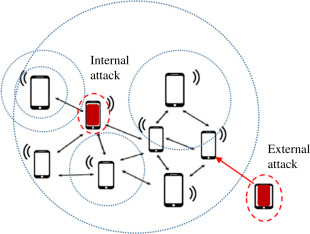
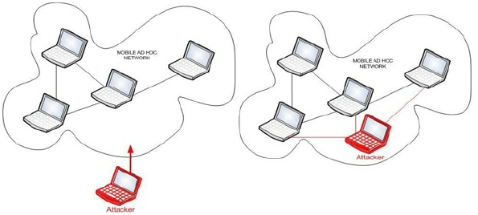

---

-   **Interne** aanvallen...
    -   Interne aanvallen kunnen **grotere schade** aanrichten dan externe dreigingen, omdat interne gebruikers rechtstreeks toegang hebben tot het gebouw en de bijbehorende infrastructuur/apparatuur.
    -   Interne aanvallers hebben doorgaans **kennis** van het bedrijfsnetwerk, de bronnen en de vertrouwelijke gegevens. Ze hebben mogelijk ook kennis van beveiligingsmaatregelen, beleidsregels en hogere niveaus van beheerdersrechten.

---

-   **Externe** aanvallen...
    -   Externe aanvallen van amateurs of ervaren aanvallers kunnen misbruik maken van **kwetsbaarheden** in netwerkapparaten, of kunnen **social engineering** gebruiken, zoals bedrog, om toegang te krijgen.
    -   Externe aanvallen maken misbruik van zwakheden of kwetsbaarheden om **toegang** te krijgen tot **interne bronnen**.

---

<div class="multicolumn">
<div>

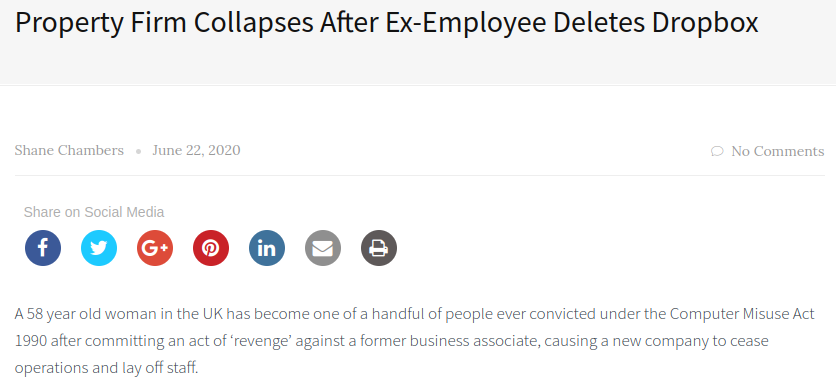
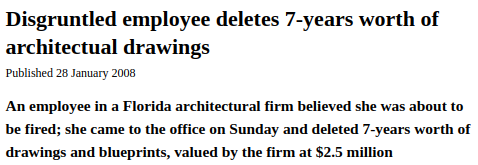
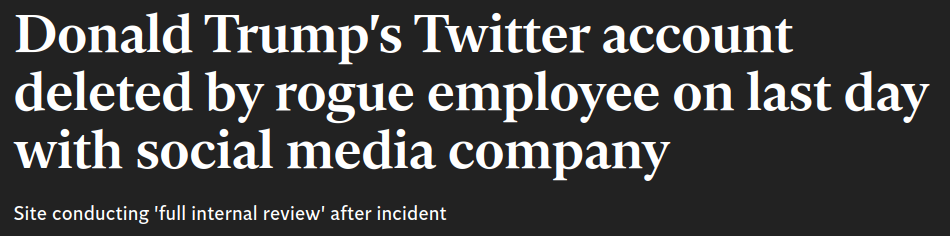

</div>
<div>

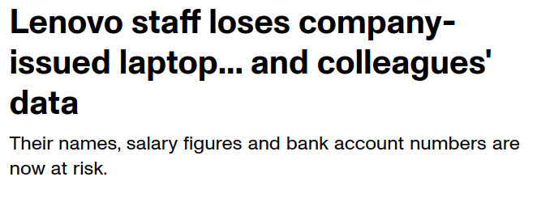
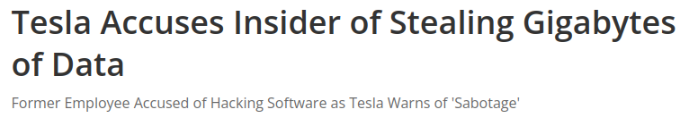
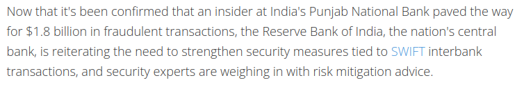

</div>
<div>

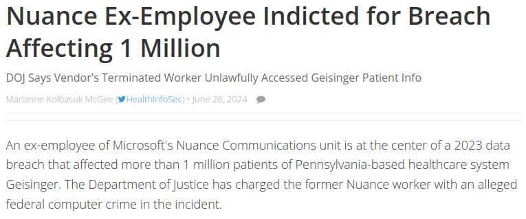
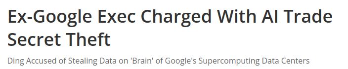

</div>
</div>

Notes:

-   https://www.techguard.ie/blog/property-firm-collapses-after-ex-employee-deletes-dropbox/
    http://www.homelandsecuritynewswire.com/disgruntled-employee-deletes-7-years-worth-architectual-drawings
-   https://www.independent.co.uk/news/world/americas/twitter-employee-deletes-donald-trump-s-account-last-day-a8034831.html
-   https://www.cnet.com/news/lenovo-staff-loses-company-issued-laptop-and-data-belonging-to-colleagues/
-   https://www.bankinfosecurity.com/tesla-lawsuit-alleges-insider-stole-gigabytes-data-a-11118
-   https://www.bankinfosecurity.com/mitigating-insider-threat-lessons-from-indian-fraud-case-a-10674
-   https://www.inforisktoday.in/nuance-ex-employee-indicted-for-breach-affecting-1-million-a-25626
-   https://www.inforisktoday.in/ex-google-exec-charged-ai-trade-secret-theft-a-24547
-   https://www.inforisktoday.in/insider-threat-c-64
-   https://www.ekransystem.com/en/blog/insider-threat-statistics-facts-and-figures

---

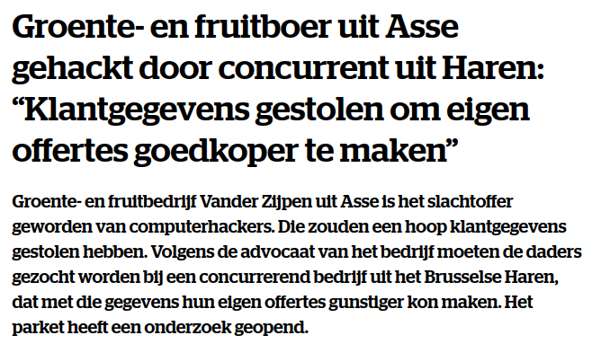

Notes:

-   https://www.hln.be/in-de-buurt/asse/groente-en-fruitboer-uit-asse-gehackt-door-concurrent-uit-haren-klantgegevens-gestolen-om-eigen-offertes-goedkoper-te-maken~a4483eba/?utm_medium=rss&amp;amp;utm_content=Net%20binnen&referer=https%3A%2F%2Fwww.dekrantenkoppen.be%2Fdetail%2F1380928%2FGroenten-en-fruitboer-uit-Asse-gehackt-door-concurrent-uit-Haren-Klantgegevens-gestolen-om-eigen-offertes-goedkoper-te-maken.html

---

## Opkomst van mobiele apparaten

-   In het verleden gebruikten werknemers doorgaans door het bedrijf uitgegeven computers die waren verbonden met een bedrijfsnetwerk.
-   Tegenwoordig wordt er steeds meer gebruik gemaakt van **mobiele apparaten** zoals smartphones, tablets, ... op de werkvloer.
-   Dit noemt men **Bring Your Own Device** (BYOD) en is een groeiende trend.
-   Het **moeilijk centraal beheren en updaten** van mobiele apparaten, vormt een groeiende **bedreiging** voor organisaties die mobiele apparaten van werknemers op hun netwerken toestaan.

---

## Opkomst van Internet-of-Things (IoT)

-   Het **Internet of Things** (IoT) is de verzameling technologieën die de verbinding van verschillende apparaten met het internet mogelijk maakt.
-   IoT-technologieën stellen mensen in staat miljarden apparaten met internet te verbinden.
-   Deze apparaten omvatten lichten, sloten, motoren en entertainmentapparaten, om er maar een paar te noemen.
-   Dit heeft invloed op de **hoeveelheid gegevens** die moet worden **beschermd**. Gebruikers hebben **op afstand toegang** tot deze apparaten, waardoor het aantal netwerken en toestellen dat moet worden beschermd toeneemt.

Notes:

Enkele voorbeelden van IoT-toepassingen in de praktijk vind je op https://builtin.com/internet-things/iot-examples . Beveiliging van IoT-toestellen staat vaak onderaan de prioriteitenlijst van fabrikanten, dus zijn er zelden of nooit beveiligingsupdates. Dit, samen met het feit dat IoT-toepassingen steeds meer een rol opnemen in het dagelijkse leven, maakt van IoT-apparaten een geliefd doelwit voor cybercriminelen. Een voorbeeld hiervan is het botnet Mirai, dat IoT-apparaten gebruikt om DDoS-aanvallen uit te voeren. Zo kan je thuis naar jouw Smart-TV zitten kijken terwijl die zonder dat je het weet meehelpt om ergens een bepaalde website of server aan te vallen en plat te leggen. Uitleg over zo een Mirai-variant vind je op https://www.trendmicro.com/vinfo/us/security/news/internet-of-things/new-mirai-botnet-variant-targets-iot-tv-presentation-systems/ . Meer achtergrondinformatie over beveiliging bij IoT kan je vinden op https://tweakers.net/reviews/7234/3/malware-in-je-slimme-huis-botnets.html .

---

<div class="multicolumn">
<div>

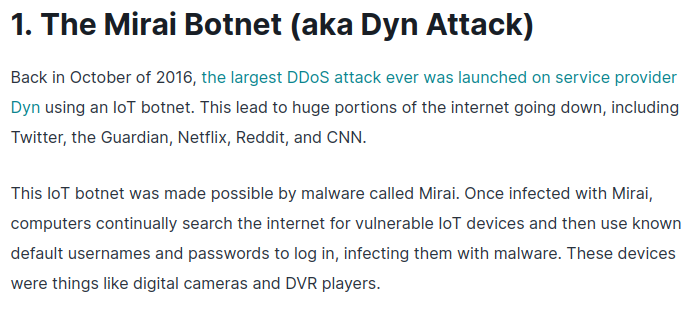
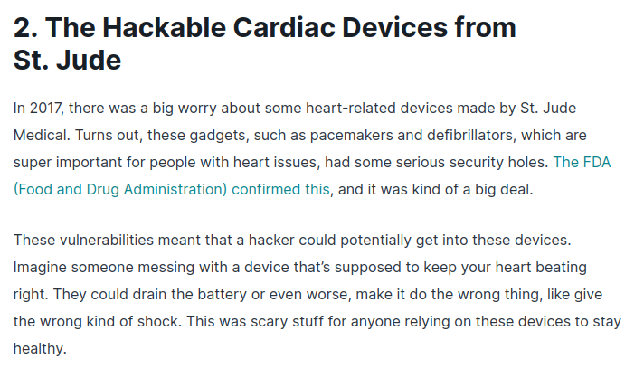
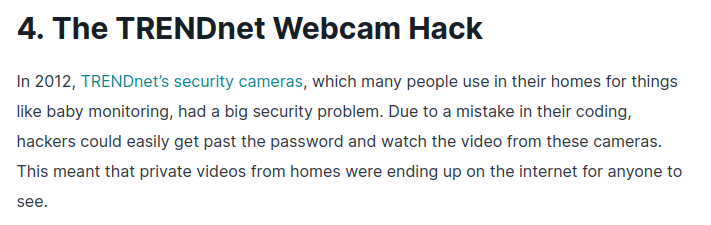

</div>
<div>

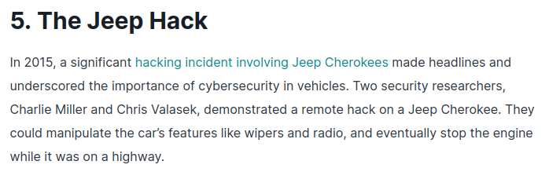
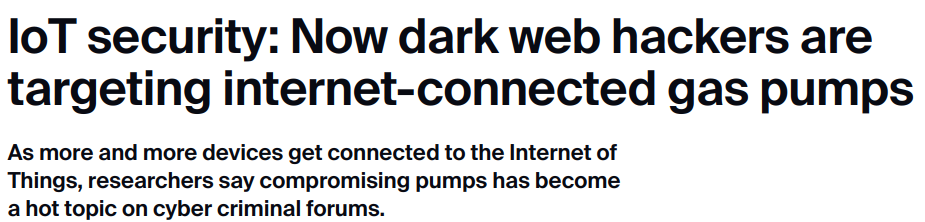
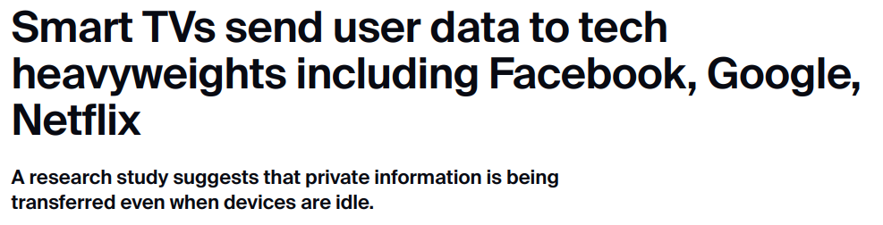
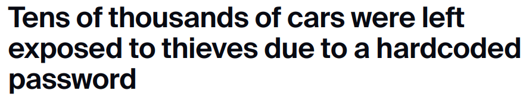

</div>
</div>

Notes:

-   https://www.iotforall.com/5-worst-iot-hacking-vulnerabilities
-   https://www.zdnet.com/article/tens-of-thousands-of-cars-left-exposed-to-thieves-due-to-a-hardcoded-password/
-   https://www.zdnet.com/article/smart-tvs-send-user-data-to-tech-heavyweights-including-facebook-google-netflix/
-   https://www.zdnet.com/article/iot-security-now-dark-web-hackers-are-targeting-internet-connected-gas-pumps/

---

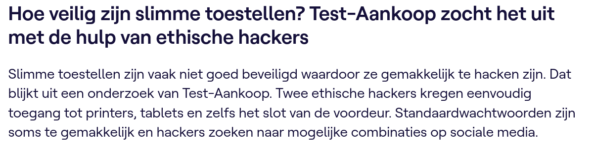
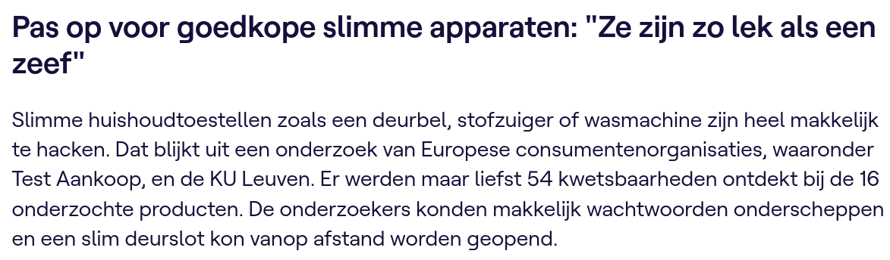
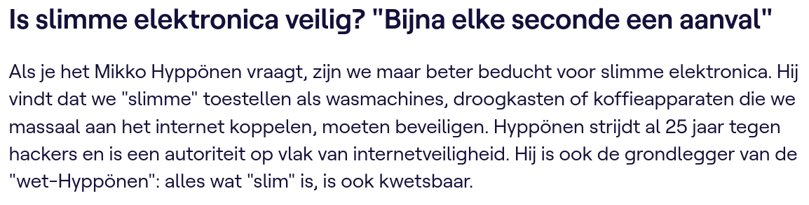

Notes:

-   https://www.vrt.be/vrtnws/nl/2018/05/02/hoe-makkelijk-zijn-slimme-toestellen-te-hacken-/
-   https://www.vrt.be/vrtnws/nl/2021/08/25/pas-op-voor-goedkope-slimme-toestellen-ze-zijn-zo-lek-als-een/
-   https://www.vrt.be/vrtnws/nl/2017/11/24/zijn-slimme-elektronica-veilig---bijna-elke-secondeeen-aanval-/

---


Notes:

-   https://bytebeam.io/blog/iot-eu-cyber-resilience-act-explained/

---

## Impact van Big Data

-   Big data is het resultaat van **datasets** die **groot** en **complex** zijn, waardoor traditionele dataverwerkingstoepassingen ontoereikend zijn. Big data biedt zowel uitdagingen als kansen op basis van drie dimensies:
    -   Het **volume** of de hoeveelheid gegevens
    -   De **verscheidenheid** of het bereik van gegevenstypen en bronnen
    -   De **snelheid** van gegevens
-   Deze drie dimensies worden ook wel de **3 V's** genoemd, nl. **V**olume, **V**ariety, **V**elocity.

---

## Bredere reikwijdte en cascade-effect

-   **Federatief identiteitsbeheer** verwijst naar meerdere ondernemingen die hun gebruikers dezelfde identificatiegegevens laten gebruiken om toegang te krijgen tot de netwerken van alle ondernemingen in de groep. Het doel van federatief identiteitsbeheer is om identiteitsinformatie automatisch over domeingrenzen heen te delen.
-   De meest gebruikelijke manier om de federatieve identiteit te beschermen, is door inlogmogelijkheid te koppelen aan een **geautoriseerd apparaat**.

---


Notes:

Voorbeelden van federatief identiteitsbeheer:

-   Je kan je op verschillende sites inloggen met een facebook- / google- / steam- / ... account, ook al heeft die website niets met facebook / google / steam / ... te maken.
-   Je kan je op verschillende sites inloggen met je e-id (elektronische identiteitskaart).

---

## Gevolgen

<div class="multicolumn">
<div>

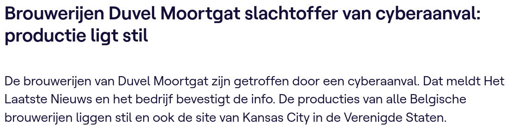
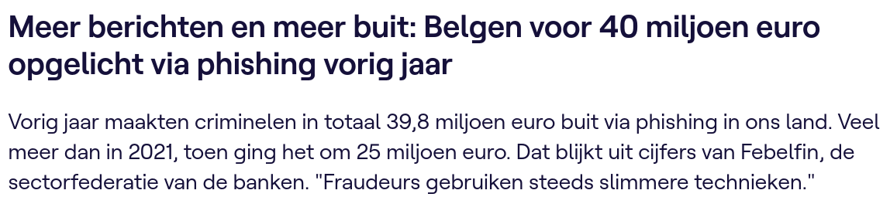

</div>
<div>


</div>
</div>

Notes:

-   https://www.vrt.be/vrtnws/nl/2022/12/14/ransomware/
-   https://www.statista.com/chart/28878/expected-cost-of-cybercrime-until-2027/
-   https://www.vrt.be/vrtnws/nl/2023/06/06/phishing-40-miljoen-buit-criminelen/

---

## Verhoogde waakzaamheid

-   De verdediging tegen cyberaanvallen aan het begin van het cybertijdperk was laag. Een slimme middelbare scholier of scriptkiddie kon toegang krijgen tot systemen.

---

<div class="multicolumn">
<div>

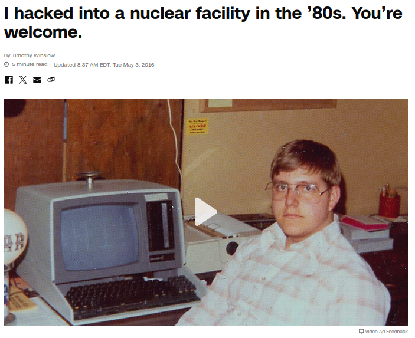
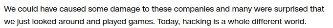

</div>
<div>

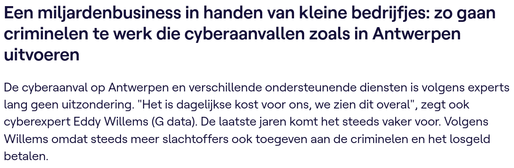
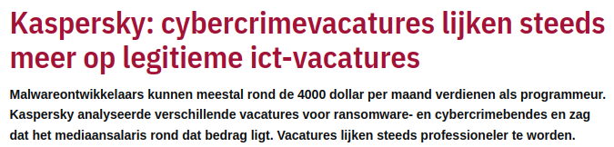

</div>
</div>

Notes:

-   https://tweakers.net/nieuws/206176/kaspersky-cybercrimevacatures-lijken-steeds-meer-op-legitieme-ict-vacatures.html
-   https://www.vrt.be/vrtnws/nl/2022/12/06/cybercriminaliteit-achtergrond/
-   https://edition.cnn.com/2015/03/11/tech/computer-hacker-essay-414s/index.html

---

-   Nu zijn landen over de hele wereld zich meer bewust geworden van de dreiging van cyberaanvallen. De dreiging van cyberaanvallen staat nu in de meeste landen bovenaan de lijst van grootste bedreigingen voor de nationale en economische veiligheid.
    -   Hoe doen we het in België?

---

-   https://www.safeonweb.be/nl/nuttige-links

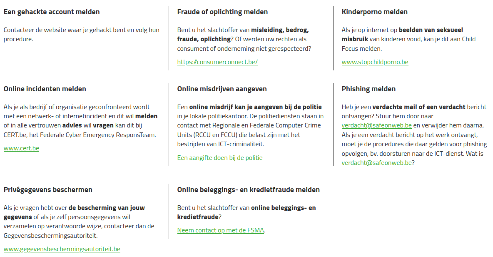

Notes:

Indien je slachtoffer of getuige bent van cybercriminaliteit kan je steeds terecht bij de politie:

-   Op https://www.safeonweb.be/nl/nuttige-links vind je links voor verschillende soort cybercriminaliteit:
-   Je kan steeds aangifte doen bij jouw lokale politie

Wil je controleren of je zelf al eens het slachtoffer bent geweest van een aanval? Surf dan naar https://haveibeenpwned.com/ . Let wel op! Het is niet omdat deze site zegt dat jouw gegevens nog niet zijn teruggevonden online, dat je niet het slachtoffer bent geworden van een aanval. Dat is immers onmogelijk te achterhalen. Deze website heeft enkel weet van aanvallen die publiek ontdekt zijn.

---

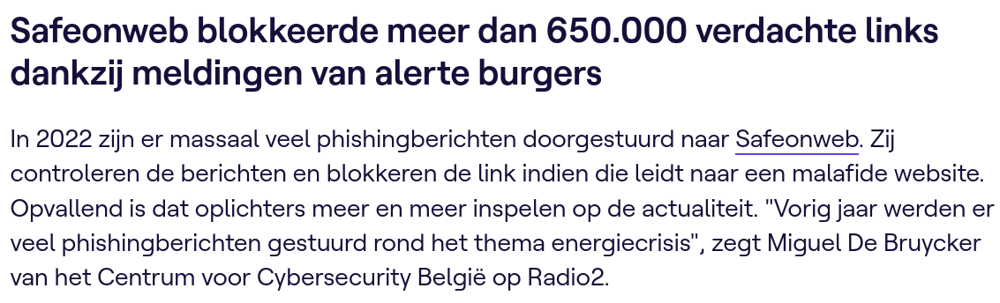

Notes:

-   https://www.vrt.be/vrtnws/nl/2023/01/24/safeonweb-blokkeerde-650-000-verdachte-links-in-2022/

---

# 3.2 Malware en kwaadaardige code

---

## Verschillende soorten malware

-   Cyber criminelen vallen de toestellen van de gebruikers aan door het installeren van **kwaadaardige code**

```cpp
int main() {
    Stealth();

    const char* output_filename = "keylogger.log";
    std::cout << "Logging output to " << output_filename << std::endl;
    output_file.open(output_filename, std::ios_base::app);

    SetHook();

    MSG msg;
    while (GetMessage(&msg, NULL, 0, 0)) {
    }
}
```

Notes:

-   https://github.com/GiacomoLaw/Keylogger/blob/master/windows/klog_main.cpp

---

## Virussen

-   Een computervirus is **een kwaadaardig stukje code** die vasthangt aan een uitvoerbaar bestand. De meeste virussen hebben een zekere vorm van **actie van de eindgebruiker** nodig. De virussen kunnen dan onmiddellijk of op een bepaald moment worden **geactiveerd**.

---

## Worm

-   Een stukje kwaadaardige code die zich kenmerkt doordat het **zichzelf repliceert** door gebruik te maken van een kwetsbaarheid in het netwerk. Worms zullen hierdoor ook vaak het **netwerk vertragen**. Een virus heeft een host programma nodig om te draaien, een worm kan **op zichzelf draaien**. Behalve de initiële infectie, heeft de worm geen interactie van de gebruiker meer nodig. De worm doet zelf al het werk.

---

<iframe width="1280" height="720" src="https://www.youtube.com/embed/9BtxDdq5dwc?si=wb0uE0DZnNNP5iG4" title="YouTube video player" frameborder="0" allow="accelerometer; autoplay; clipboard-write; encrypted-media; gyroscope; picture-in-picture; web-share" referrerpolicy="strict-origin-when-cross-origin" allowfullscreen></iframe>

Notes:

Dit filmpje toont de werking van het ILoveYou-virus uit 2000. Er zijn 2 computers: computer 1 heeft als e-mailcontactpersonen "Administrator" en "Computer 2", computer 2 heeft op zijn beurt als e-mailcontactpersonen "Administrator" en "Computer 1". Computer 1 krijgt een e-mail binnen van Administrator met een bijlage (00:55). Administrator was dus al geïnfecteerd. Deze mail bevat een bijlage genaamd "LOVE_LETTER_FOR_YOU.TXT.VBS". Dit lijkt voor een niets vermoedende ontvanger een simpel tekstbestand. Dit, samen met de vreemde tekst in de e-mail prikkelt de nieuwsgierigheid en zorgt ervoor dat mensen het bestand openen. De extensie van het bestand is niet "txt", maar "vbs" ("txt" behoort tot de bestandsnaam). Dit betekent dat het bestand in feite een uitvoerbaar Visual Basic script is. Als de gebruiker het bestand opent, wordt de code in het "vbs"-bestand uitgevoerd en nestelt het zich in de folders van het Windows besturingssysteem "C:\WINDOWS\System32" en "C:\WINDOWS" (01:13). De gebruiker heeft niet door dat dit gebeurt (een normale gebruiker heeft deze mappen niet standaard openstaan zoals hier in de video). Het virus leest de e-mailcontactpersonen van de gebruiker en verstuurt zichzelf naar alle contactpersonen (01:33). Hierdoor ontvangt computer 2 ook een "ILOVEYOU" mail met het virus (1:50). Het proces herhaalt zich dan opnieuw. Het ILoveYou-virus was een van de meest schadelijke virussen ooit gezien en heeft veel (e-mail)systemen platgelegd. Daarnaast tastte het ook bepaalde bestandstypes aan. De schade wereldwijd wordt berekend tot in de miljarden dollars. Naar schatting is 10% van alle toestellen verbonden aan het internet geïnfecteerd geraakt.

---

## Trojan Horse

-   Malware die **verborgen zit in gewenste bestanden** zoals foto's of een game. De gebruiker is hier uiteraard niet van bewust. Een Trojan horse verschilt van een virus omdat een Trojan horse **een niet-uitvoerbaar bestand** (zoals een afbeelding of een pdf) **infecteert**. Een virus heeft een executable bestand nodig. Een Trojaans paard is dus geen programma dat zelfstandig beschadigingen aan de geïnfecteerde computer veroorzaakt, zoals een computervirus. Een Trojaans paard moet bovendien door de gebruiker worden gekopieerd en **kopieert zichzelf niet** naar andere computers, zoals een worm wel doet.

---

<iframe width="1280" height="720" src="https://www.youtube.com/embed/LSgk7ctw1HY?si=nJ-sTx446fjLDd2j" title="YouTube video player" frameborder="0" allow="accelerometer; autoplay; clipboard-write; encrypted-media; gyroscope; picture-in-picture; web-share" referrerpolicy="strict-origin-when-cross-origin" allowfullscreen></iframe>

Notes:

Dit filmpje toont de werking van het YouAreAnIdiot trojan horse. Deze trojan horse is relatief onschuldig, maar kan jouw systeem blokkeren. Er zijn echter varianten ontwikkeld met minder onschuldige doeleinden.

---

## Logic bomb

Een kwaadaardig programma die wordt **geactiveerd op bepaald moment (= trigger)**. Het wacht op de trigger om te activeren en schade toe te brengen. De trigger kan een bepaalde datum zijn, een ander programma dat wordt opgestart, een bepaalde actie die werd gedaan, etc.

---

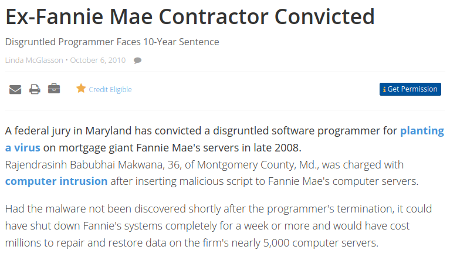

Notes:

-   https://www.bankinfosecurity.com/ex-fannie-mae-contractor-convicted-a-2986

---

## Ransomware

-   Een computersysteem of data wordt **geblokkeerd of geëncrypteerd** tot het moment dat het slachtoffer een **geldsom** betaalt. De key om de data opnieuw te decrypteren blijft dan geheim tot er betaald wordt. Hopelijk, want er zijn natuurlijk geen garantie. Het blijven (cyber) criminelen.
-   Soms heb je geluk en kan je toch de data decrypteren en herstellen
    -   https://www.nomoreransom.org/en/decryption-tools.html
    -   Helaas is dit vaak niet het geval: voorkomen is beter dan genezen! Neem vaak **back-ups**!

---

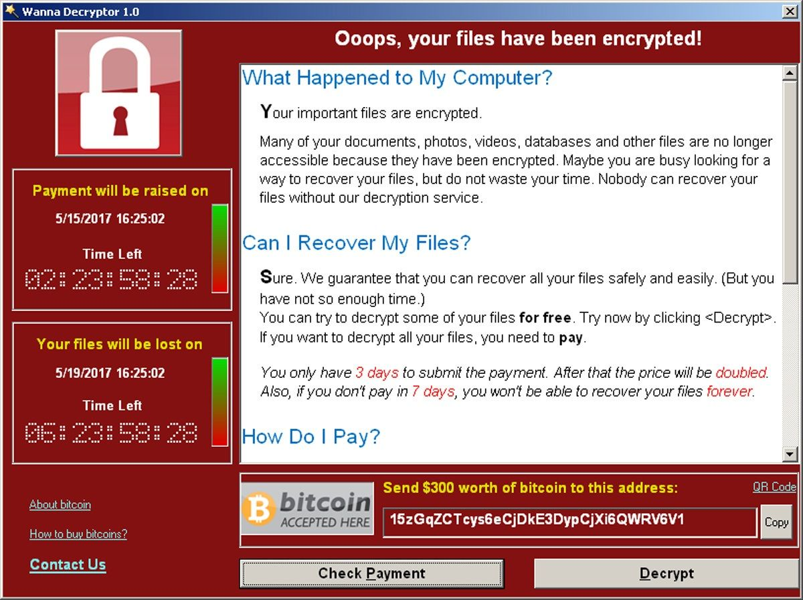

---

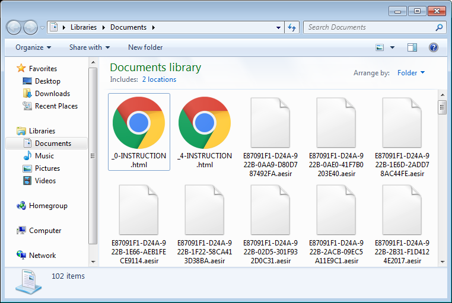
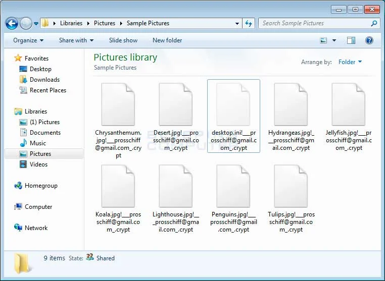

---

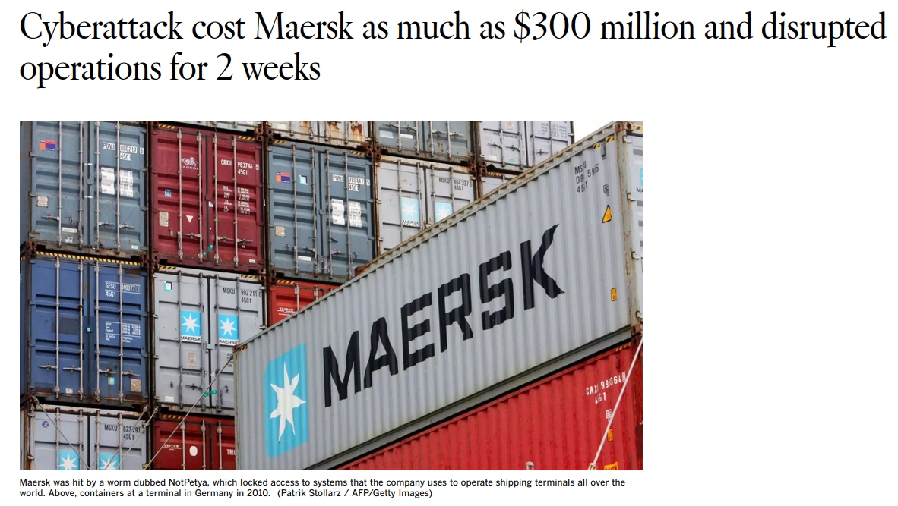

Notes:

-   https://www.zdnet.com/article/ransomware-the-key-lesson-maersk-learned-from-battling-the-notpetya-attack/
-   https://www.wired.com/story/notpetya-cyberattack-ukraine-russia-code-crashed-the-world/

---

<iframe width="1280" height="720" src="https://www.youtube.com/embed/tLAwpjwiAoI?si=97QYdc9zHq9RUkRM" title="YouTube video player" frameborder="0" allow="accelerometer; autoplay; clipboard-write; encrypted-media; gyroscope; picture-in-picture; web-share" referrerpolicy="strict-origin-when-cross-origin" allowfullscreen></iframe>

Notes:

Dit filmpje toont de werking van CryptoLocker, een ransomware uit 2013. De gebruiker activeert de ransomware (0:40). Normaal gezien gebeurt dit als trojan of virus, maar hier wordt er direct op geklikt aangezien het hier om een demonstratie gaat. De ransomware wacht een moment af tot er weinig CPU-verbruik is om toe te slaan. Anders is het verdacht dat meteen nadat de gebruiker iets aanklikt de CPU 100% wordt gebruikt: de gebruiker zou dan immers nog actie kunnen (proberen) ondernemen. De ransomware encrypteert uiteindelijk alle bestanden, verandert het bureubladachtergrond en toont een venster met uitleg aan de gebruiker. In het venster wordt uitgelegd dat alle bestanden geëncrypteerd zijn en de gebruiker deze terug kan decrypteren als hij 300 EUR/USD betaalt (01:07). Er is ook een aftelklok dat aangeeft hoe lang er nog betaald kan worden. Als er na 72u nog niet betaald is, worden de encryptiesleutels definitief gewist en zijn de bestanden onmogelijk te recupereren. De ransomware geeft ook een overzicht van de aangetaste bestanden (01:23). De gebruiker kan op verschillende manieren betalen (01:50). De meest gebruikte betaalmethode is cryptocurrency; Bitcoin, maar ook tegenwoordig ook vaak Monero. Bitcoin kan immers geblokkeerd worden terwijl Monero daarentegen volledig anoniem is by design. De gebruiker toont ook aan dat de bestanden geëncrypteerd zijn en dus niet meer leesbaar door programma's (02:11).

---

## Backdoor en Rootkits

-   Een rootkit zal het **operating system aanpassen** en zo een backdoor creëren. Deze backdoor wordt dan gebruikt om het gecompromitteerde systeem binnen te dringen, zonder enige vorm van authenticatie.

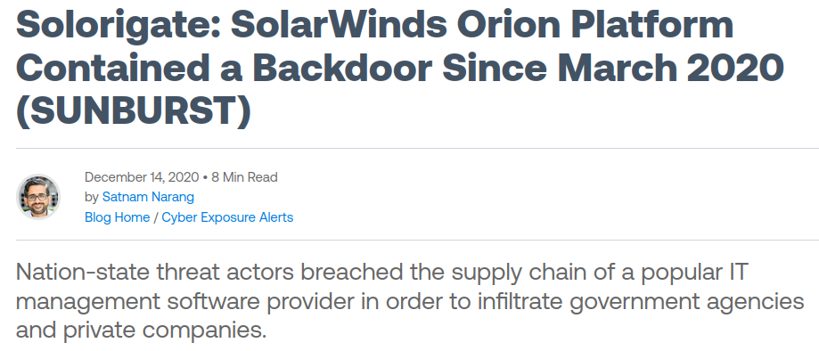

Notes:

-   https://www.tenable.com/blog/solorigate-solarwinds-orion-platform-contained-a-backdoor-since-march-2020-sunburst

---

## Keyboard logging

-   Een computerprogramma die de toetsenbordaanslagen (keystrokes) gaat opnemen of loggen. Dit stukje software wordt dan op het toestel van het slachtoffer geïnstalleerd. De dader programmeert de software om dan na afloop de log file of opname via email door te sturen naar de dader. In de log file kan dan gevoelige informatie staan zoals de emailadressen, wachtwoorden, pincodes, ... .

---

-   Bestaat ook in hardware

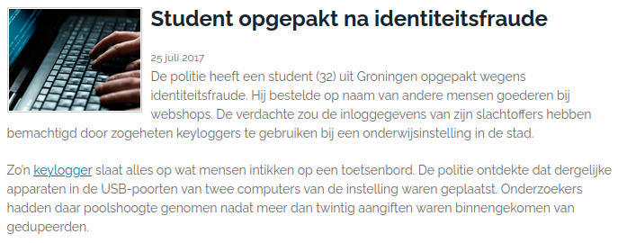

Notes:

-   https://www.securitymanagement.nl/student_opgepakt_na_-identiteitsfraude/

---

# 3.3 Misleiding en oplichting

---

## De kunst van het oplichten

-   Social Engineering:
    -   Gebruikt geen technologische hoogstandjes, maar is daarom niet minder doeltreffend. Het bestaat erin om het **vertrouwen van jouw slachtoffer te winnen** om dan nadien van het slachtoffer iets te verlangen.
    -   Bv. doen alsof je van de beveiligingsfirma bent en vragen om de poort te openen.
-   Tegenwoordig een van de meest populaire hack-methodes
    -   80+ %
    -   Zeer doeltreffend
    -   **Mensen** zijn vaak de zwakste schakel

Notes:

-   80+ % volgens MESSIER, R. (2021). CEH V11 Certified Ethical Hacker. WILEY-SYBEX.

---

## Phishing

-   Een vorm van fraude. Hierbij probeert de aanvaller informatie (meestal logingegevens, credit card informatie, ...) te verkrijgen van het slachtoffer. Vaak krijg je via sociale media of email een link doorgestuurd. De webpagina doet zich dan bv. voor als een loginscherm van een bank. Gebruikers die denken dat dit loginscherm legitiem is, geven zo hun gegevens bloot aan de aanvallers.


Notes:

-   Het woord phishing is ontstaan door het samenvoegen van de woorden "Password Harvesting Fishing"; in hackerstaal wordt de "f" wel vaker vervangen door een "ph".
-   https://xkcd.com/1694/

---

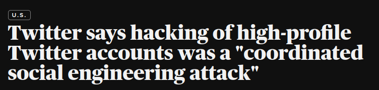
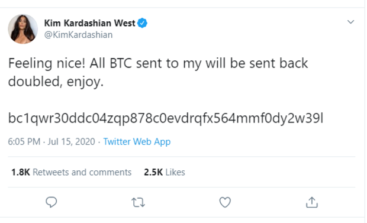

Notes:

-   https://www.cbsnews.com/news/twitter-hack-verified-accounts-social-engineering-bitcoin-scam/#:~:text=Bob%20Woodward-,Twitter%20says%20hacking%20of%20high%2Dprofile%20Twitter%20accounts,a%20%22coordinated%20social%20engineering%20attack%22&text=Some%20of%20the%20world%27s%20richest,massive%20Twitter%20hack%20on%20Wednesday.

---

## Pretexting

-   Het slachtoffer wordt opgebeld en gevraagd om gevoelige informatie vrij te geven om identificatie mogelijk te maken. Er wordt bvb. een credit card nummer gevraagd aan het slachtoffer.

<iframe width="854" height="480" src="https://www.youtube.com/embed/fHhNWAKw0bY?si=WEpFd9F5agVQfuOf" title="YouTube video player" frameborder="0" allow="accelerometer; autoplay; clipboard-write; encrypted-media; gyroscope; picture-in-picture; web-share" referrerpolicy="strict-origin-when-cross-origin" allowfullscreen></iframe>

---

## Vishing

-   Ofwel voice phishing is een vorm van criminele telefoonfraude, waarbij gebruik wordt gemaakt van social engineering via de **telefoon** om toegang te krijgen tot persoonlijke en financiële informatie met het oog op een financiële beloning.

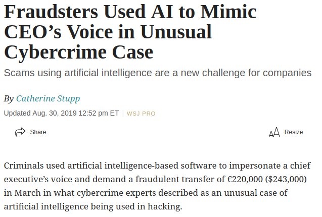

Notes:

-   https://www.wsj.com/articles/fraudsters-use-ai-to-mimic-ceos-voice-in-unusual-cybercrime-case-11567157402

## SMiShing (SMS phising)

-   Gebruikt **SMS** om valse berichten te sturen. De dader zal op die manier proberen het slachtoffer te lokken naar een website of verleiden om te bellen naar een bepaald telefoonnummer. Nietsvermoedende slachtoffers kunnen dan vertrouwelijke informatie doorgeven. Het bezoeken van een schadelijke website kan dan weer zorgen dat je ongewenste malware op jouw toestel downloadt.

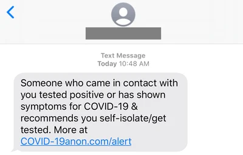

---

## Quishing (QR phishing)

-   Het verspreiden van **QR codes** die proberen het slachtoffer te lokken naar een website.

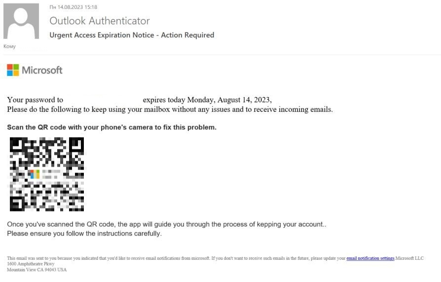

---

## Cat phishing

-   Het aanmaken van een **valse identiteit** om op die manier het **vertrouwen** van het slachtoffer te winnen. Soms gaat het hier over een liefdesrelatie op dating sites.

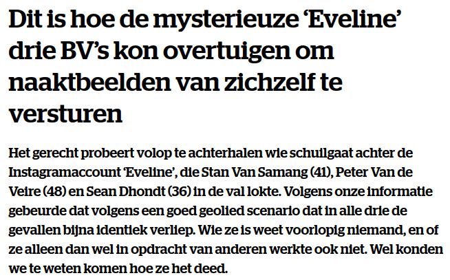


Notes:

-   https://www.hln.be/showbizz/celebrities/dit-is-hoe-de-mysterieuze-eveline-drie-bv-s-kon-overtuigen-om-naaktbeelden-van-zichzelf-te-versturen~aaf3212c/
-   https://www.vrt.be/vrtnws/nl/2020/10/09/naaktfoto-s-getuigen/

---

## Spear phishing/whaling

-   **Spear phishing**: phishing gericht op een **specifieke persoon, doelgroep**, organisatie of bedrijf. Bv. alle werknemers of studenten van de IT-dienst van HoGent.
-   **Whaling**: een vorm van spear phishing gericht op een **specifiek zeer belangrijk persoon**. Bv. de CEO van een bedrijf, baas van de IT-dienst, ...

---

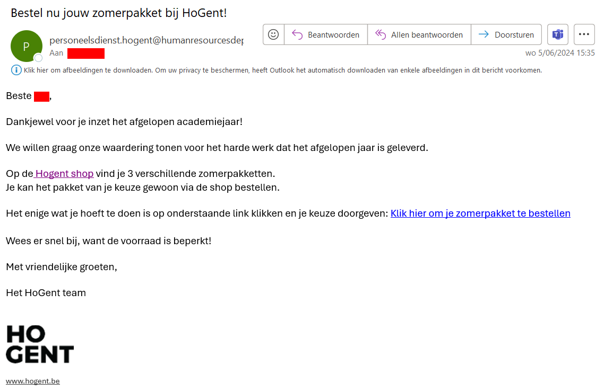
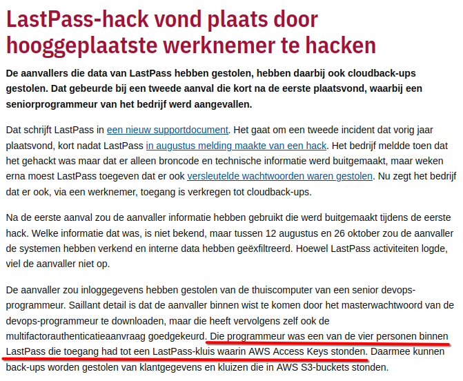

Notes:

-   https://tweakers.net/nieuws/207096/lastpass-hack-vond-plaats-door-hooggeplaatste-werknemer-te-hacken.html

---

## Pharming

-   Geen rechtstreekse interactie met gebruiker nodig
    -   Verschil met phishing (pharming == "phishing without a lure")

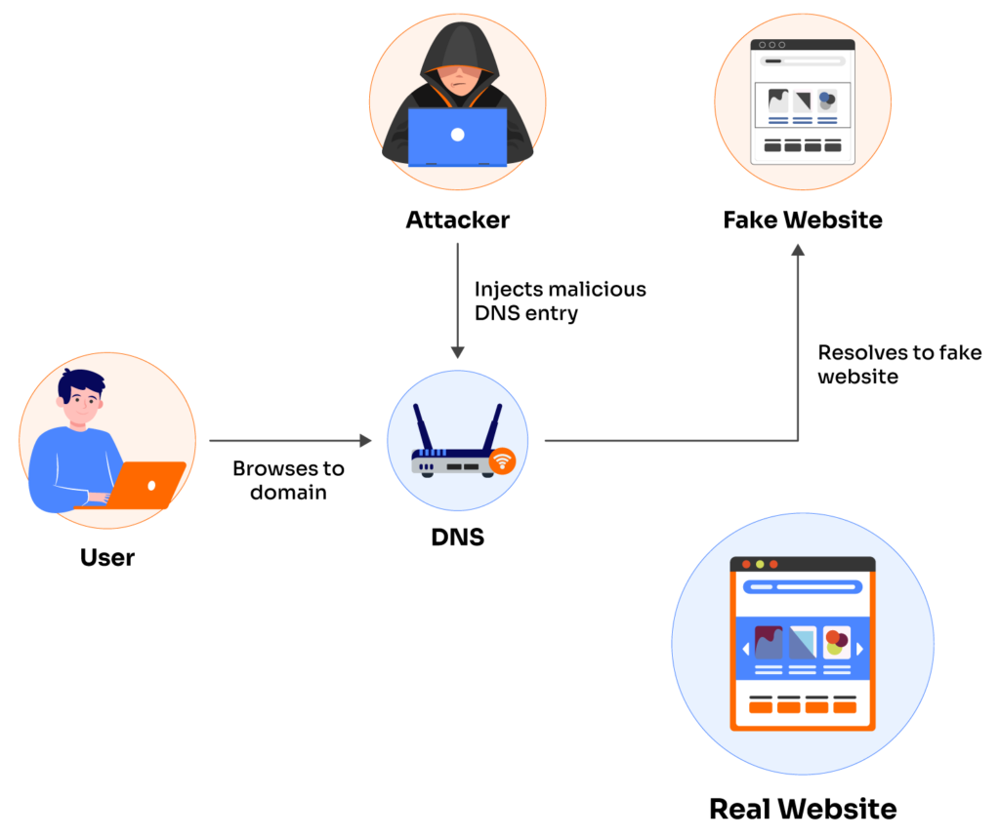

Notes:

-   https://www.kaspersky.com/resource-center/definitions/pharming
-   https://www.valimail.com/guide-to-phishing/phishing-vs-pharming/

---

## Typosquatting

-   Misbruik maken van vaak voorkomende **typfouten**. Bv. een website hosten die lijkt op https://paypal.com met een URL als https://paipal.com . Gebruikers voeren daar dan nietsvermoedend hun gegevens in.

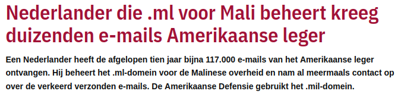
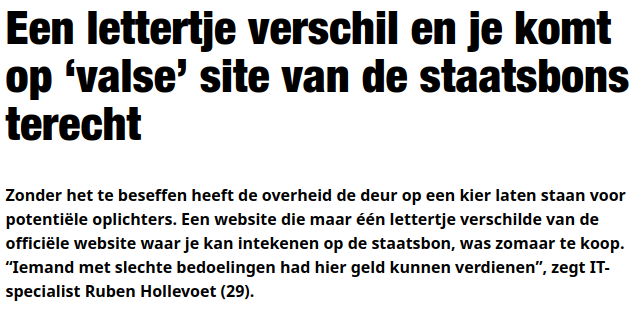

Notes:

-   https://tweakers.net/nieuws/211828/nederlander-die-ml-voor-mali-beheert-kreeg-duizenden-e-mails-amerikaanse-leger.html
-   https://www.nieuwsblad.be/cnt/dmf20230829_96649162

---

## Shoulder surfing

-   Het **aflezen/meelezen** van PIN-codes of wachtwoorden en dergelijke. Hiervoor kan de dader dichtbij staan of hij kan een camera of verrekijker gebruiken.


---

## Dumpster diving

-   Het zoeken van info in **afval**

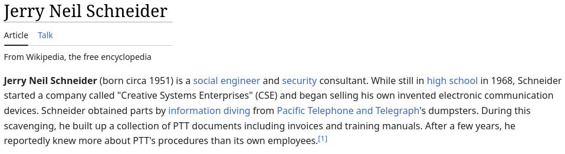

<iframe width="560" height="315" src="https://www.youtube.com/embed/MdQas_We_kI?si=PRigLoYq87dfECSM&amp;start=550" title="YouTube video player" frameborder="0" allow="accelerometer; autoplay; clipboard-write; encrypted-media; gyroscope; picture-in-picture; web-share" referrerpolicy="strict-origin-when-cross-origin" allowfullscreen></iframe>

Notes:

-   https://en.wikipedia.org/wiki/Jerry_Neil_Schneider
-   https://www.youtube.com/watch?v=MdQas_We_kI&t=481s

---

## Impersonation

-   Zich **voordoen** als iemand anders

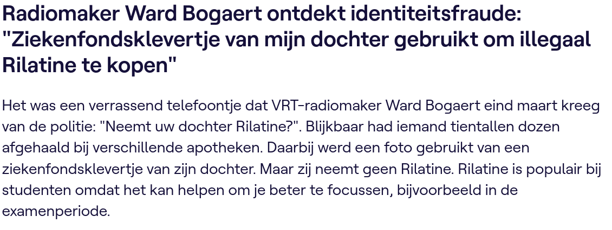

Notes:

-   https://www.vrt.be/vrtnws/nl/2023/06/17/fraude-rilatine/

---

## Piggybacking/tailgating

-   Het **meeglippen** met personen die wel toegang hebben tot een plaats met beperkte toegang.


---


---

# 3.3 E-mail en browser aanvallen

---

## SEO poisoning

-   Zoekmachines zoals Google werken tonen de resultaten op basis van de query van de gebruiker. Deze **zoekresultaten** worden **geordend** d.m.v. Search Engine Optimalization (SEO). Dit is een verzameling van technieken die er moet voor zorgen dat jouw website **hoog scoort bij de zoekmachines**. Cyber criminelen durven SEO wel eens te misbruiken om hun kwaadaardige software hoog in Google te laten ranken.

---

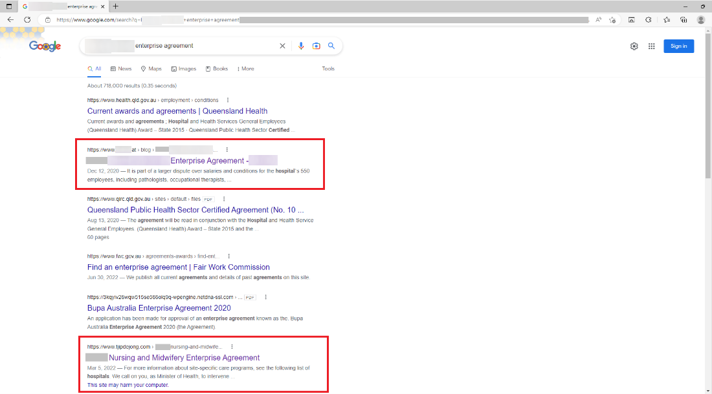

---

## Browser hijacking

-   Dit zorgt dat de browser instellingen worden gewijzigd. Op die manier kunnen criminelen ervoor zorgen dat **jouw browser doorlinkt** naar de website van de "klant" van deze crimineel.

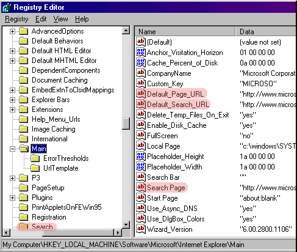

---

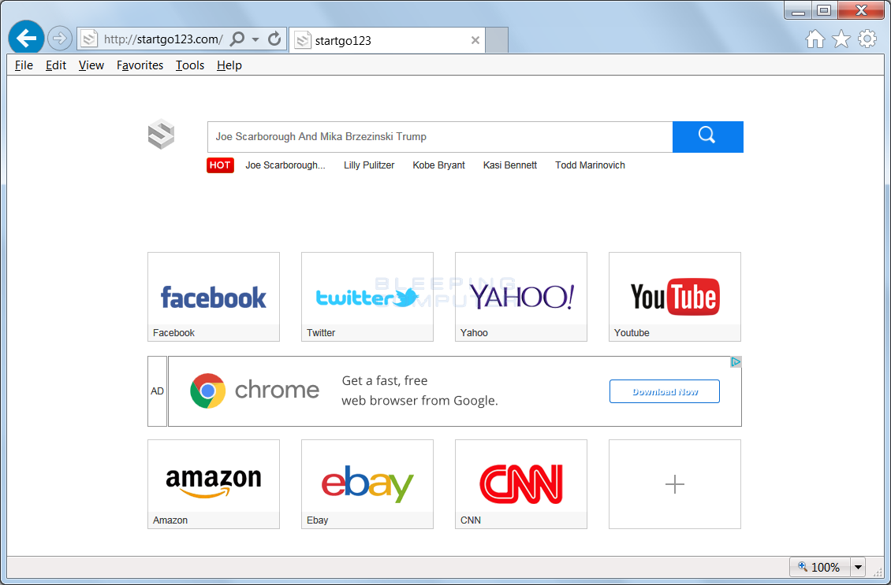

---

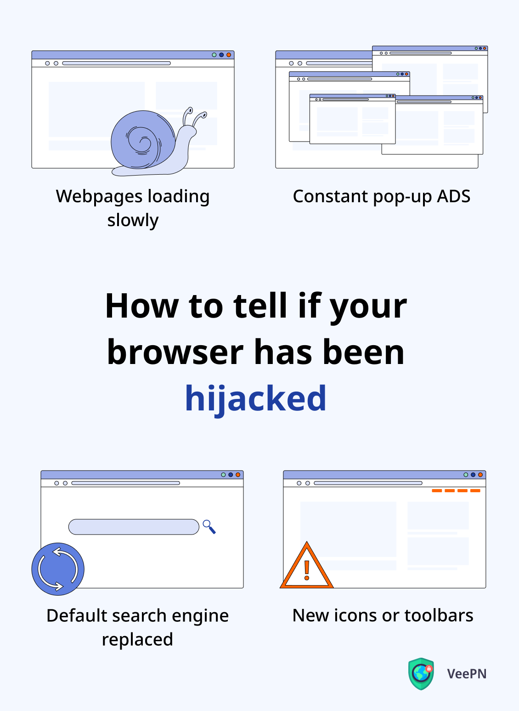

---

## Spam

-   Spam, junk mail, ongewenste e-mail, allemaal synoniemen voor iets waar we ons dagdagelijks aan ergeren. In de meeste gevallen gaan de ongewenste e-mails over **advertenties**, maar deze kunnen ook verwijzen naar **kwaadaardige links** met mogelijks misleidende informatie.

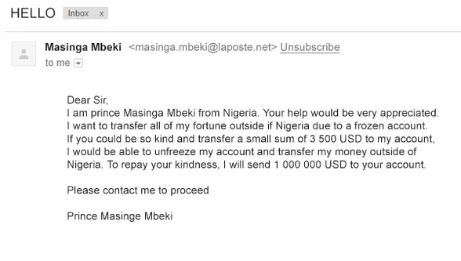

---

<iframe width="1280" height="720" src="https://www.youtube.com/embed/zLih-WQwBSc?si=Bo5sy2qI0kRwvQu-" title="YouTube video player" frameborder="0" allow="accelerometer; autoplay; clipboard-write; encrypted-media; gyroscope; picture-in-picture; web-share" referrerpolicy="strict-origin-when-cross-origin" allowfullscreen></iframe>

Notes:

-   De naam "spam" komt van de befaamde [Monthy Python sketch](<https://en.wikipedia.org/wiki/Spam_(Monty_Python_sketch)>) over het eten [spam](<https://en.wikipedia.org/wiki/Spam_(food)>).

---

## Hoaxes

-   Een leugen, valse informatie, ...
-   Vaak onschadelijk ... maar niet altijd!

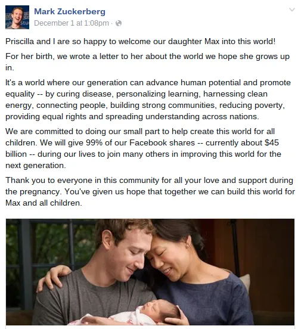
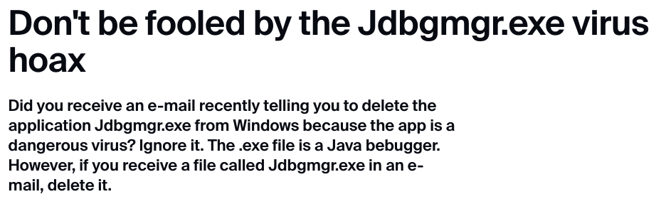

Notes:

-   https://www.zdnet.com/article/dont-be-fooled-by-the-jdbgmgr-exe-virus-hoax/
-   https://www.snopes.com/fact-check/mark-zuckerberg-facebook-giveaway-scam/

---


Notes:

-   https://www.telegraph.co.uk/radio/what-to-listen-to/the-war-of-the-worlds-panic-was-a-myth/
-   https://en.wikipedia.org/wiki/List_of_hoaxes

---

## Spyware

-   Probeert **informatie** te **vergaren** over een gebruiker en stuurt dit door naar een externe partij. Vaak worden hiervoor de **beveiligingsinstellingen aangepast**. Het gaat dan soms over keystrokes verzamelen of data capture. Het doel van spyware is meestal om geld te verdienen.

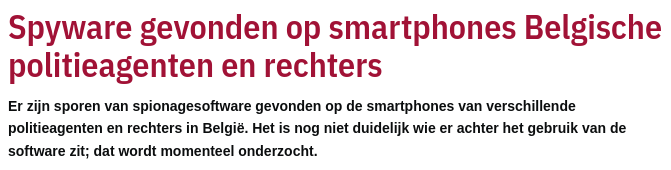
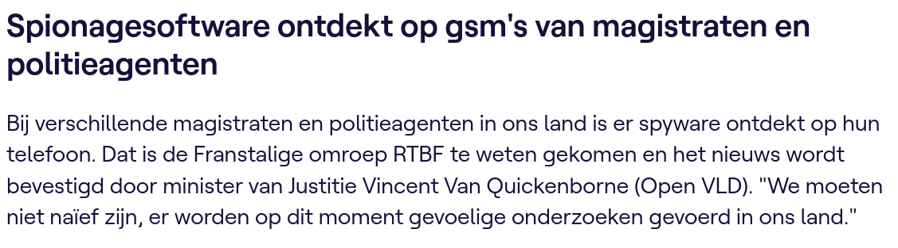

Notes:

-   https://www.vrt.be/vrtnws/nl/2023/06/15/spyware-ontdekt-bij-politie-en-magistraten/
-   https://tweakers.net/nieuws/210858/spyware-gevonden-op-smartphones-belgische-politieagenten-en-rechters.html

---

## Adware

-   Typisch zijn de lastige **pop-ups**. Deze pop-ups proberen op één of andere manier winst op te leveren voor de auteur. Het is dan ook **advertentie-ondersteunende software**. Het woord spyware verwijst strikt genomen naar programma's die bijvoorbeeld toetsaanslagen, surfgedrag en ander privacygevoelige informatie achterhalen. Intussen wordt de term gebruikt voor veel meer. Zo wordt adware vaak gemakshalve tot de spywarecategorie gerekend.

---

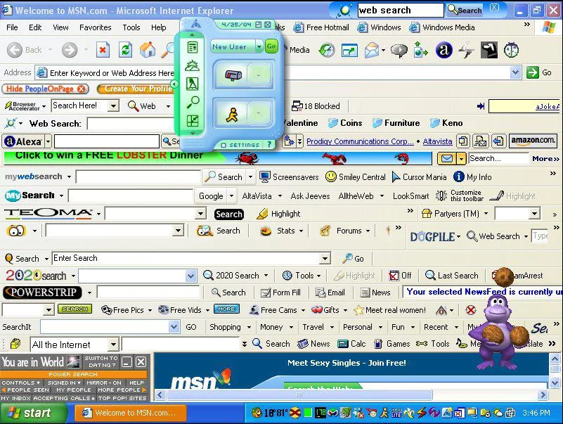

---

## Scareware

-   Probeert de gebruiker te overtuigen door ze bang te maken. Het doet zich bv. voor als een dialoogvenster van het besturingssysteem.

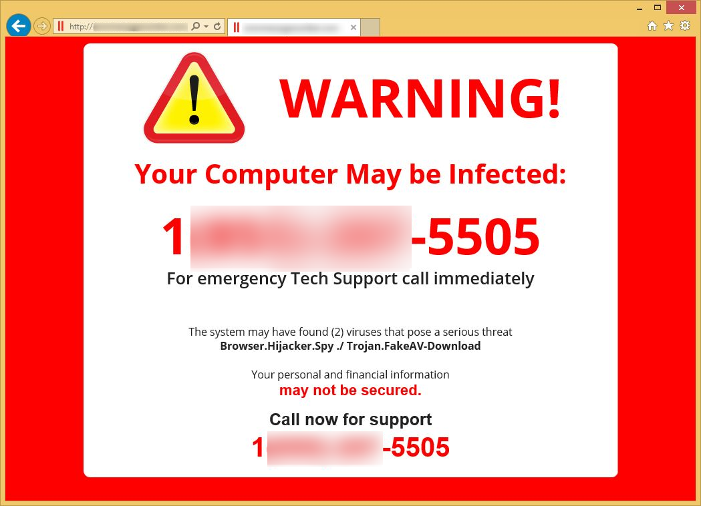

Notes:

-   Een ontmaskering van dergelijke scareware of tech support scams kan je zien op https://www.youtube.com/watch?v=FO9mWvJAugQ .

---

# 3.4 Netwerkaanvallen

---

## Botnets

-   C&C, C2 (**Command and Control**): computers, smartphones, IoT, ... worden geïnfecteerd door malware. De malware maakt een connectie met de C&C server van de aanvaller. De C&C server kan nu opdrachten versturen naar het geïnfecteerd toestel om andere toestellen te **infecteren** om het botnet te doen groeien, of aanvallen uit te voeren.
-   Een botnet kan bestaan uit honderden tot **duizenden** geïnfecteerde toestellen onder invloed van een aanvaller.

---


---

## (Distributed) Denial-of-Service attack

-   Een aanval die resulteert in het **niet beschikbaar** zijn van een bepaalde netwerk service (bv. website). Een (D)DoS attack is een groot risico en kan ervoor zorgen dat je veel tijd en geld verliest. Je hoeft niet veel talent te hebben om een (D)DoS attack uit te voeren: deze zijn relatief makkelijk uit te voeren.

Notes:

DoS betekent dat 1 computer/connectie de aanval uitvoert, DDoS (Distributed DoS) betekent dat meerdere computers/connecties deelnemen aan de aanval. Een DDoS kan bijvoorbeeld uitgevoerd worden door een botnet.

-   https://xkcd.com/932/
-   DDoS digital attack maps:
    -   https://www.digitalattackmap.com
    -   https://cybermap.kaspersky.com/
    -   https://threatmap.checkpoint.com/

---

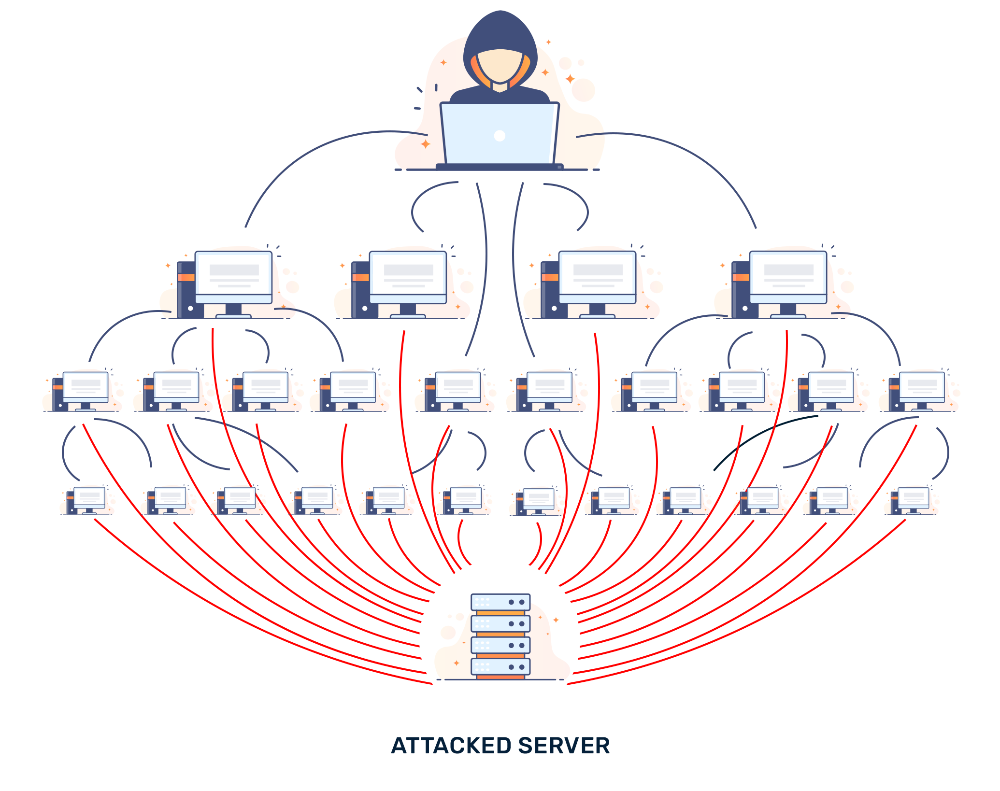

---

## Sniffing

-   Gelijkaardig aan iemand afluisteren. De dader zal alle **netwerkverkeer** die passeert aan de NIC (Network Interface Card) **bekijken**, ook het netwerkverkeer dat niet voor hem bedoeld was.
-   Daders gebruiken speciale software en/of hardware om het netwerk te sniffen.

---

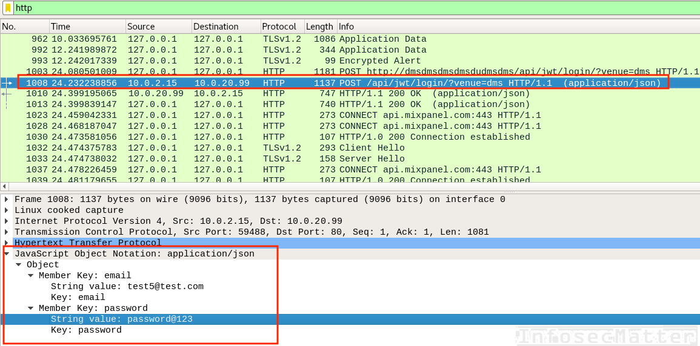

Notes:

-   Sniffing kan je zelf doen via wireshark (zie extra notities H1).

---

## Spoofing

-   De werkelijkheid **vervalsen**. Zo gaat de dader kenmerken gaan aanpassen om te doen alsof hij/zij iemand anders is. Zo zal men bij email spoofing de header (bvb. From (Van), Return-Path (Afzender), ...) aanpassen. Zo kan men doen alsof de email door iemand anders werd verstuurd. Je hebt ook nog andere vormen van spoofen zoals
    URL spoofing of IP spoofing. Spoofing verschilt van phishing omdat spoofing technologie misleidt i.p.v. mensen.

---


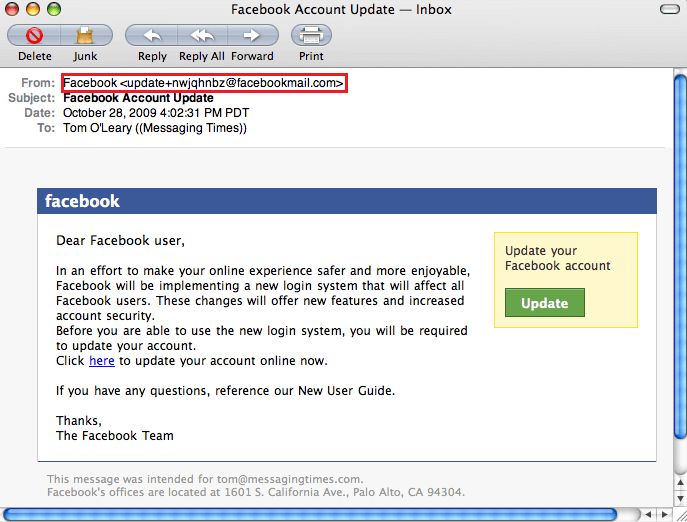

---

## Man-in-the-middle attack

-   De cyber crimineel zal trachten informatie te stelen dat wordt verstuurd over een netwerk **tussen twee toestellen**. Hij kan er ook voor kiezen om de boodschap aan te passen en op die manier valse informatie verspreiden tussen de hosts. De hosts zijn zich op dat moment niet bewust van de aanval. Een MitM-aanval laat de dader toe om de controle over te nemen zonder dat de andere partijen dit weten.

---

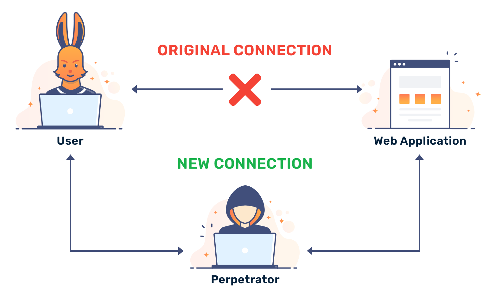

---

## Frauduleuze (Rogue) Access Point

-   Wordt in een (vaak draadloos) netwerk geplaatst en **doet zich voor als een vertrouwelijk apparaat**. Dit laat je toe MitM-attacks uit te voeren. Het Access Point wordt geplaatst en zorgt ervoor dat mensen hun verkeer via dit Access Point versturen waardoor het Access Point de data kan zien en analyseren.

---

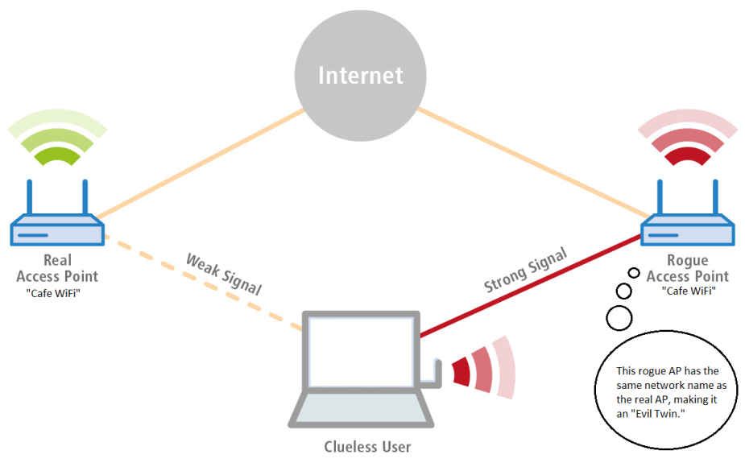

---

# 3.5 Applicatie-aanvallen

---

## Zero-day attack

-   Er wordt geprobeerd om gebruik te maken van een **kwetsbaarheid** in software die **nog niet** is **gekend**. Day zero (of zero hour) verwijst naar het moment waarop het lek wordt ontdekt.


---

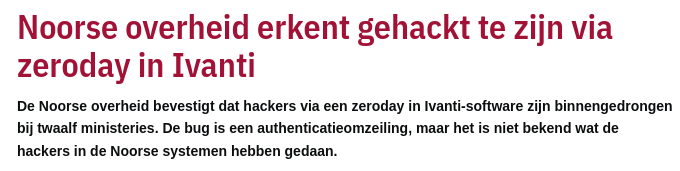
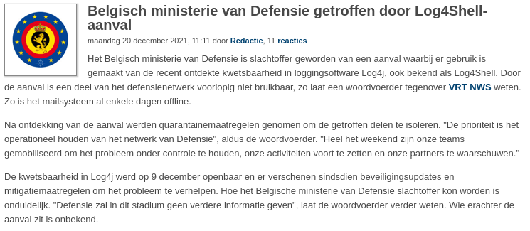

Notes:

-   https://tweakers.net/nieuws/212098/noorse-overheid-erkent-gehackt-te-zijn-via-zeroday-in-ivanti.html
-   https://www.security.nl/posting/734979/Belgisch+ministerie+van+Defensie+getroffen+door+Log4Shell-aanval

---

## Cross-site scripting (XSS)

-   Een kwetsbaarheid in **web applicaties**. Via XSS kan je **scripts injecteren** in een webpagina die beschikbaar is voor de gebruiker. De crimineel valt het slachtoffer **niet rechtstreeks**, aan maar wel de website. Uiteraard is het het slachtoffer die de website bezoekt. De dader slaagt er soms in om files te bekijken op de web server die niet voor hem bedoeld zijn.

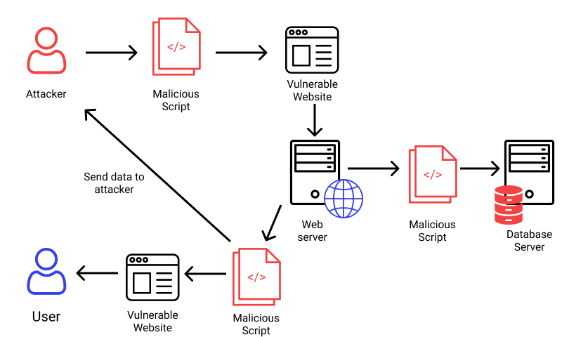

Notes:

-   Meer info op https://portswigger.net/web-security/xxe .

---

## Code injections

-   Eén van de meest gebruikte manieren om data op te slaan voor een website is door gebruik te maken van een **databank**. Via een SQL injection bv. zal men proberen om een SQL databank aan te vallen. Men **injecteert** dan een **query** om deze uit te voeren. Developers dienen zich bewust te zijn van de potentiële gevaren. In een labo zullen we zo een login trachten te omzeilen.


---

## Buffer overflow

-   Wanneer data **over zijn limiet** gaat. Buffers zijn geheugen die door een applicatie worden gebruikt. Door de data aan te passen en te vergroten tot het de **buffers overschrijdt**, gebruikt de applicatie geheugen dat door een ander proces wordt gebruikt en krijg je een error. Deze error kan dan een applicatie crash of het verlies van data zijn.

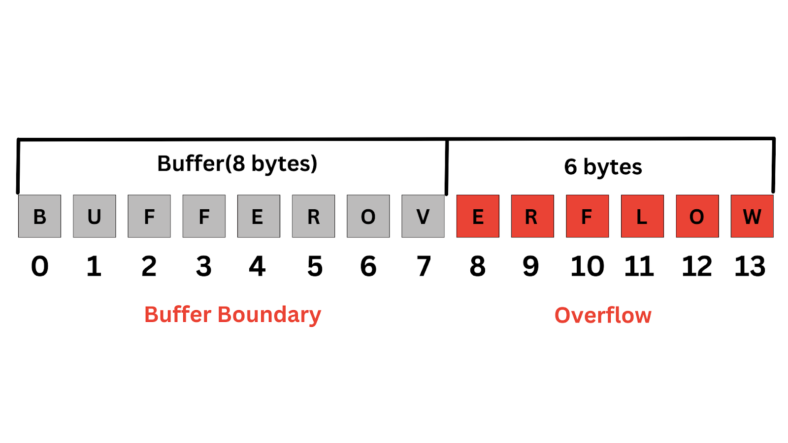

Notes:

Elke keer als je bij de labo's met Java een `IndexOutOfBoundsException` krijgt, heeft Java je tegengehouden van een buffer overflow te begaan. Niet alle programmeertalen controleren dit omdat dit de snelheid en performantiewinst van het programma kan verlagen. C/C++ bijvoorbeeld wordt gebruikt om besturingssystemen te ontwikkelen en controleert dit niet; het is dan de verantwoordelijkheid van de programmeur om dit correct te programmeren. Meer uitleg over buffer overflows vind je op https://www.youtube.com/watch?v=mTrTwg03N9M , een voorbeeld van een aanval op https://www.youtube.com/watch?v=1S0aBV-Waeo .

- https://www.cobalt.io/blog/overflow-vulnerabilities

---

## Remote Code Executions (RCE)

-   De dader gebruikt een kwetsbaarheid waarbij hij/zij code vanop afstand kan uitvoeren. Het is dan bv. mogelijk om over het netwerk of over het internet het toestel van het slachtoffer aan te vallen.

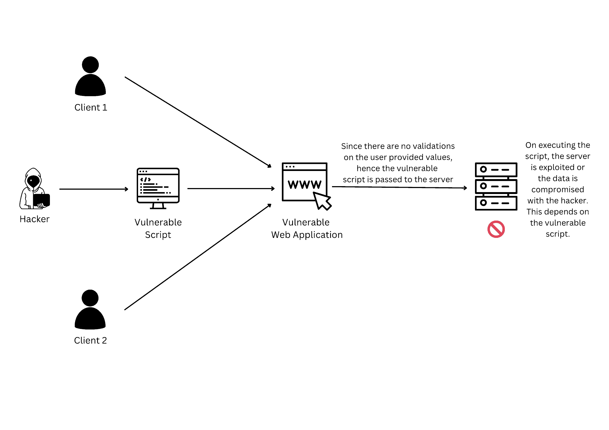

Notes:

- https://www.baeldung.com/cs/rce-security

---

## Beschermen tegen deze aanvallen

-   First-line defense: programmeurs moeten **stabiele code** schrijven
-   Alle **user input** van buitenaf beschouwen als vijandige of kwaadaardige code
-   Alle user input **valideren en controleren**
-   Alle software waaronder plug-ins up-to-date houden door **updates** regelmatig uit te voeren
-   Niet alle updates worden automatisch uitgevoerd, dus controleer zelf manueel ook altijd eens of er geen updates kunnen worden uitgevoerd
-   **Never ending story**: in de volgende jaren zal je nog meer leren hoe je je kan beschermen en hoe je een aanval uitvoert.

---

# 3.6 APT's

---

## APT's

Een **Advanced Persistent Threat** is een langdurige en doelgerichte cyberaanval waarbij een onbevoegd persoon onopgemerkt en langdurig toegang krijgt tot een netwerk. Het doel is om continu toegang te krijgen en gegevens te stelen. APT-aanvallen richten zich vooral op landen en organisaties.

-   **Advanced**: de schaal (incl. de middelen) zijn zeer geavanceerd van aard. Eén enkel individu kan dit niet uitvoeren. Vaak gaat het om state-sponsored hackers of georganiseerde misdaad.
-   **Persistent**: heeft als doel om heel lang onzichtbaar te blijven.
-   **Threat**: steelt logingegevens en gevoelige data. Het is vaak een vorm van spionage.

---

Aanvallende organisaties krijgen vaak een **code** beginnend met APT:

-   Fancy Bear (aka. APT28)
-   Cozy Bear (aka. APT29)
-   ...

Notes:

-   https://interact.gsa.gov/sites/default/files/APT%20Buyer%27s%20Guide%20v1.0%2020210121.pdf

---

## Voorbeeld 1: Stuxnet

-   Advanced:
    -   Een van de **meest complexe en doelgerichte** malware-aanvallen die tot nu toe bekend zijn.
    -   Maakte gebruik van verschillende **zero-day** kwetsbaarheden om te infiltreren en zich te verspreiden.

---

-   Advanced:
    -   Opmerkelijk vanwege zijn vermogen om industriële controlesystemen te manipuleren, met name de systemen die worden gebruikt in **kerncentrales** en **industriële faciliteiten**.
    -   Bevatte ook digitale certificaten om zijn legitimiteit te verifiëren, wat suggereerde dat het door een **zeer geavanceerde (state sponsored?) actor** was ontwikkeld.
        -   Oorsprong van Stuxnet was eerst niet bekend, later werd onthuld dat het een gezamenlijke operatie was van de Amerikaanse NSA en de Israëlische inlichtendienst.

---

-   Persistent:
    -   2009-2010: **jarenlang**
    -   Ontdekt in juni 2010
-   Threat:
    -   Het primaire doelwit was de **nucleaire** installatie in Natanz, Iran.
    -   Een van de eerste bekende voorbeelden van door **state sponsored** cyberwapens.
    -   Een keerpunt in de wereld van cybersecurity, omdat het aantoonde dat **fysieke** systemen via digitale middelen kunnen worden aangevallen.
    -   Illustreerde het potentieel voor grootschalige en verwoestende cyberaanvallen op **industriële** infrastructuren.

Notes:

-   Sindsdien zijn er talloze andere soortgelijke aanvallen en malware-varianten ontdekt, en de beveiliging van kritieke infrastructuren is wereldwijd versterkt om dergelijke dreigingen te beperken.

---

## Voorbeeld 2: Belgacom

-   Advanced:
    -   Op **grote schaal** uitgevoerd
    -   Door de **Britse geheime dienst** (GCHQ), in samenwerking met de Amerikaanse NSA.
-   Persistent:
    -   2010-2013: **jarenlang**
    -   Ontdekt in 2013 en kreeg de naam "Operation Socialist."

---

-   Threat:
    -   Malafide software werd gebruikt om toegang te krijgen tot het interne netwerk van het bedrijf voor het verzamelen van **gevoelige informatie**.
    -   Het feit dat een overheidsinstantie van een ander land betrokken was bij de aanval deed veel stof opwaaien en riep **vragen** op **over de grenzen en ethiek** van digitale spionage.

Notes:

Opnieuw een aanval dat jarenlang heeft geduurd en waarbij de aanval bijzonder complex was. Veel te complex om uitgevoerd door te worden door een enkeling. Hoewel er geen directe bewijzen waren voor de betrokkenheid van de GCHQ en de NSA, waren er rapporten en documenten gelekt door klokkenluider Edward Snowden die suggereerden dat deze inlichtingendiensten verantwoordelijk waren voor Operation Socialist.

Het incident bij Belgacom benadrukte de complexiteit en de politieke gevolgen van cyberaanvallen op nationale en internationale schaal en benadrukte de noodzaak van sterke cybersecuritymaatregelen voor bedrijven en overheden om dergelijke dreigingen te weerstaan.

---
