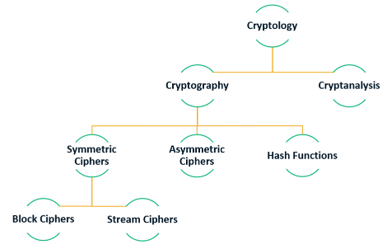
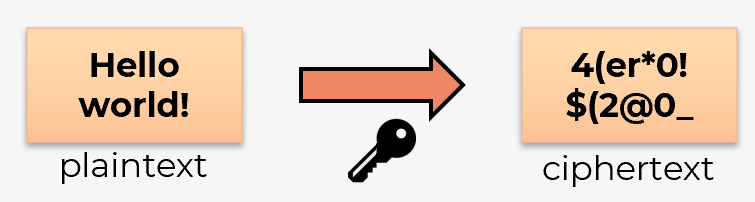
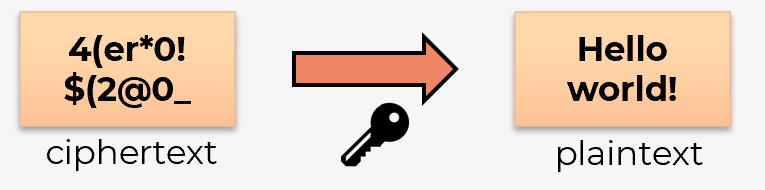
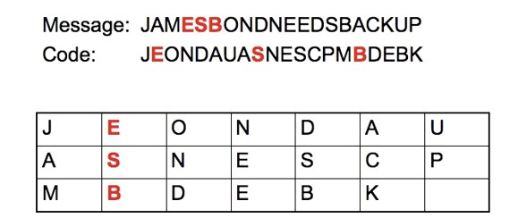
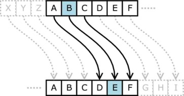
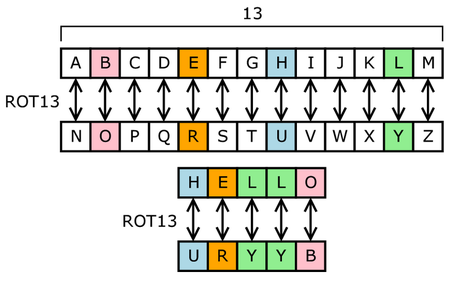
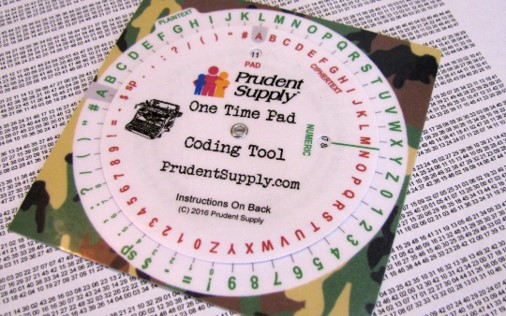
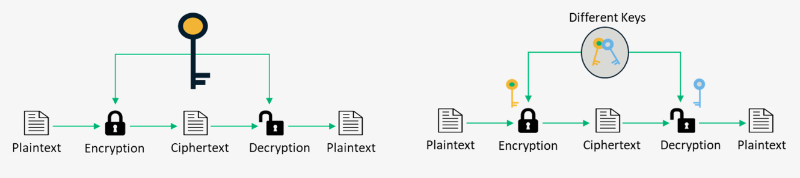
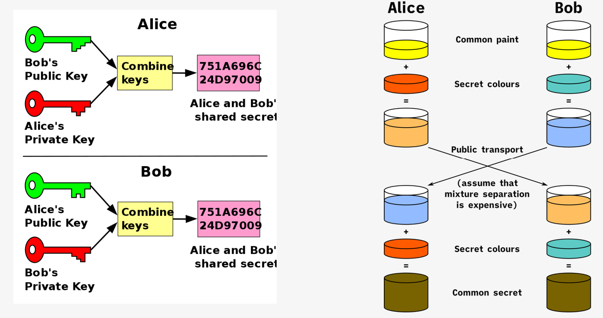

# Confidentiality

De kunst van het beschermen van geheimen.
---

# 4.1 Cryptografie

---

## Cryptografie
- *Cryptologie*: **wetenschap** maken en breken **geheime codes**

- *Cryptografie*: **manier** om gegevens **op te slaan** en te verzenden, zodat alleen de ontvanger deze kan lezen
Moderne cryptografie: gebruik van algoritmen om gevoelige data te beschermen
Cryptografie is veel **ouder dan computers** (duizenden jaren)Belangrijk middel voor uitwisselen berichten in diplomatieke kringen.

- *Crypto-analyse*: focust op het **kraken** van cryptografie

Note:
- Cryptologie is de wetenschap van het maken en breken van geheime codes. Cryptografie is een manier om gegevens op te slaan en te verzenden, zodat alleen de beoogde ontvanger deze kan lezen of verwerken. Moderne cryptografie maakt gebruik van computationeel beveiligde algoritmen om ervoor te zorgen dat cybercriminelen niet gemakkelijk beschermde informatie kunnen compromitteren.

- De geschiedenis van cryptografie begon duizenden jaren geleden in diplomatieke kringen. Boodschappers van het hof van een koning brachten versleutelde berichten naar andere rechtbanken. Af en toe probeerden andere rechtbanken die niet bij de communicatie betrokken waren, berichten te stelen die waren verzonden naar een koninkrijk dat zij als een tegenstander beschouwden. Niet lang daarna begonnen militaire commandanten encryptie te gebruiken om berichten te beveiligen.

- Elke versleutelingsmethode gebruikt een specifiek algoritme, een cijfer genaamd, om berichten te versleutelen en te ontsleutelen. Een cijfer is een reeks goed gedefinieerde stappen die worden gebruikt om berichten te versleutelen en ontsleutelen. Er zijn verschillende methoden om cijfertekst te maken:
Transpositie (omzetting)
Substitutie (vervanging)
Eenmalige pad

---
## Encrypteren
- Om vertrouwelijkheid (confidentiality) te garanderen kunnen we een bericht **encrypteren** met behulp van een specifiek algoritme (cijfer/cipher)
- Hierbij wordt een bericht dat we kunnen begrijpen (**plaintext**) omgezet naar een onleesbaar bericht (**ciphertext**) via een aantal goed gedefinieerde stappen, vaak met behulp van een geheime **sleutel**.

---

## Decrypteren
- Het omgekeerde is ook mogelijk, **decrypteren** zet een onleesbaar bericht terug om naar de originele leesbare tekst.

- Voor encrypteren en decrypteren wordt vaak een **combinatie** gebruikt van verschillende **technieken**:
    - Transpositie (omzetting)
    - Substitutie (vervanging)
    - One-time pad

---

## Transpositie

Eenvoudig voorbeeld **transpositie** waarbij de volgorde van de karakters wijzigt (cfr. transpositie van een matrix, AT)
---
## Substitutie

Voorbeelden **substitutie** waarbij karakters vervangen worden door andere karakters 

---
## One-time pad

Voorbeeld one-time pad waarbij een random **sleutel (=pad)** toegevoegd wordt 
aan de plaintext

Nadien wordt het resultaat 
omgezet naar een getal van 2 cijfers

---
## One-time pad

<iframe width="1280" height="720" src="https://www.youtube.com/watch?v=FlIG3TvQCBQ" title="YouTube video player" frameborder="0" allow="accelerometer; autoplay; clipboard-write; encrypted-media; gyroscope; picture-in-picture; web-share" referrerpolicy="strict-origin-when-cross-origin" allowfullscreen></iframe>

---
## Twee types algoritmen
- *Symmetrische* algoritmen
    - **Zelfde sleutel** voor encrypteren (versleutelen) en decrypteren
    - Verzender en afzender **kennen de sleutel** voor communicatie begint
        - Groot nadeel: hoe wissel je deze veilig uit?

- *Asymmetrische* algoritmen
    - **Sleutelpaar** = verschillende sleutels voor encrypteren en decrypteren
    - 1 sleutel is **publiek** (openbaar), andere is **privé**
        - Daarom ook vaak term: **publieke-sleutelcryptografie**
        - Iedereen kan bericht encrypteren met publieke sleutel, enkel ontvanger kan decrypteren met private sleutel
        - Ook omgekeerde is mogelijk: encrypteren met private sleutel, decrypteren met publieke sleutel
    - Complexer en dus **trager** dan symmetrische algoritmen
    - Hoeft geen sleutel op voorhand uit te wisselen
Niet het grote nadeel van symmetrische encryptie

---
## Twee types algoritmen

---
## Private-key versleuteling
**Symmetrisch** versleutelingsproces: vooraf **gedeelde sleutel** om gegevens te encrypteren en decrypteren (private-key versleuteling)

- **DES** Data Encryption Standard
    - Eenvoudig, encrypteert 64-bits blokken met 56-bits sleutel
    - Niet bruikbaar in praktijk, niet veilig!
- **3DES** Triple DES 
    - 3x DES met verschillende sleutels
    - Sleutelsterkte: ~~3x56 = 168 bits~~ in praktijk 112-168 bits afhankelijk van gekozen combinatie
- **IDEA** International Data Encryption Algorithm
    - 64-bits blokken met 128-bits sleutel
    - Vervanging voor DES, gebruikt bij PGP (Pretty Good Privacy)
- **AES** Advanced Encryption Standard
    - 128-bits blokken, sleutel van 128, 192 of 256 bits
    - Goedgekeurd door NIST, gebruikt door Amerikaanse overheid

---
## Public-key versleuteling
**Asymmetrisch** versleutelingsproces: **verschillende sleutels** voor encrypteren en decrypteren (public key encryption). Niet mogelijk om via één sleutel de andere te achterhalen

- **RSA** Rivest Shamir Adleman
    - Gebruikt product van 2 heel grote priemgetallen
    - Vaak gebruikt in browsers
- **ECC** Elliptic Curve Cryptography
    - Alternatief voor RSA: Nulpunten van elliptische curven ipv. priemgetallen
    - VS: NSA gebruikt dit voor handtekeningen en uitwisselen sleutels
- **Diffie-Hellman**
    - Gebruikt om geheime sleutel (sessiesleutel) voor symmetrisch algoritme uit te wisselen
    - Vaak gebruikt: SSL, TLS, SSH, IPSec, …
- **ElGamal**
    - Amerikaanse overheidsstandaard voor digitale handtekeningen
    - Gratis! Niemand heeft patent…

---
## Public-key versleuteling
- Encrypteren (encrypt/decrypt)
- Digitale handtekening (sign/verify) (zie H5).

 
---

## Symmetrische vs. asymmetrische codering
<table>
<tr>
<th>Symmetrisch</th>
<th>Asymmetrisch</th>
</tr>
<tr>
<td>Snel</td>
<td>Niet nodig om beide sleutels te delen</td>
</tr>
<tr>
<td>Verbruikt weinig resources</td>
<td>Kan gebruikt worden voor encryptie en validatie (=handtekening)</td>
</tr>
<tr>
<td>Kan gebruikt worden voor korte en lange berichten
</td>
<td>Gebruikt veel resources</td>
</tr>
<tr>
<td>Sleutel moet op veilige manier gedeeld worden</td>
<td>Enkel bruikbaar voor relatief kleine berichten</td>
</tr>
</table>

Asymmetrische codering vaak gebruikt om een (tijdelijke) sessiesleutel voor symmetrische encryptie uit te wisselen!

---
## Diffie Hellman
Wordt gebruikt om met asymmetrisch algoritmen een symmetrische sleutel te genereren

---

---
# 4.2 crypto-analyse

---
## Het kraken van cryptografie
- Bij het **kraken** van cryptografie probeer je een onleesbaar bericht (ciphertext) om te vormen naar een leesbaar bericht (plaintext) **zonder** dat je de **geheime sleutel** kent

- In sommige gevallen zelfs zonder dat je weet **welk algoritme** gebruikt is voor de encryptie

- In theorie kan je elk algoritme kraken, maar de kans op succes hangt af van 2 factoren:
    - De hoeveelheid **tijd** die je hebt voor het bericht irrelevant wordt
    - De hoeveelheid **bronnen** (mensen en computerbronnen zoals CPU en GPU) die je kan gebruiken

---
## Technieken
- Soms is het mogelijk om algoritmen te kraken door **op zoek** te gaan naar **bepaalde patronen** in de ciphertext (zo is de Enigma gekraakt door Alan Turing!)

- Voor het kraken van moderne algoritmen worden vaak volgende technieken gebruikt:
    -  **Dictionary attack**: uitproberen van verschillende waarden uit een opgegeven lijst (bv. woordenboek of dump van wachtwoorden)
    - **Brute-force attack**: uitproberen van alle mogelijke waarden voor de geheime sleutel (heel tijdsintensief!)
    - **Rainbow tables**: gebruikt vooraf gemaakte, gesorteerde lijsten met ciphertext en de overeenkomstige plaintext, wordt gebruikt voor het kraken van hashing algoritmen (zie H5)	
