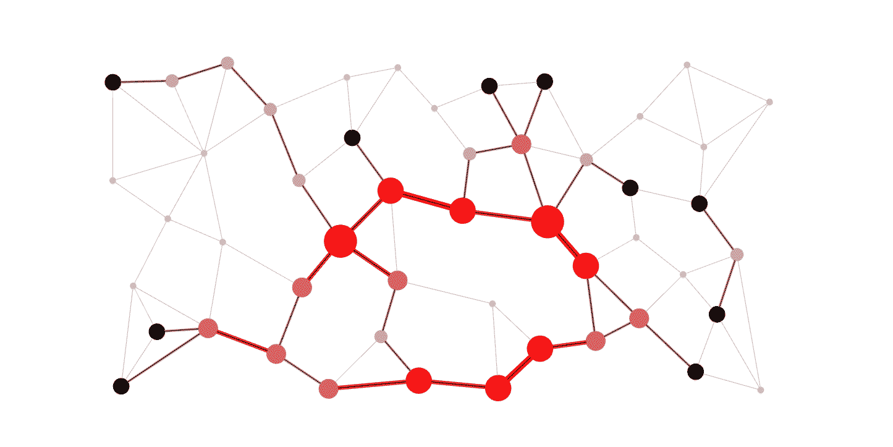

# H6: availability

---

# 6.1 Onvoorziene problemen

---

## Disaster Recovery Planning

Het is nodig om een organisatie draaiende te houden wanneer er een ramp optreedt. Een ramp omvat zowel **natuurlijke** als **menselijke** acties die schade toebrengen aan assets en eigendom. Het kan de organisatie beletten om zijn 
activiteiten voort te zetten. 

---

## Disaster Recovery Planning

- Natuurlijke ramp 
    - Geologische rampen (bvb. aardbevingen)
    - Meteorologische rampen (denk aan bliksem, hagel, tornado, ...)
    - Gezondheidsramp (pandemieën, quarantaines)

- Ramp veroorzaakt door mensen
    - Gebeurtenissen op het werk (staking, ontslag, en bewust trager werken)
    - Socio-politieke gebeurtenissen (vandalisme, blokkades protesten, sabotage, terreur, ...)
    - Onderbreking in nutsvoorzieningen (stroom, communicatie, ...)

---

# 6.2 Hoge Beschikbaarheid

---

## Wat is het 5x9 principe?
Wordt in het Engels the Five Nines genoemd
Systemen en services kennen een uptime van 99.999%
Ofwel: ze zijn beschikbaar in 99.999% van de tijd
Concreet: downtime bedraagt minder dan 5 minuten 15.36 seconden per jaar

| Nine of availability | Uptime (%) | Max downtime per year |
|---|:---:|---:|
| one nine | 90.0 | 36.5  days |
| two nines | 99.0  | 3.65  days |
| five nines | 99.999  | 5 min 15.36 sec |

---

## Omgevingen met hoge beschikbaarheid (cruciale sectoren)

- Financiële sector: 
    - Trading, diensten beschikbaar voor klant, vertrouwen van de klant
- Gezondheidssector: 
    - Patiëntenzorg de klok rond
- Industrie
    - Fabrieken, assemblage, ...
- Transportsector:
    - NMBS, luchtvaart, ...

---

## Omgevingen met hoge beschikbaarheid (cruciale sectoren)
- Openbare veiligheid:
    - Staat in voor de veiligheid van de gemeenschap (brandweer, politie, leger, ...)
- Nutsvoorzieningen:
    - Energiecentrales, waterzuiveringsstations, ...
- Telecom sector:
    - Telefoon, internet, TV, ...
- Retail industrie: 
    - Supply chains, leveren van producten, ...
    - Denk aan de eindejaarsperiode

---

## Bedreigingen van de beschikbaarheid

- Er zijn heel wat oorzaken van **verlies van beschikbaarheid**. Van het falen van systeem tot een natuurramp.
    - System failure
    - Niet-doelbewuste oorzaak
    - Doelbewuste aanval
    - Natuurramp

---

## Hoge beschikbaarheid

Notes: 
- https://www.nieuwsblad.be/cnt/dmf20200917_92485312
- https://www.theguardian.com/world/2020/oct/01/tokyo-stock-exchange-trading-suspended-due-to-technical-problem

---

## Hoge beschikbaarheid

Notes: 
- https://www.cybersecurity-insiders.com/venezuela-power-outage-caused-by-us-cyber-attack/
- https://www.hln.be/buitenland/flightradar-overbelast-iedereen-wil-luchtruim-oekraine-en-rusland-volgen~a5f6eaec/

---

## Hoge beschikbaarheid kan je bekomen door

- Een zo hoog mogelijke uptime van diensten
    - Door te mikken naar veel "nines" uit het 5x9 principe  
- **Redundantie** om **single points of failure** vermijden
- **Robuuste** systemen bouwen
- **Monitoren** van de systemen
- **backups**

---

### Vermijden SPoF

- Single points of failure zijn de **zwakke schakels** die ervoor kunnen zorgen dat het ganse systeem faalt.

---

## Redundantie

- Een **single point of failure** moet altijd vermeden worden. Dit kan zowel over hardware als data, processen, software, etc. gaan.
- Een oplossing is dan dikwijls om ervoor te zorgen dat je niet op **één element** vertrouwt. 
- De organisatie kan **redundantie** inbouwen om kritische processen over te nemen op de moment dat er eentje faalt. Men gaat bv. meerdere load balancers voorzien (die eigenlijk allemaal hetzelfde doel hebben).

---

## Redundantie

- **N+1 redundantie** is een algemeen principe. N+1 redundantie zorgt ervoor dat systemen **beschikbaar blijven** als er eentje faalt.
- Componenten (N) moeten steeds **minimum één backup** component hebben (+1)
Voorbeeld: een auto heeft een reservewiel in de koffer voor als één van de vier wielen faalt.

---

## Systemen zullen falen
- Elk systeem zal ooit falen, wat dan?
- Robuuste systemen hebben een **hoge tolerantie** voor **falen**. 
Bv. routing protocols in een netwerk: als een toestel faalt, wordt er automatisch een andere weg gezocht tussen A en B. Robuustheid inbouwen is **meer dan enkel redundantie** voorzien.

Notes: 
Een mooi voorbeeld van een hoge tolerantie is het internet. Berichten op het internet kunnen verschillende routes volgen. Als er een router wegvalt of een route beschadigd raakt, dan nemen de berichten een andere route. De verzender en ontvanger merken hier niets van. In het echte leven kan je dit vergelijken met een wegennetwerk. Zie https://www.youtube.com/watch?v=gQtgtKtvRdo voor enkele visualisaties.

---

## Systemen zullen falen
- Meer en meer applicaties worden ontwikkeld met een bepaalde principes in het achterhoofd waarin men er van uit gaat dat de applicatie vroeg of laat kan "crashen".
    - Video wordt hervat na connectieverlies bij een video call.
    - Als je webbrowser crasht, kan je toch nog je openstaande tabs recupereren.

- Ook bij het nemen van back-ups of rond het beheer van schijven (storage) zijn er systemen die **"self-healing"** zijn zoals ZFS (zie semester 2). 

---

## Monitoring
- Failures / problemen **detecteren** wanneer ze zich voordoen.
- **Alerts** / meldingen weergeven op communicatieplatformen
    - Discord
    - Microsoft Teams
    - Slack

- Visualisatie
    - Vrije ruimte op harde schijven
    - Temperaturen van fysieke machines
    - CPU/memory load

---

## Monitoring

---

# 6.3 Back-ups

---

## Neem jij back-ups?

---

## De 3-2-1-regel

- **Minstens 3** kopieën
- Op **minstens 2** verschillende media
- Waarvan **minstens 1** op een andere locatie
- Meer mag altijd

Notes:
https://www.seagate.com/be/nl/blog/what-is-a-3-2-1-backup-strategy/
https://www.backblaze.com/blog/the-3-2-1-backup-strategy/
https://www.rubrik.com/insights/understanding-the-3-2-1-backup-rule
https://www.veeam.com/blog/321-backup-rule.html

---

## De 3-2-1-regel
Voorbeeld:
- 1 kopie op laptop
- 1 kopie op een NAS
- 1 kopie op de cloud

Strategie:
- 1 + 1 + 1 = 3 kopieën
- Laptop / NAS / cloud = 2+ verschillende media
- Cloud = 1 off-site media

Notes: 
Image: https://www.backblaze.com/blog/a-tale-of-two-nas-setups-part-one-easy-off-site-backups/

---

## De 3-2-1-regel

---

## Varianten op de 3-2-1-regel
- 3-2-1 regel is uitgevonden voor cloud storage bestond.
    - 1 of meer van de kopieën was vroeger bijna sowieso steeds offline
    - Als alles verbonden is, kan het ook beschadigd worden (bv. ransomware)
        - Bv. laptop, NAS, cloud, ... 
    - **Synchronisatie != back-up**
- Nog steeds een goede leidraad
    - Beter 3-2-1 dan geen back-ups

---

## Varianten op de 3-2-1-regel
- 3-2-1-1-0
    - 1 van de kopieën moet offline staan zonder enige verbinding (air gapped).
        - Net als toen de cloud nog niet bestond.
    - Verifiëer de kopieën: ze mogen geen (0) fouten bevatten.
        - Test de back-ups zelf en het herstellen van back-ups!
- 4-3-2
    - 4 kopieën, minstens 3 verschillende media, minstens 2 ander locaties
    - Vooral voor gespecialiseerde bedrijven

Notes: 
https://www.backblaze.com/blog/whats-the-diff-3-2-1-vs-3-2-1-1-0-vs-4-3-2/

---

## Welke media

- Tapes
- HDD
- SSD
- USB
- CD/DVD/Blu-ray
- NAS
- Cloud

---

## HDD

- Kan niet tegen schokken of magnetisme.
- Hot storage:
    - Datacenters houden statistieken bij over welk HDD's (niet) lang meegaan
        - Welk model, welk merk, grootte, ...
        - https://www.backblaze.com/cloud-storage/resources/hard-drive-test-data
    - Voorlopige cijfers geven een gemiddelde levensduur van 6 a 7 jaar
- Cold storage:
    - Geen exacte cijfers: +/- 5 jaar max?
- Bekijk de S.M.A.R.T. waarden

Notes:
https://www.backblaze.com/blog/how-long-do-disk-drives-last/
https://www.backblaze.com/blog/hard-drive-life-expectancy/
https://www.backblaze.com/blog/whats-the-diff-hot-and-cold-data-storage/
https://www.backblaze.com/blog/what-smart-stats-indicate-hard-drive-failures/

---

## HDD

---

## SSD

- Beperkt aantal writes
- Kan niet goed tegen hoge temperaturen
- Hot storage:
    - Datacenters houden ook over SSD's statistieken bij
    - Technologie is nieuw: nog geen harde conclusies t.o.v. HDD's
- Cold storage:
    - Alweer geen exacte cijfers
    - Best sowieso jaarlijks eens aansluiten tegen bit rot volgens JEDEC standaard
- Bekijk de S.M.A.R.T. waarden
    - Andere dan bij HDD's
    - Kijk zelf met https://crystalmark.info/en/software/crystaldiskinfo/ 
        - Zowel voor HDD's als SSD's

---

## HDD vs. SSD

Notes: 
https://www.backblaze.com/blog/hdd-versus-ssd-whats-the-diff/

---

## NAS = Network attached storage

---

## Cloud

- Handig voor off-site back-ups
- Automatisch
    - Hoeft er niet aan te denken om een back-up te nemen
- Wat met privacy / kost?
    - Let op met "free tiers"
    - Als je niet betaald, kan jouw data het product zijn
- Synchronisatie is geen back-up!
    - Ransomware wordt gesynct
    - Verwijderingen worden niet tegengehouden
    - Nood aan "**immutability** of data"
- Cloud kan on-/off-prem geïnstalleerd worden
    - Ook gekend als on-/off-site.

Notes:
Tip: experimenteer gerust met jouw Terabyte op OneDrive via je school account.

https://www.backblaze.com/blog/3-2-1-backup-best-practices-using-the-cloud/

Kosten:
- https://www.backblaze.com/blog/free-isnt-always-free-a-guide-to-free-cloud-tiers/
- https://www.backblaze.com/blog/free-cloud-storage-whats-the-catch/

Synchronisatie is geen backup:
- https://www.backblaze.com/blog/business-cloud-backup-vs-cloud-sync/
- https://www.backblaze.com/blog/the-case-for-backup-over-sync/
- https://www.backblaze.com/blog/cloud-backup-vs-cloud-sync/

---

## Hoeveel back-ups bijhouden en hoe lang?

- Je houdt best meerdere back-ups over langere tijd bij
    - Je hebt niet altijd door wanneer er fouten of malware in je back-ups zitten
    - Je wil zo ver kunnen terugkeren in de back-ups als nodig om een correcte kopie van een beschadigd bestand terug te vinden

---

## Incrementele back ups

- Automatiseer back-ups zodat je deze niet vergeet!
- **Full** back-up
    - Telkens opnieuw de volledige inhoud opslaan (copy-paste)
    - Verbruikt veel tijd en ruimte
- **Incrementele** back-ups
    - Houdt 1 kopie bij, samen met alle verschillen ("delta's") die er later gebeurd zijn
    - Bespaart veel tijd en ruimte
    - Maakt het mogelijk om bv. 30 wekelijkse back-ups + 20 maandelijkse + 5 jaarlijkse kopieën bij te houden.

Notes:
https://www.backblaze.com/blog/whats-the-diff-full-incremental-differential-and-synthetic-full-backups/

---

## Incrementele back ups

---

## Test de back-ups!

- "Is it really a backup if you haven't attempted to restore?"
- "Untested backup == no backup"

Notes:
https://www.linkedin.com/pulse/hardware-backup-failure-brings-delta-its-knees-trevor-dierdorff

---

## Heb je wel alles geback-upt?

- Smartphones
    - SMS, ...
- Tablets
- USB-sticks, CD's, DVD's, videocassettes, ...
- Social media (bv. foto's, bestanden in chats, ...)
    - Facebook, Whatsapp, Discord, ...
- Cloud
    - Google drive, OneDrive, Dropbox, MEGA, ...
- E-mails
Notes:
https://www.backblaze.com/blog/a-guide-for-the-family-it-manager/
https://www.backblaze.com/blog/how-to-back-up-your-android/
https://www.backblaze.com/blog/how-to-back-up-and-restore-whatsapp-messages-and-files/
https://www.backblaze.com/blog/saving-your-uncles-data-how-to-back-up-a-social-media-profile/

---
https://www.canada.ca/en/conservation-institute/services/preventive-conservation/guidelines-collections/caring-audio-video-data-recording-media.html
https://www.canada.ca/en/conservation-institute/services/care-objects/electronic-media/cd-formats-longevity-faq.html
https://www.canada.ca/en/conservation-institute/services/care-objects/electronic-media/computer-hard-disks-diskettes-faq.html
https://www.digitalpreservation.gov/personalarchiving/index.html
https://www.digitalpreservation.gov/personalarchiving/documents/PA_All_brochure.pdf
