# H6: availability

---

# 6.1 Onvoorziene problemen

---

## Disaster Recovery Planning

-   Het is nodig om een organisatie draaiende te houden wanneer er een ramp optreedt.
-   Een ramp omvat zowel **natuurlijke** als **menselijke** acties die schade toebrengen.
    -   Kan de organisatie beletten om zijn activiteiten voort te zetten.

---

## Natuurlijke rampen

-   Geologische rampen
    -   Bv. aardbevingen
-   Meteorologische rampen
    -   Bv. bliksem, hagel, tornado, ...
-   Gezondheidsramp
    -   Bv. pandemieën, quarantaines, ...

---

## Menselijke rampen

-   Gebeurtenissen op het werk
    -   Bv. staking, ontslag, bewust trager werken, ...
-   Socio-politieke gebeurtenissen
    -   Bv. vandalisme, blokkades protesten, sabotage, terreur, ...
-   Onderbreking in nutsvoorzieningen
    -   Bv. stroom, internet, ...

---

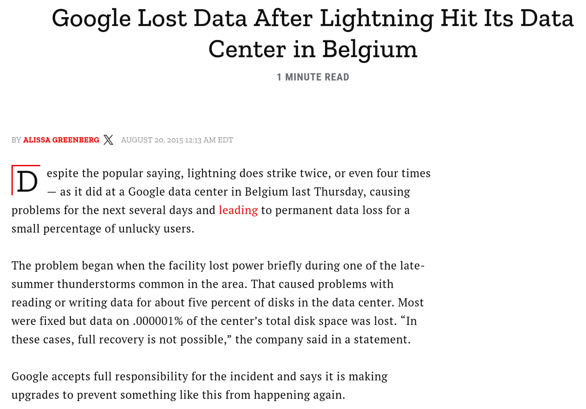

Notes:

-   https://time.com/4004192/google-data-lightning-belgium/

---

# 6.2 Hoge beschikbaarheid

---

## Wat is het 5x9 principe?

-   Wordt in het Engels the **Five Nines** genoemd
-   Systemen en services kennen een uptime van **99.999%**
    -   Ofwel: ze zijn beschikbaar in 99.999% van de tijd
    -   Concreet: downtime bedraagt minder dan 5 minuten 15.36 seconden per jaar

| Availability | Uptime (%) | Max downtime per year |
| ------------ | ---------- | --------------------: |
| five nines   | 99.999     |             5m 15.36s |
| four nines   | 99.99      |             52m 33.6s |
| three nines  | 99.9       |            8h 45m 36s |
| two nines    | 99         |        3 days 15h 36m |
| one nine     | 90         |           36 days 12h |

---

| Availability      | Max downtime per year | Max downtime per month | Max downtime per week | Max downtime per day |
| ----------------- | --------------------: | ---------------------: | --------------------: | -------------------: |
| **99.999% (5x9)** |         **5m 15.36s** |            **26.784s** |            **6.048s** |           **0.864s** |
| 99.995%           |             26m 16.8s |              2m 13.92s |                30.24s |                4.32s |
| 99.99 (4x9)%      |             52m 33.6s |              4m 27.84s |              1m 0.48s |                8.64s |
| 99.95%            |            4h 22m 48s |              22m 19.2s |               5m 2.4s |                43.2s |
| 99.9 (3x9)%       |            8h 45m 36s |              44m 38.4s |              10m 4.8s |             1m 26.4s |
| 99.5%             |         1 day 19h 48m |             3h 43m 12s |               50m 24s |               7m 12s |
| 99 (2x9)%         |        3 days 15h 36m |             7h 26m 24s |            1h 40m 48s |              14m 24s |
| 95%               |            18 days 6h |          1 day 13h 12m |                8h 24m |               1h 12m |
| 90 (1x9)%         |           36 days 12h |          3 days 2h 24m |               16h 48m |               2h 24m |

Notes:

-   Een jaar komt in deze berekeningen overeen met 365 dagen
-   Een maand komt in deze berekeningen overeen met 31 dagen

---

## Omgevingen met hoge beschikbaarheid (cruciale sectoren)

-   Financiële sector:
    -   Trading, diensten beschikbaar voor klant, vertrouwen van de klant
-   Gezondheidssector:
    -   Patiëntenzorg de klok rond
-   Industrie
    -   Fabrieken, assemblage, ...
-   Transportsector:
    -   NMBS, luchtvaart, ...

---

## Omgevingen met hoge beschikbaarheid (cruciale sectoren)

-   Openbare veiligheid:
    -   Brandweer, politie, leger, ...)
-   Nutsvoorzieningen:
    -   Energiecentrales, waterzuiveringsstations, ...
-   Telecom sector:
    -   Telefoon, internet, TV, ...
-   Retail industrie:
    -   Supply chains, leveren van producten, ...
    -   Denk aan de eindejaarsperiode

---

## Bedreigingen van de beschikbaarheid

-   Er zijn heel wat oorzaken van **verlies van beschikbaarheid**. Van het falen van systeem tot een natuurramp.
    -   System failure
    -   Niet-doelbewuste oorzaak
    -   Doelbewuste aanval
    -   Natuurramp

---

## Hoge beschikbaarheid

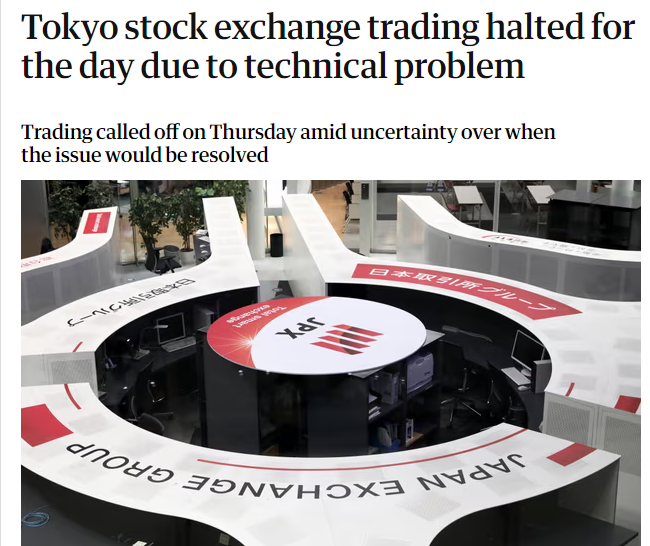

Notes:

-   https://www.nieuwsblad.be/cnt/dmf20200917_92485312
-   https://www.theguardian.com/world/2020/oct/01/tokyo-stock-exchange-trading-suspended-due-to-technical-problem

---

## Hoge beschikbaarheid

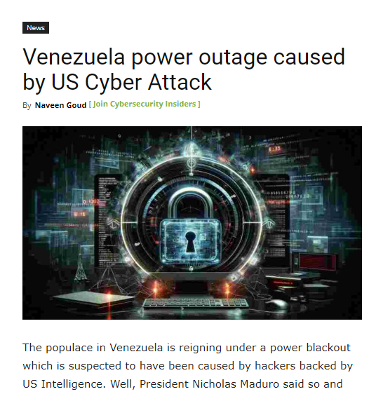

Notes:

-   https://www.cybersecurity-insiders.com/venezuela-power-outage-caused-by-us-cyber-attack/
-   https://www.hln.be/buitenland/flightradar-overbelast-iedereen-wil-luchtruim-oekraine-en-rusland-volgen~a5f6eaec/

---

## Hoge beschikbaarheid kan je bekomen door

-   Een zo hoog mogelijke **uptime** van diensten
    -   Door te mikken naar veel "nines" uit het 5x9 principe
-   **Redundantie** om **single points of failure** (SPoF) vermijden
-   **Robuuste** systemen te bouwen
-   Het **monitoren** van de systemen
-   Het maken van **backups**

---

### Vermijden SPoF

-   Single points of failure zijn de **zwakke schakels** die ervoor kunnen zorgen dat het ganse systeem faalt.

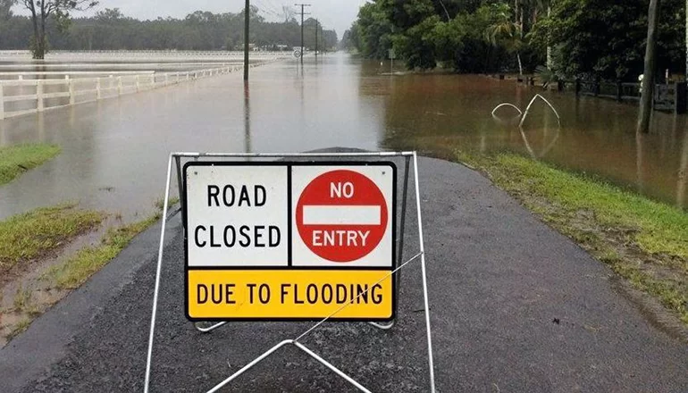

---

## Redundantie

-   Een **single point of failure** moet altijd vermeden worden.
    -   Hardware, data, processen, software, personeel, ... .
-   Oplossing: zorg je niet op **één element** vertrouwt.
-   Faalt een kritiek onderdeel?
    -   **Redundantie**: een reserve neemt over.
    -   Bv. meerdere load balancers voorzien (die eigenlijk allemaal hetzelfde doel hebben).

---

## Redundantie

-   **N+1 redundantie** zorgt ervoor dat systemen **beschikbaar blijven** als er eentje faalt.
-   Componenten (**N**) moeten steeds **minimum één backup** component hebben (**+1**)
    -   Bv. een auto heeft een reservewiel in de koffer voor als 1 van de 4 wielen faalt.

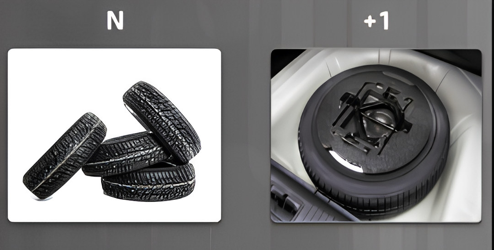

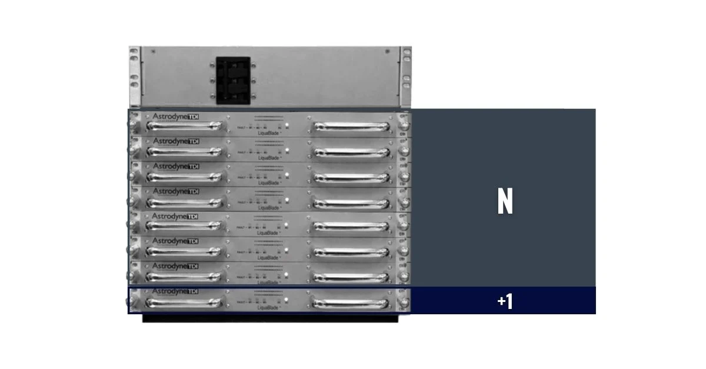

---

## Systemen zullen falen

-   Elk systeem zal ooit falen, wat dan?
-   Robuuste systemen hebben een **hoge tolerantie** voor **falen**.
    -   Bv. routing protocols in een netwerk: als een toestel faalt, wordt er automatisch een andere weg gezocht tussen A en B.
-   Robuustheid inbouwen is **meer dan enkel redundantie** voorzien.

Notes:

Een mooi voorbeeld van een hoge tolerantie is het internet. Berichten op het internet kunnen verschillende routes volgen. Als er een router wegvalt of een route beschadigd raakt, dan nemen de berichten een andere route. De verzender en ontvanger merken hier niets van. In het echte leven kan je dit vergelijken met een wegennetwerk. Zie https://www.youtube.com/watch?v=gQtgtKtvRdo voor enkele visualisaties.

---

## Systemen zullen falen

-   Meer en meer applicaties worden ontwikkeld mwaarbij men er van uit gaat dat de applicatie vroeg of laat kan **crashen**.
    -   Bv. video wordt hervat na connectie-verlies bij een video call.
    -   Bv. als je webbrowser crasht, kan je toch nog je openstaande tabs recupereren.
-   Ook bij het nemen van back-ups of rond het beheer van schijven (storage) zijn er systemen die **self-healing** zijn zoals ZFS
    -   zie semester 2.

---

## Monitoring

-   Problemen (**failures**) **detecteren** wanneer ze zich voordoen.
-   Meldingen (**alerts**) weergeven op communicatieplatformen
    -   Discord, Microsoft Teams, Slack, ...
-   **Visualisatie**
    -   Vrije ruimte op harde schijven
    -   Temperaturen van fysieke machines
    -   CPU/memory load
    -   ...

---

## Monitoring

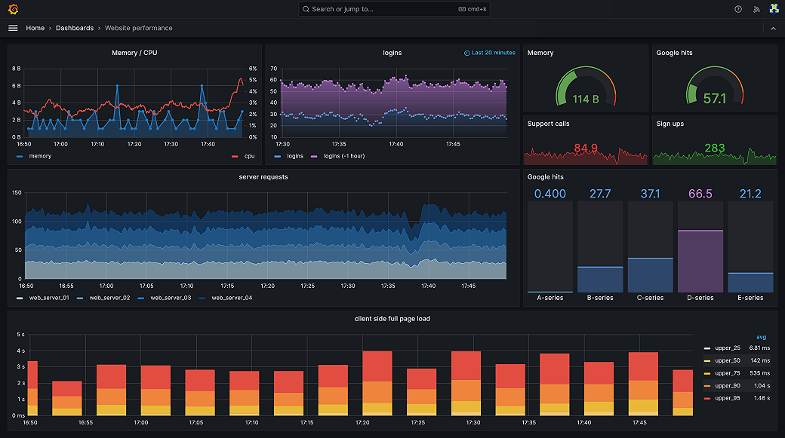

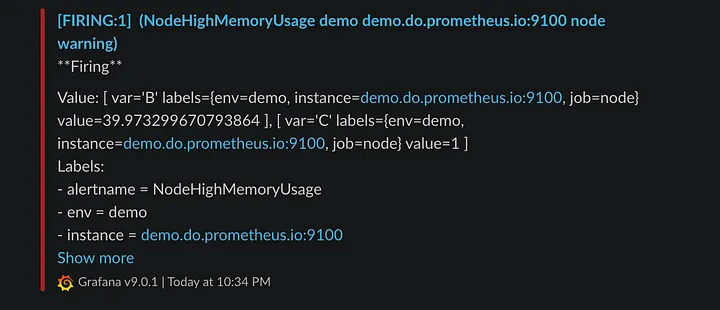

---

# 6.3 Back-ups

---

## Waarom backups nemen?

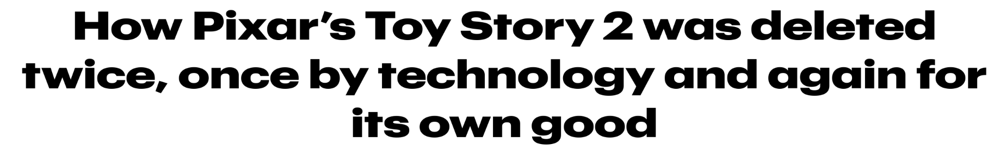
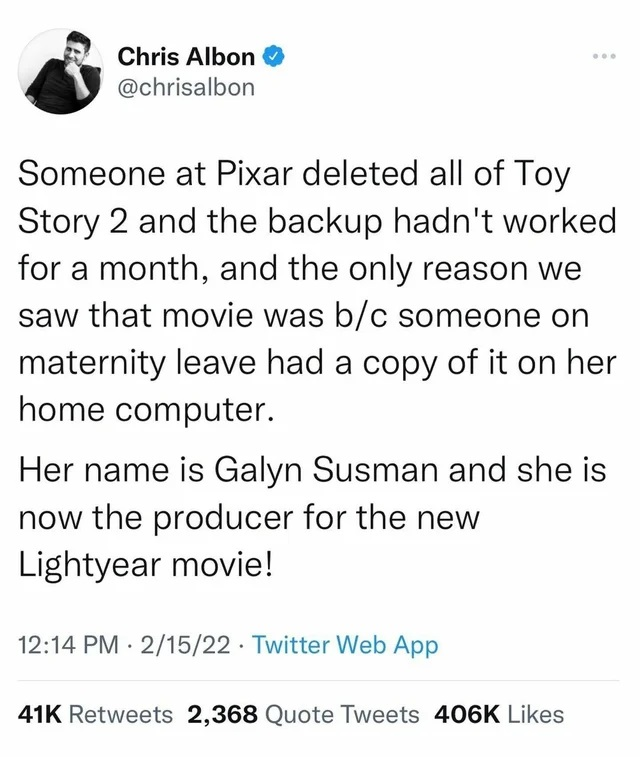

---

> The command that had been run was most likely `rm -r -f *`. [...] Unfortunately, someone on the system had run the command at the **root** level of the Toy Story 2 project
>
> **90%** of the movie had been deleted by the stray command.
>
> Pixar, at the time, did **not** continuously **test** their backups.
>
> Susman [...] had given birth to her son Eli shortly before, and had been working from home. [...] she had a [...] workstation at her house [...] and it was loaded up with a **full copy** of the movie.
>
> ~ Oren Jacob, former Chief Technical Officer of Pixar - then an associate technical director for Toy Story 2

Notes:

-   https://thenextweb.com/news/how-pixars-toy-story-2-was-deleted-twice-once-by-technology-and-again-for-its-own-good

---

## Neem jij back-ups?

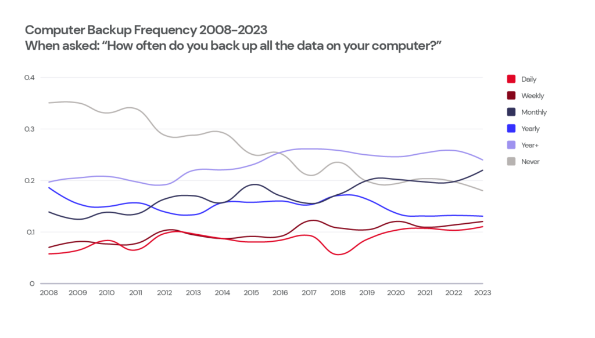

Notes:

-   https://www.backblaze.com/blog/2024-state-of-the-backup-security-incidents-and-data-loss-on-the-rise/

---

## De 3-2-1-regel

-   **Minstens 3** kopieën
-   Op **minstens 2** verschillende media
-   Waarvan **minstens 1** op een andere locatie
-   Meer mag altijd!

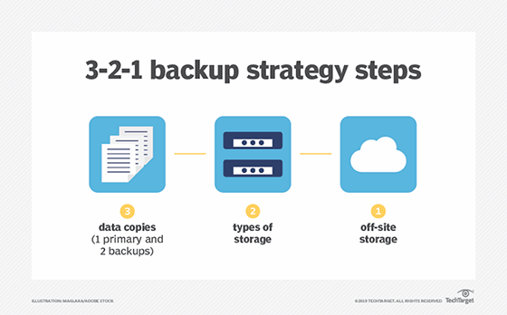

Notes:

-   https://www.seagate.com/be/nl/blog/what-is-a-3-2-1-backup-strategy/
-   https://www.backblaze.com/blog/the-3-2-1-backup-strategy/
-   https://www.rubrik.com/insights/understanding-the-3-2-1-backup-rule
-   https://www.veeam.com/blog/321-backup-rule.html

---

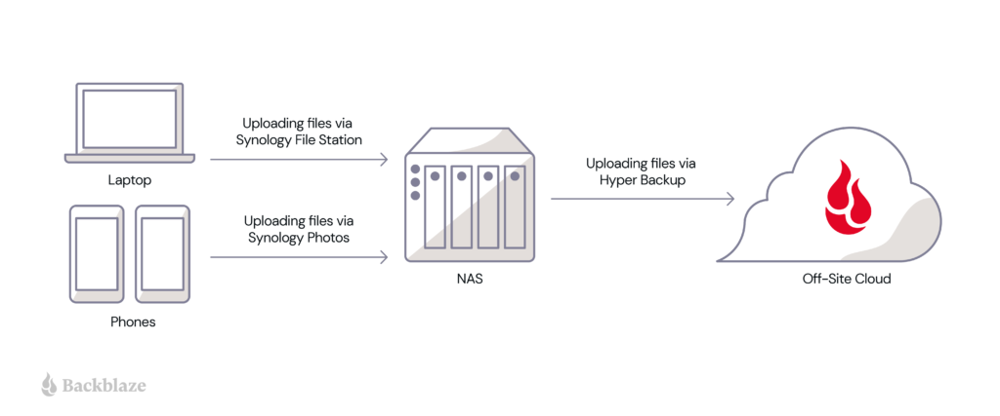

Notes:

-   Bv. https://www.backblaze.com/blog/a-tale-of-two-nas-setups-part-one-easy-off-site-backups/

---

Voorbeeld:

-   1 kopie op laptop
-   1 kopie op een NAS
-   1 kopie op de cloud

Strategie:

-   1 + 1 + 1 = 3 kopieën
-   Laptop / NAS / cloud = 2+ verschillende media
-   Cloud = 1 off-site media

---

## Varianten op de 3-2-1-regel

-   3-2-1 regel is uitgevonden voor cloud storage bestond.
    -   1 of meer van de kopieën was vroeger bijna sowieso steeds offline
    -   Als alles verbonden is, kan het ook beschadigd worden
        -   Bv. ransomware &rarr; laptop, NAS, cloud, ...
    -   :warning: **Synchronisatie &ne; back-up**
-   Nog steeds een goede leidraad
    -   Beter 3-2-1 dan geen back-ups!

---

## Varianten op de 3-2-1-regel

-   3-2-1-1-0
    -   **1** van de kopieën moet offline staan zonder enige verbinding (**air gapped**).
        -   Net als toen de cloud nog niet bestond.
    -   Verifiëer de kopieën: ze mogen **0 (geen)** fouten bevatten.
        -   :warning: **Test** de back-ups zelf en het herstellen van back-ups!
-   4-3-2
    -   4 kopieën, minstens 3 verschillende media, minstens 2 ander locaties
    -   Vooral voor gespecialiseerde bedrijven

Notes:

-   https://www.backblaze.com/blog/whats-the-diff-3-2-1-vs-3-2-1-1-0-vs-4-3-2/

---

## Welke media

-   Tapes
-   HDD
-   SSD
-   USB
-   CD/DVD/Blu-ray
-   NAS
-   Cloud

---

## HDD

-   Kan niet tegen schokken of magnetisme.
-   Hot storage:
    -   Datacenters houden statistieken bij over welk HDD's (niet) lang meegaan
        -   Welk model, welk merk, grootte, ...
        -   https://www.backblaze.com/cloud-storage/resources/hard-drive-test-data
    -   Voorlopige cijfers geven een gemiddelde levensduur van 6 a 7 jaar
-   Cold storage:
    -   Geen exacte cijfers: +/- 5 jaar max?
-   Bekijk de **S.M.A.R.T. waarden**

Notes:

-   https://www.backblaze.com/blog/how-long-do-disk-drives-last/
-   https://www.backblaze.com/blog/hard-drive-life-expectancy/
-   https://www.backblaze.com/blog/whats-the-diff-hot-and-cold-data-storage/
-   https://www.backblaze.com/blog/what-smart-stats-indicate-hard-drive-failures/

---

## HDD

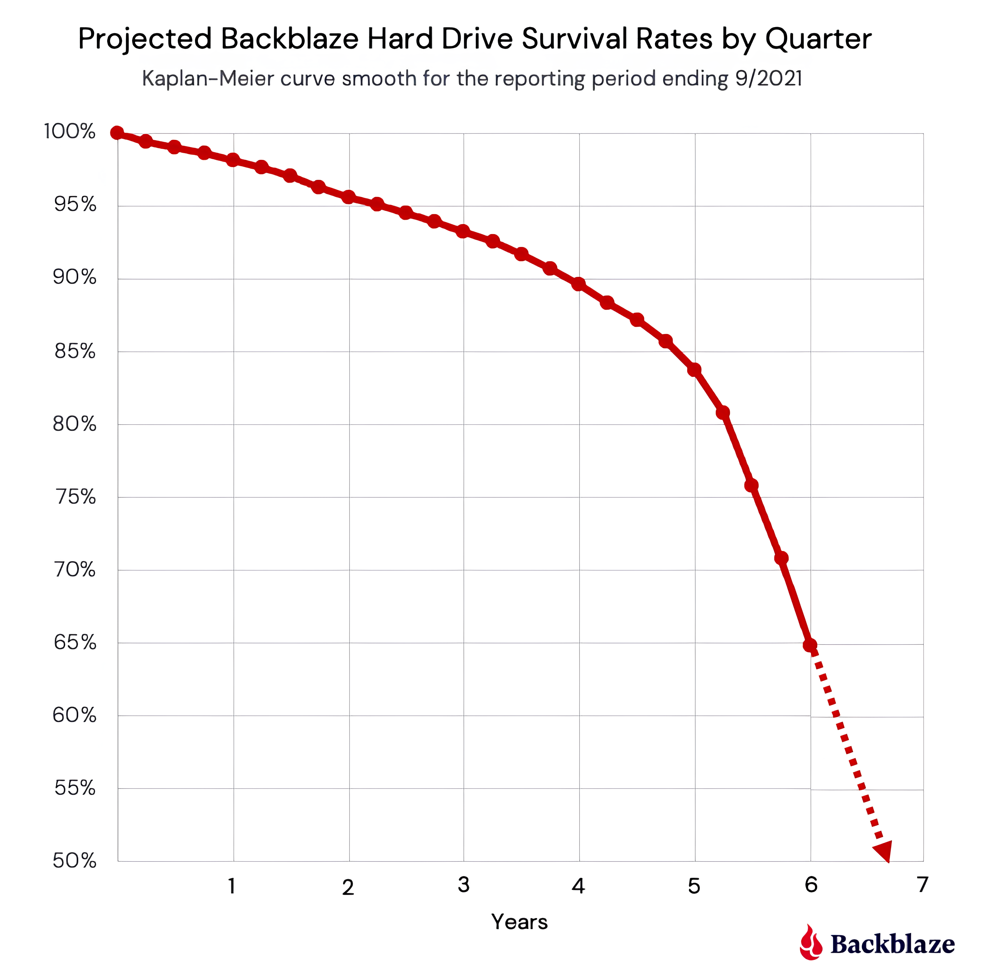

---

## SSD

-   Beperkt aantal writes en kan niet goed tegen hoge temperaturen
-   Hot storage:
    -   Datacenters houden ook over SSD's statistieken bij
    -   Technologie is nieuw: nog geen harde conclusies t.o.v. HDD's
-   Cold storage:
    -   Alweer geen exacte cijfers
    -   Best sowieso jaarlijks eens aansluiten tegen bit rot volgens JEDEC standaard
-   Bekijk de **S.M.A.R.T. waarden**
    -   Andere dan bij HDD's
    -   Kijk zelf met https://crystalmark.info/en/software/crystaldiskinfo/
        -   Zowel voor HDD's als SSD's

---

## HDD vs. SSD

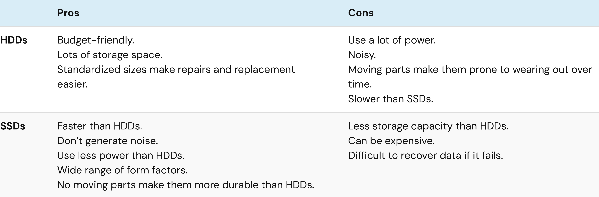

Notes:

-   https://www.backblaze.com/blog/hdd-versus-ssd-whats-the-diff/

---

## NAS = Network attached storage

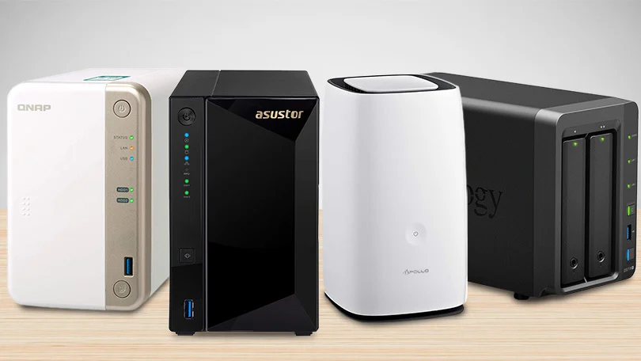

---

## Cloud

-   Handig voor off-site back-ups
-   Automatisch
    -   Hoeft er niet aan te denken om een back-up te nemen
-   Wat met privacy / kost?
    -   Let op met "free tiers"
    -   Als je niet betaald, kan jouw data het product zijn
-   Synchronisatie is geen back-up!
    -   Ransomware wordt gesynct
    -   Verwijderingen worden niet tegengehouden
    -   Nood aan "**immutability** of data"
-   Cloud kan on-/off-prem geïnstalleerd worden
    -   Ook gekend als on-/off-site.

Notes:

-   Tip: experimenteer gerust met jouw Terabyte op OneDrive via je school account.
-   https://www.backblaze.com/blog/3-2-1-backup-best-practices-using-the-cloud/
-   Kosten:
    -   https://www.backblaze.com/blog/free-isnt-always-free-a-guide-to-free-cloud-tiers/
    -   https://www.backblaze.com/blog/free-cloud-storage-whats-the-catch/
-   Synchronisatie is geen backup:
    -   https://www.backblaze.com/blog/business-cloud-backup-vs-cloud-sync/
    -   https://www.backblaze.com/blog/the-case-for-backup-over-sync/
    -   https://www.backblaze.com/blog/cloud-backup-vs-cloud-sync/

---

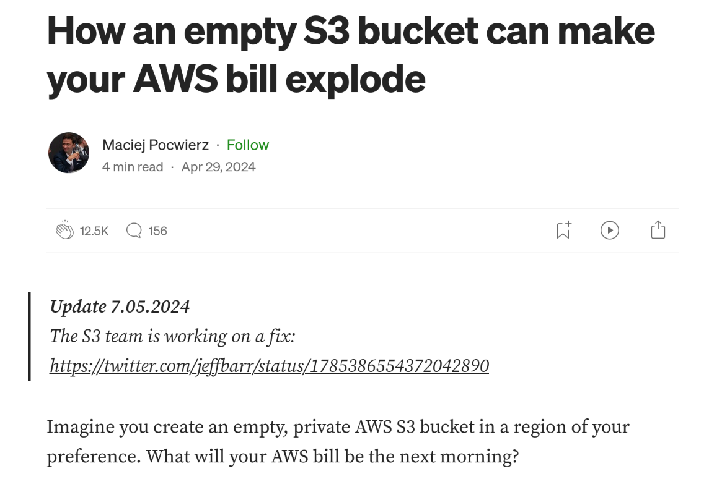
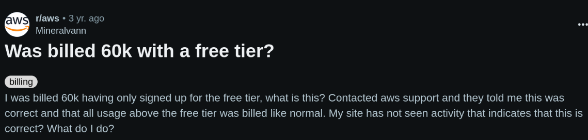

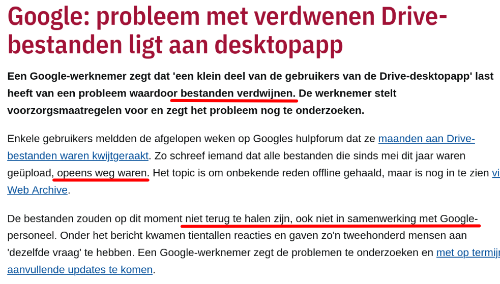
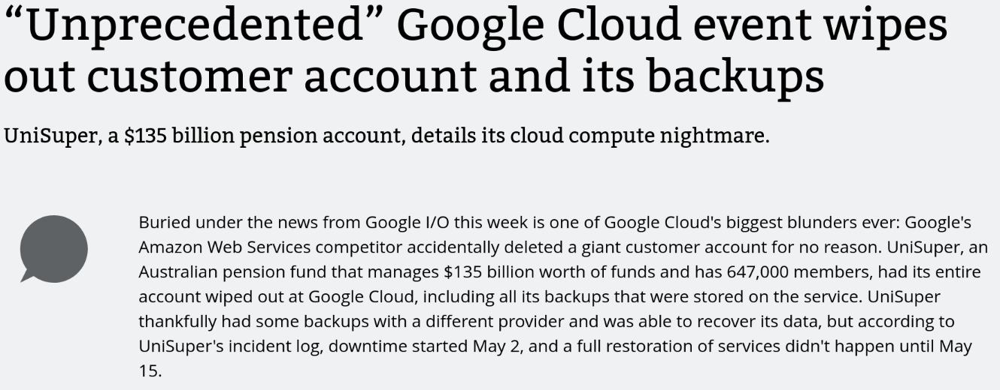

Notes:

-   https://medium.com/@maciej.pocwierz/how-an-empty-s3-bucket-can-make-your-aws-bill-explode-934a383cb8b1
-   https://www.reddit.com/r/aws/comments/qgr9jh/was_billed_60k_with_a_free_tier/
-   https://www.reddit.com/r/aws/comments/lbqcos/my_forgotten_account_has_a_20000_bill_how_screwed/
-   How one mistake increased my AWS bill 525,000x: https://www.youtube.com/watch?v=wR5FduIqGy0
-   https://tweakers.net/nieuws/216070/google-probleem-met-verdwenen-drive-bestanden-ligt-aan-desktopapp.html
-   https://arstechnica.com/gadgets/2024/05/google-cloud-accidentally-nukes-customer-account-causes-two-weeks-of-downtime/

---

## Hoeveel back-ups bijhouden en hoe lang?

-   Je houdt best **meerdere** back-ups over **langere tijd** bij
    -   Je hebt niet altijd door wanneer er fouten of malware in je back-ups zitten
    -   Je wil zo ver kunnen terugkeren in de back-ups als nodig om een correcte kopie van een beschadigd bestand terug te vinden

---

## Incrementele back ups

-   **Automatiseer** back-ups zodat je deze niet vergeet!
-   **Full** back-up
    -   Telkens opnieuw de volledige inhoud opslaan (copy-paste)
    -   Verbruikt veel tijd en ruimte
-   **Incrementele** back-ups
    -   Houdt 1 kopie bij, samen met alle verschillen ("delta's") die later gebeurd zijn
    -   Bespaart veel tijd en ruimte
    -   Maakt het mogelijk om bv. 30 wekelijkse back-ups + 20 maandelijkse + 5 jaarlijkse kopieën bij te houden.

Notes:

-   https://www.backblaze.com/blog/whats-the-diff-full-incremental-differential-and-synthetic-full-backups/

---

## Incrementele back ups

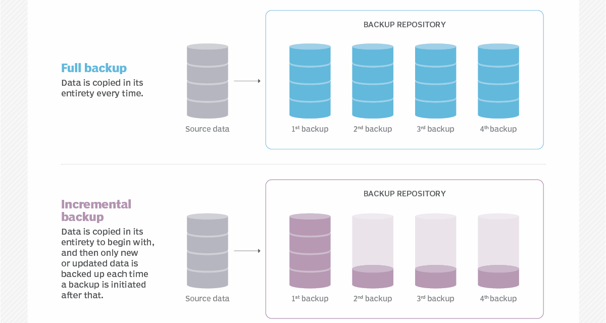

---

## Test de back-ups!

-   :warning: Test dat
    -   De backups worden gemaakt
    -   De data correct herstelt wordt van de backups

> Is it really a backup if you haven't attempted to restore?  
> Untested backup == no backup

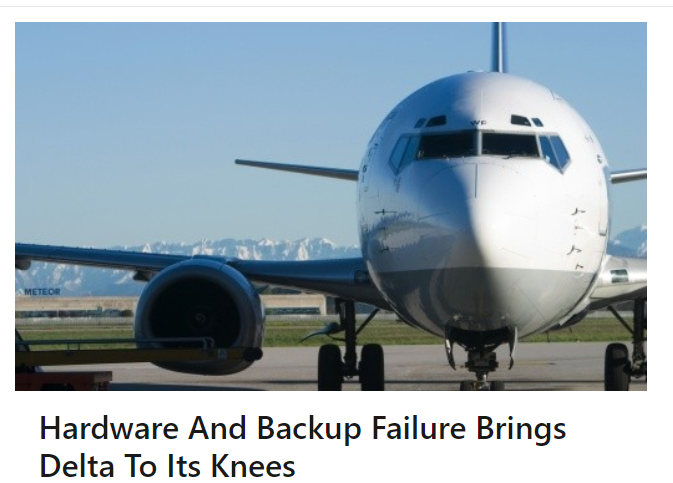

Notes:

-   https://www.linkedin.com/pulse/hardware-backup-failure-brings-delta-its-knees-trevor-dierdorff

---

## Heb je wel alles geback-upt?

-   Smartphones
    -   SMS, ...
-   Tablets
-   USB-sticks, CD's, DVD's, videocassettes, ...
-   Social media (bv. foto's en bestanden in chats, ...)
    -   Facebook, Whatsapp, Discord, ...
-   Cloud
    -   Google drive, OneDrive, Dropbox, MEGA, ...
-   E-mails

Notes:

-   https://www.backblaze.com/blog/a-guide-for-the-family-it-manager/
-   https://www.backblaze.com/blog/how-to-back-up-your-android/
-   https://www.backblaze.com/blog/how-to-back-up-and-restore-whatsapp-messages-and-files/
-   https://www.backblaze.com/blog/saving-your-uncles-data-how-to-back-up-a-social-media-profile/

---

<!--
- https://www.canada.ca/en/conservation-institute/services/preventive-conservation/guidelines-collections/caring-audio-video-data-recording-media.html
- https://www.canada.ca/en/conservation-institute/services/care-objects/electronic-media/cd-formats-longevity-faq.html
- https://www.canada.ca/en/conservation-institute/services/care-objects/electronic-media/computer-hard-disks-diskettes-faq.html
- https://www.digitalpreservation.gov/personalarchiving/index.html
- https://www.digitalpreservation.gov/personalarchiving/documents/PA_All_brochure.pdf
-->
