# H7: certificaten

---

# 7.1 Waarom nood aan certificaten?

---

## Problemen

-   Symmetrische encryptie
    -   **(!)** Je moet fysiek afspreken om sleutel uit te wisselen
-   Asymmetrische encryptie
    -   **(!)** Je moet de juiste publieke sleutel kunnen bemachtigen
    -   Wat bij een MitM attack?
        -   Een hacker onderschept een publieke sleutel, vervangt deze door zijn eigen publieke sleutel en stuurt deze door
        -   Niemand heeft door dat een hacker de geëncrypteerde data kan aflezen
        -   Hoe kunnen we **garanderen** dat een **publieke sleutel bij een bepaalde persoon of organisatie hoort**?

---

<iframe width="1280" height="720" src="https://www.youtube.com/embed/5rT6fZUwhG8?si=9Spu6o9Z1Mm1ZuZ1" title="YouTube video player" frameborder="0" allow="accelerometer; autoplay; clipboard-write; encrypted-media; gyroscope; picture-in-picture; web-share" referrerpolicy="strict-origin-when-cross-origin" allowfullscreen></iframe>

_Van begin tot 5m02s_

---

# 7.2 De oplossing: certificaten

---

## Certificaten: een digitaal paspoort

-   Iedereen vertrouwt een 3e persoon of organisatie
    -   De **Certificate Authority** (CA)
-   Deze deelt "**identiteitskaarten**" oftewel **certificaten** uit
-   Dankzij de identiteitskaart/certificaat kan iemand bewijzen dat hij of zij daadwerkelijk die persoon is
-   Geen geldige identiteitskaart/certificaat? **Niet te vertrouwen!**

---

-   Bv. iedereen vertrouwt de overheid
    -   Inloggen met identiteitskaart op overheidswebsites, tonen bij politiecontroles, afgeven bij het stemmen, ...
    -   Bewijst dat je een Belgische staatsburger bent

<div class="multicolumn">
<div>

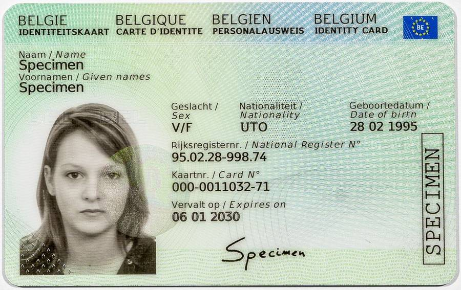

</div>
<div>

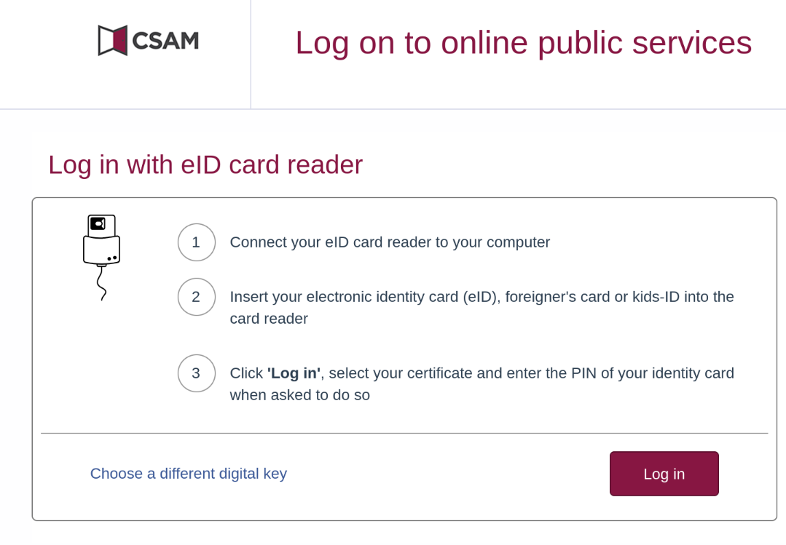

</div>
</div>

Notes:

-   https://www.ibz.rrn.fgov.be/nl/identiteitsdocumenten/eid/
-   https://eid.belgium.be/nl

---

-   Bv. iedereen vertrouwt HOGENT
    -   studentenkaart voor goedkoper eten in resto, afgeven tijdens examens, uitlenen bibliotheek, toegang fietsenstallingen, printen op campus, studentenkortingen voor o.a. bioscoop, ...
    -   Bewijst dat je een student aan HOGENT bent

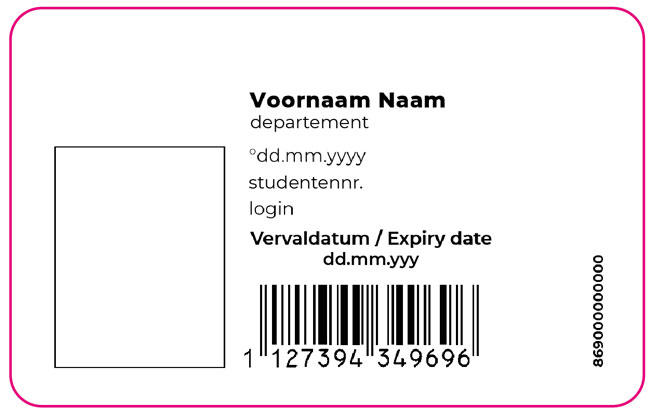
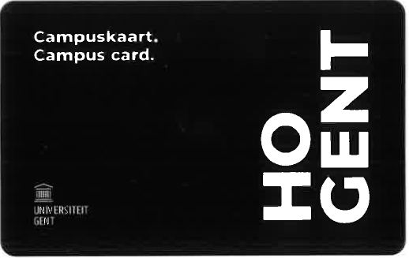

Notes:

-   https://www.hogent.be/student/een-vlotte-start/studentenkaart/
-   https://www.ugent.be/student/nl/administratie/studentenkaart

---

-   Bv. iedereen vertrouwt jouw bank
    -   Met bankkaart kan je jouw rekening bekijken, geld afhalen, geld overschrijven, online betalen, ... .
        -   Je kan zelfs geld afhalen aan bankautomaten van andere banken.
    -   Bewijst dat je de eigenaar bent van een specifieke rekening bij een bepaalde bank.

<div class="multicolumn">
<div>

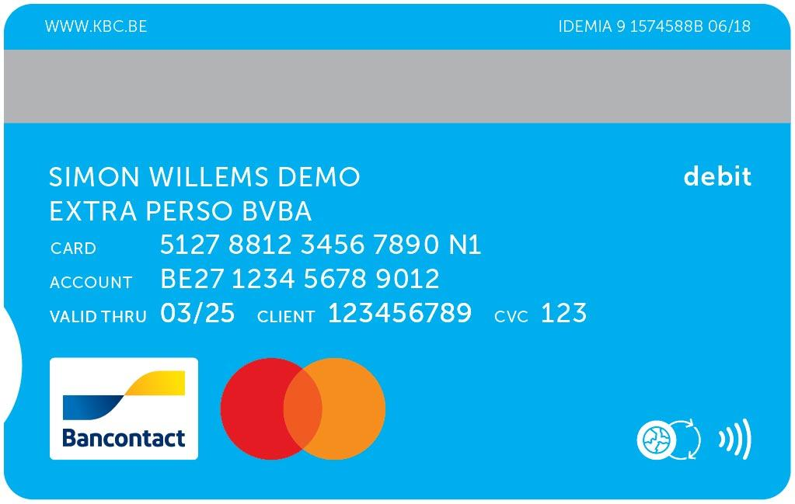

</div>
<div>

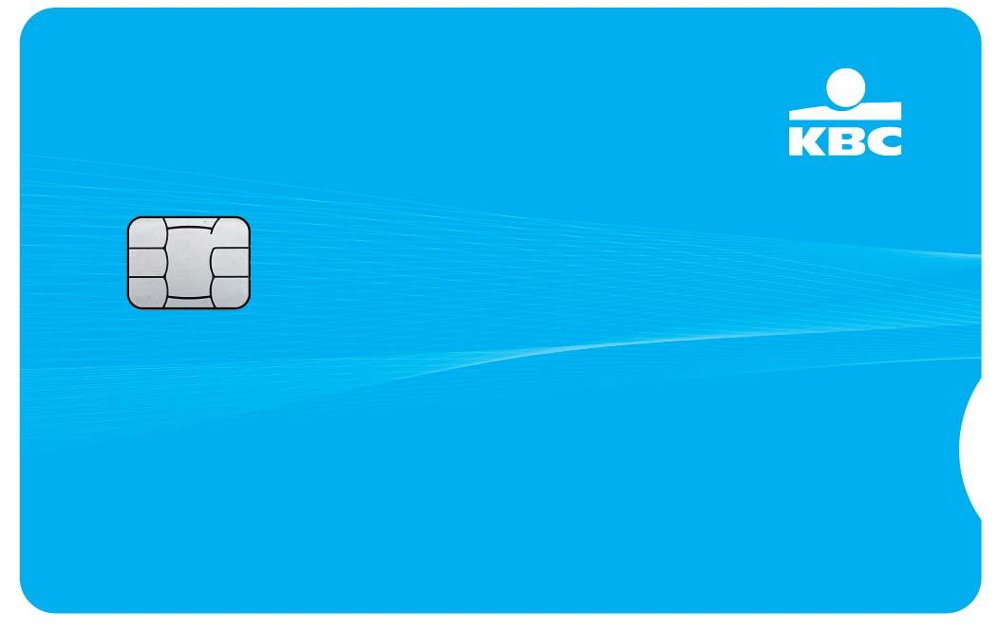

</div>
</div>

Notes:

-   https://www.kbc.be/particulieren/nl/betalen/betaalkaarten/debetkaarten/bankkaart.html

# 7.3 Certificate authorities

---

## Hoe doen we dit online?

-   Online werken we met **Certificate Authorities** (CA's) als 3e vertrouwenspersoon/-organisatie
-   CA genereert **certificaten** (== digitale identiteitskaarten) voor gebruikers die dit aanvragen
    -   Gebruikers kunnen **elkaar controleren** via deze certificaten of ze daadwerkelijk met de gewenste persoon communiceren
    -   Een certificaat koppelt een **publieke sleutel** van een gebruiker aan zijn **identiteit**.
        -   M.a.w. "_Dit is mijn publieke sleutel en je kan het controleren bij de CA via mijn certificaat_"

---

-   Certicaten aanvragen, maken en verifiëren gebeurt allemaal met **asymmetrische encryptie**
    -   **Iedereen** (CA's en gebruikers) heeft dus een asymmetrisch sleutelpaar (**publieke en private sleutel**) nodig!

---

## Hoe ziet een certificaat er uit?

-   Een certificaat is een digitaal ondertekend tekstbestand
-   Het structuur van het tekstbestand is vastgelegd volgens de **X.509 standaard**

---

```text
Certificate:
    Data:
        Version: 3 (0x2)
        Serial Number:
            72:14:11:d3:d7:e0:fd:02:aa:b0:4e:90:09:d4:db:31
        Signature Algorithm: sha256WithRSAEncryption
        Issuer: C=US, ST=Texas, L=Houston, O=SSL Corp, CN=SSL.com EV SSL Intermediate CA RSA R3
        Validity
            Not Before: Apr 18 22:15:06 2019 GMT
            Not After : Apr 17 22:15:06 2021 GMT
        Subject: C=US, ST=Texas, L=Houston, O=SSL Corp/serialNumber=NV20081614243, CN=www.ssl.com/postalCode=77098/businessCategory=Private Organization/street=3100 Richmond Ave/jurisdictionST=Nevada/jurisdictionC=US
        Subject Public Key Info:
            Public Key Algorithm: rsaEncryption
                RSA Public-Key: (2048 bit)
                Modulus:
                    00:ad:0f:ef:c1:97:5a:9b:d8:1e ...
                Exponent: 65537 (0x10001)
        X509v3 extensions:
            X509v3 Authority Key Identifier:
                keyid:BF:C1:5A:87:FF:28:FA:41:3D:FD:B7:4F:E4:1D:AF:A0:61:58:29:BD

            Authority Information Access:
                CA Issuers - URI:http://www.ssl.com/repository/SSLcom-SubCA-EV-SSL-RSA-4096-R3.crt
                OCSP - URI:http://ocsps.ssl.com

            X509v3 Subject Alternative Name:
                DNS:www.ssl.com, DNS:answers.ssl.com, DNS:faq.ssl.com, DNS:info.ssl.com, DNS:links.ssl.com, DNS:reseller.ssl.com, DNS:secure.ssl.com, DNS:ssl.com, DNS:support.ssl.com, DNS:sws.ssl.com, DNS:tools.ssl.com
            X509v3 Certificate Policies:
                Policy: 2.23.140.1.1
                Policy: 1.2.616.1.113527.2.5.1.1
                Policy: 1.3.6.1.4.1.38064.1.1.1.5
                  CPS: https://www.ssl.com/repository

            X509v3 Extended Key Usage:
                TLS Web Client Authentication, TLS Web Server Authentication
            X509v3 CRL Distribution Points:

                Full Name:
                  URI:http://crls.ssl.com/SSLcom-SubCA-EV-SSL-RSA-4096-R3.crl

            X509v3 Subject Key Identifier:
                E7:37:48:DE:7D:C2:E1:9D:D0:11:25:21:B8:00:33:63:06:27:C1:5B
            X509v3 Key Usage: critical
                Digital Signature, Key Encipherment
            CT Precertificate SCTs:
                Signed Certificate Timestamp:
                    Version   : v1 (0x0)
                    Log ID    : 87:75:BF:E7:59:7C:F8:8C:43:99 ...
                    Timestamp : Apr 18 22:25:08.574 2019 GMT
                    Extensions: none
                    Signature : ecdsa-with-SHA256
                                30:44:02:20:40:51:53:90:C6:A2 ...
                Signed Certificate Timestamp:
                    Version   : v1 (0x0)
                    Log ID    : A4:B9:09:90:B4:18:58:14:87:BB ...
                    Timestamp : Apr 18 22:25:08.461 2019 GMT
                    Extensions: none
                    Signature : ecdsa-with-SHA256
                                30:45:02:20:43:80:9E:19:90:FD ...
                Signed Certificate Timestamp:
                    Version   : v1 (0x0)
                    Log ID    : 55:81:D4:C2:16:90:36:01:4A:EA ...
                    Timestamp : Apr 18 22:25:08.769 2019 GMT
                    Extensions: none
                    Signature : ecdsa-with-SHA256
                                30:45:02:21:00:C1:3E:9F:F0:40 ...
    Signature Algorithm: sha256WithRSAEncryption
         36:07:e7:3b:b7:45:97:ca:4d:6c ...
```

---

## Certificaten aanvragen

1. De gebruiker **genereert** een certificate signing request (CSR).
    - Bevat zijn publieke sleutel
    - Bevat zijn informatie (zijn identiteit): naam, adres, ...

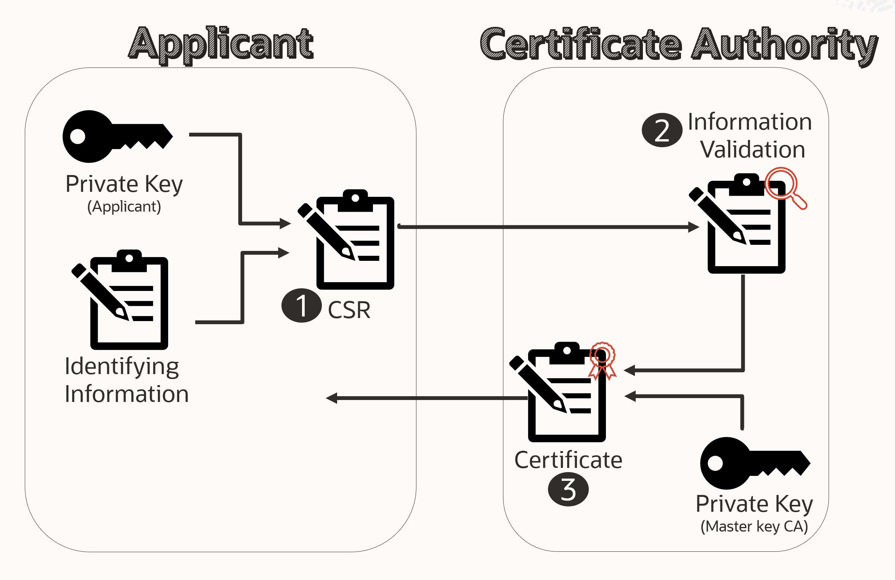

---

2. De CA ontvangt de CSR en **controleert** de identiteit van de gebruiker aan de hand van de informatie in de CSR.


---

3. De CA creëert het gevraagd certificaat en **ondertekent** dit met zijn private sleutel.
    - Het certificaat is nu 100% zeker afkomstig van de CA
    - Indien het certificaat vervalst wordt, wordt de handtekening ongeldig (en dus ook het certificaat)


---

## Kortom

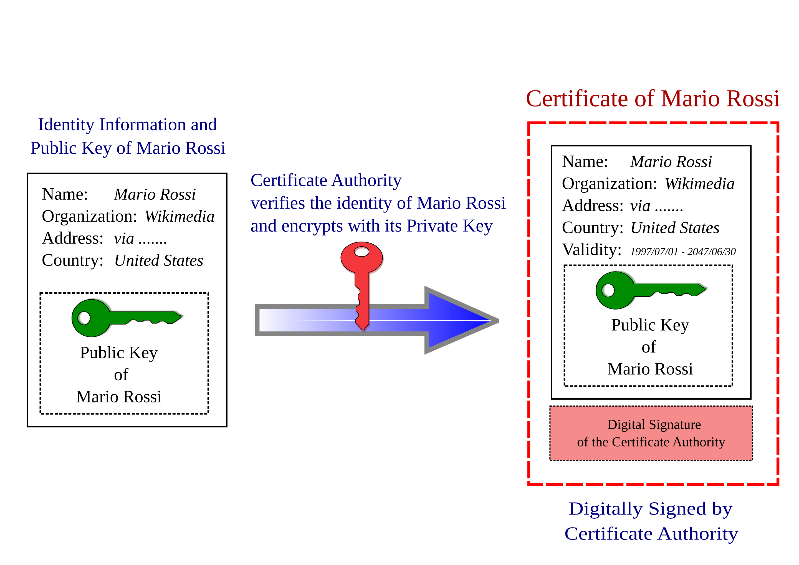

---

## Certificaten verifiëren

-   Alice wil een geëncrypteerd bericht versturen naar Bob
-   In H4 stuurde Bob simpelweg zijn publieke key door
    -   **(!)** Dit kan onderschept en vervalst worden!
-   In plaats van de publieke sleutel, stuurt Bob beter zijn **certificaat** naar Alice
    -   Het certificaat bevat de publieke sleutel en is ondertekend door de CA.

---

-   Het certificaat is ondertekend met de private sleutel van de CA
    -   Alice kan de **geldigheid** dus nagaan dankzij de publieke sleutel van de CA
        -   Indien geldig: de publieke sleutel in het certificaat is volgens de CA inderdaad van Bob
        -   **(!)** Indien niet geldig: Bob is niet wie hij zegt dat hij is!
            -   Mogelijks een **MitM** aanval!
-   Alice kan nu ook indien gewenst haar certificaat geven aan Bob
    -   Bob kan dan ook op dezelfde manier achterna gaan of hij daadwerkelijk met Alice praat

Notes:

-   Eigenlijk worden er hashes gebruikt van de certificaten. Meer details vind je op volgende links:
    -   https://www.juniper.net/documentation/us/en/software/junos/vpn-ipsec/topics/concept/pki-security-overview.html .
    -   https://cheapsslsecurity.com/blog/digital-signature-vs-digital-certificate-the-difference-explained/

---

## De publieke sleutel van de CA

-   Hoe geraken gebruikers aan de publieke sleutel van de CA?
    -   Is dit ook niet onderhevig aan een mogelijke MitM aanval?
-   Wie ondertekent het certificaat van de CA zelf?

---

## Verspreiden van CA certificaten

-   CA-certificaten worden geïnstalleerd samen met programma's die gebruik maken van certificaten
    -   OS, web browsers (HTTPS), VPN clients, SSH clients, ... .
-   Gebruik je een eigen CA, dan moet je deze manueel toevoegen
    -   Anders krijg je een gelijkaardige fout als deze:

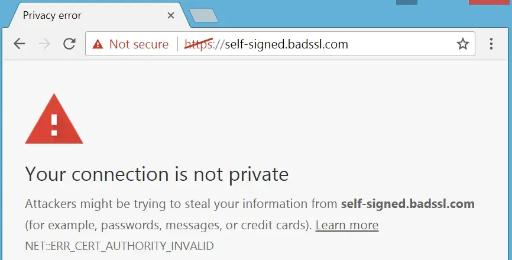

---

## Bv. Windows

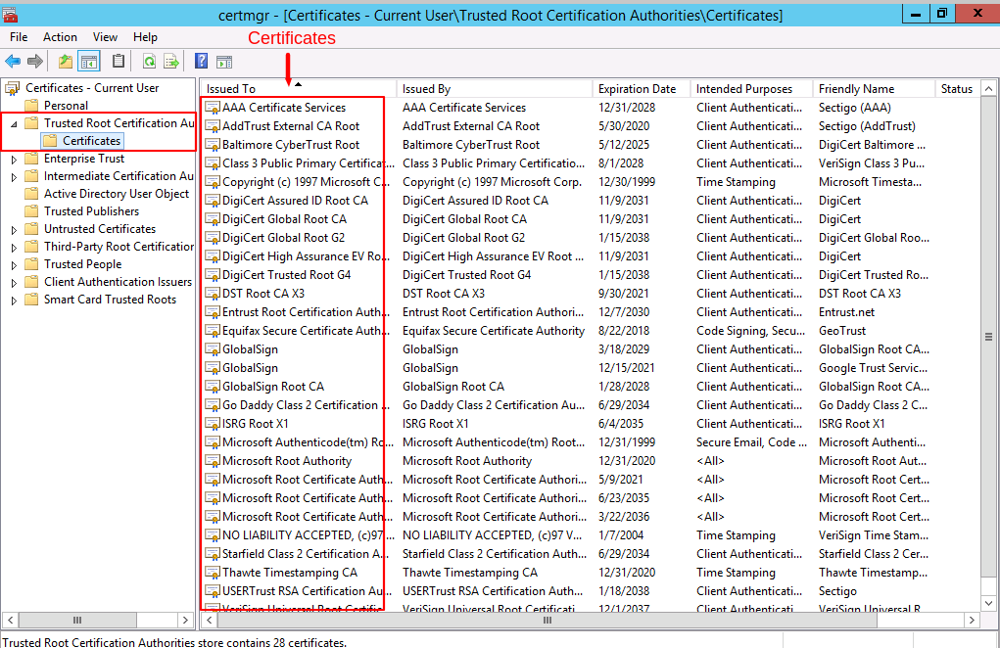

---

## Bv. Firefox

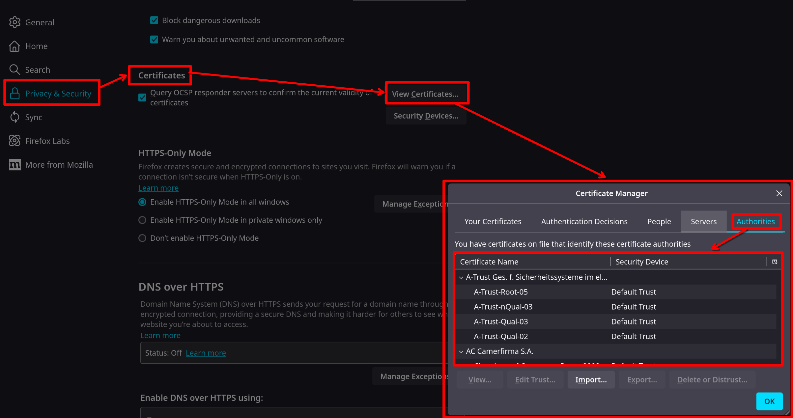

---

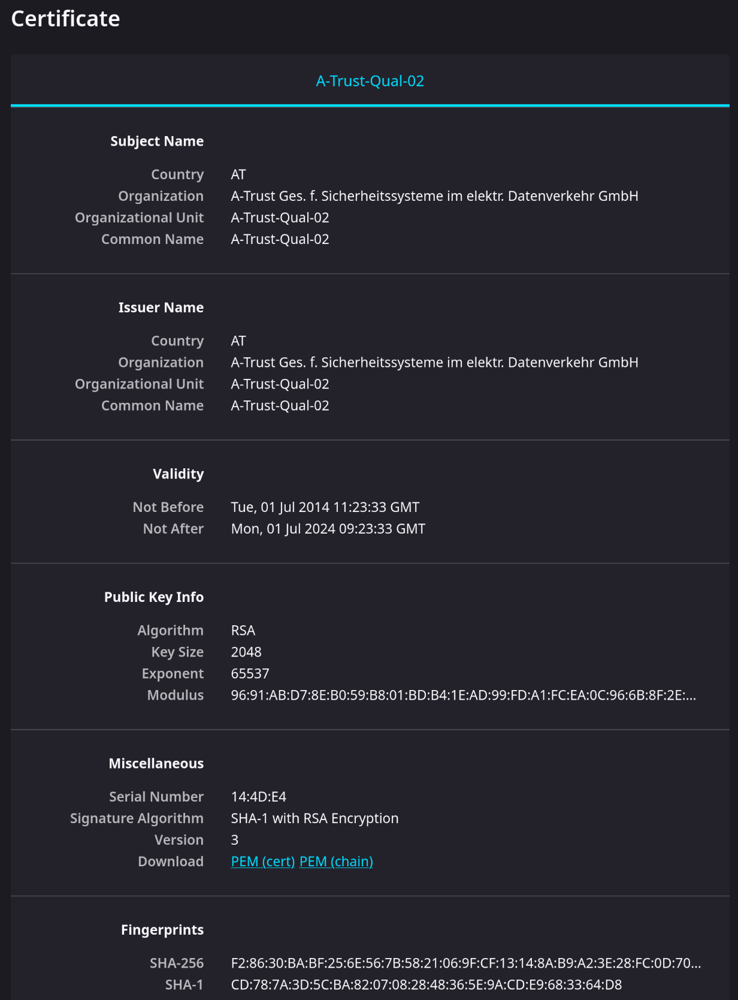

---

## Bv. Chrome

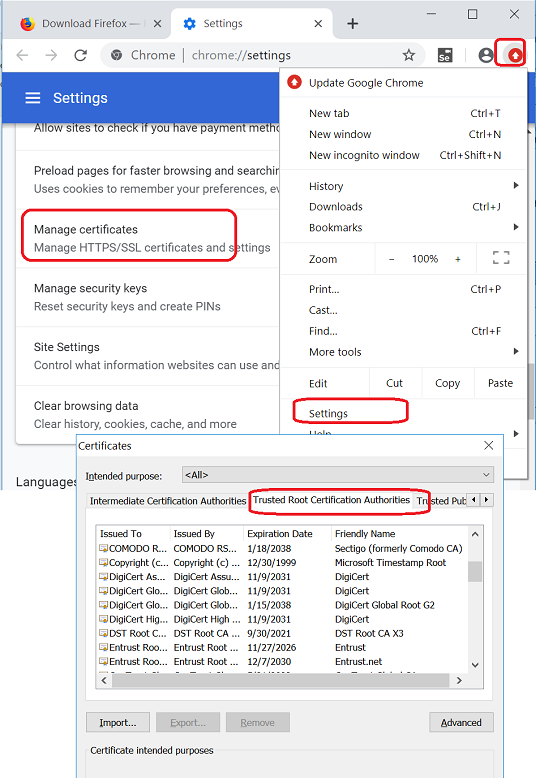

---

<iframe width="1280" height="720" src="https://www.youtube.com/embed/5rT6fZUwhG8?si=vu7XqAO51xRA6YB_&amp;start=303" title="YouTube video player" frameborder="0" allow="accelerometer; autoplay; clipboard-write; encrypted-media; gyroscope; picture-in-picture; web-share" referrerpolicy="strict-origin-when-cross-origin" allowfullscreen></iframe>

_Van 5m03s tot eind_

---

# 7.4 Toepassing: HTTPS

---

# 7.5 Toepassing: VPN

---

# 7.5 Toepassing: SSH

---
