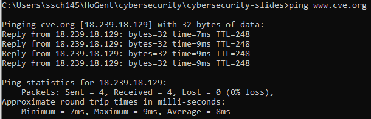
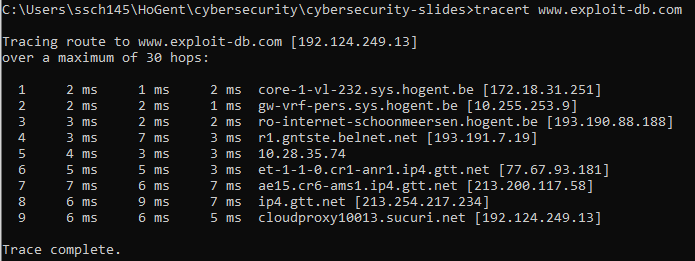
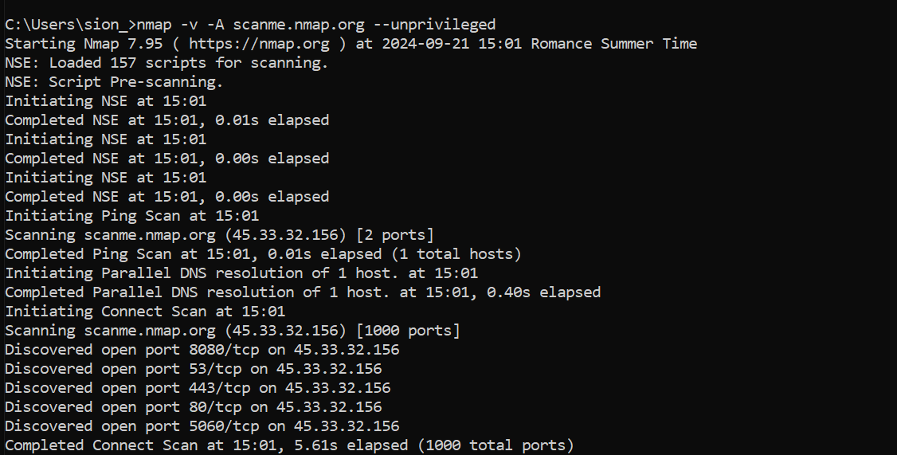

# Cybersecurity

## H8: Red Team.

---

# 8.1 Taak van het Red Team

---

## Taak van het Red Team

- Proberen inbreken
- Verdediging testen
- **Zwakke punten blootleggen**

Notes:
- Niet enkel in cyberspace: Red Team kan bijvoorbeeld in gebouwen proberen binnenraken, papieren stelen, veiligheidscamera's onschadelijk maken...
- Legaal, en in dienst van de organisatie die ze aanvallen
- De verdediging wordt het "Blue Team" genoemd
- Deze legale hackers worden ook "White hat hackers" genoemd. Illegale hackers met slechte bedoelingen zijn "Black hat", en hackers die soms wetten negeren maar niet per se slechte bedoelingen hebben zijn "Grey hats"

---

# 8.2 De 5 fasen

---

## De 5 fasen

- Reconnaissance: Onopvallend **informatie** verzamelen
- Scanning and enumeration: Actief zoeken naar **zwakke punten**
- Gaining access: De gevonden zwaktes **aanvallen**
- Maintaining access: Zorgen voor manieren om later **opnieuw in te breken**
- Covering tracks: Zorgen dat het doel **geen sporen** terugvindt

Notes:
- Details in volgende subsecties
- Verschil Reconnaissance en Scanning & enumeration: Bij Reconnaissance wordt zeer breed informatie verzameld, over alles dat mogelijk nuttig kan zijn. Bij s&e wordt zeer specifiek ingezoomd op mogelijke aanvalspistes. Hierbij worden vaak specifieke tools gebruikt die zoeken naar bepaalde zwaktes, gebaseerd op de informatie uit de reconnaissance fase.

---

## De 5 fasen

- **Cybersecurity** (Dit vak):
    - Intro fase 1 (reconnaissance)
    - Intro fase 2 (scanning en enumeration)
- Verder uitwerken in specialisatie _System & network administration_

Notes:
- Reden: geavanceerde technieken hebben grondigere kennis (van oa. operating systems en netwerken) nodig

---

# 8.3 Stap 1: Reconnaissance

---

## Reconnaissance

- Zo **veel** mogelijk informatie verzamelen
- Zo **onopvallend** mogelijk
- Doel:
    - Het doelwit **begrijpen**
    - De toekomstige aanval **accurater** maken door het **aanvalsdomein** te beperken

Notes:
- Dit proces van data verzamelen wordt ook "footprinting" genoemd
- Enkele belangrijke vragen:
    - Waar zit de waardevolle data?
    - Hoe is de toegang tot die data beveiligd?
- Het aanvalsdomein kan bijvoorbeeld een IP-range zijn
- Deze data wordt vaak in een informatiedatabank opgeslagen, zodat het Red Team daar makkelijk aan kan en bijvoorbeeld verbanden kan leggen tussen verschillende bevindingen.

---

## Reconnaisance: types
- **Passief**
    - **Geen contact** met het doelwit
    - Anoniem
- **Actief**
    - **Wel contact** met het doelwit
    - Doelwit heeft informatie over aanvaller!
    - Doelwit weet (normaalgezien) niet dat die data gelinkt is aan een toekomstige aanval.
- Soms **dunne grens**: bv. website bezoeken

Notes:
- Voorbeelden passieve recon:
    - Publieke bronnen (overheidsdata, kranten, social media, ...)
    - Aankomend/vertrekkend personeel in de gaten houden
- Voorbeelden actieve recon:
    - Helpdesk bellen
    - Werknemer om een naamkaartje vragen
    - Solliciteren
- Website bezoeken: is in principe niet anoniem, de server van het doelwit heeft informatie over de aanvaller. Het is echter praktisch vaak niet mogelijk te achterhalen dat dit specifieke bezoek te maken had met een toekomstige aanval, zeker niet als de site door honderden gebruikers tegelijk bezocht wordt. We rekenen dit dus als passieve reconnaissance.
- Als je atypisch gedrag vertoont kan dit natuurlijk wel alarmbellen doen afgaan. SQL injectie proberen uitvoeren op een site is dus zeker geen passieve reconnaissance!

---

## Reconnaissance: Zoekmachines

Gebruik niet enkel [Google](https://google.com): **verschillende zoekmachines** hebben verschillende resultaten
- [Bing](https://bing.com), [Yandex](https://yandex.com), [Duckduckgo](https://duckduckgo.com), ...

Gebruik **operatoren** om effici&#235;nter te zoeken

Notes:
- Elke zoekmachine heeft eigen operatoren.
- Voor vele voorbeelden over hoe operatoren gebruikt kunnen worden om zwakke plekken te ontdekken: de [Google Hacking Database](https://www.exploit-db.com/google-hacking-database)

---

## Reconnaissance: Openbare databanken

Openbare databanken bevatten **publiek beschikbare**, maar soms zeer interessante, data.
Voorbeelden:
- [Nationale Bank Belgi&#235;](https://nbb.be)
- [Belgisch staatsblad](https://www.ejustice.just.fgov.be/cgi/welcome.pl)
- [Vlaamse databanken en zoeksystemen](https://www.vlaanderen.be/intern/werkplek/digitale-tools-en-digitale-veiligheid/bibliotheken-vlaamse-overheid/databanken-en-zoeksystemen)

Notes:
- Voorbeelden van interessante data die kan voorkomen in publieke documenten:
    - Adressen (ook e-mail)
    - Namen van belangrijke personen
    - Financi&#235;le data

---

## Reconnaissance: Vacatures

- Informatie over belangrijke (open) **posities**
- Informatie over gebruikte **technologie&#235;n**

Notes:
- Dit kan zowel op de site van het bedrijf zelf, als op algemene job-zoekertjes-sites, bijvoorbeeld [Indeed](https://indeed.com), [Jobat](https://jobat.be), ...

---

## Reconnaissance: Social Media

- Mensen **delen** vaak (onbewust) **gevoelige informatie**
    - Locatie
    - Afbeeldingen van beveiliginsmechanismen of sleutels
    - Biometrische data, bijvoorbeeld in [deze studie](https://documents.trendmicro.com/assets/white_papers/wp-leaked-today-exploited-for-life.pdf)

---

## Reconnaissance: Social Media

- **Gespecialiseerde tools** om informatie van sociale media te verzamelen:
    - Online: Pipl, Maltego, ...
    - Commandline: bv. recon-ng, ...
- **Emailadressen verzamelen** met bv. [hunter.io](https://hunter.io)

Notes:
- Hoewel we spreken van gespecialiseerde tools, is dit nog niet per se "scanning en enumeration". We zoeken gewoon algemeen naar bruikbare informatie. Natuurlijk kunnen we tijdens de S&E fase wel specifiek op zoek gaan naar, bijvoorbeeld, zichtbare vingerafdrukken als we een bepaalde scanner willen omzeilen.

---

## Reconnaissance: Websites

- De meeste organisaties hebben een website
- Bevat vaak **veel informatie**
    - Contactgegevens
    - Foto's (personeel, gebouwen)
    - Structuur van het bedrijf
- Gebruikte **technologie**
    - [Netcraft](https://www.netcraft.com/), [BuiltWith](https://builtwith.com/), [Wappalyzer](https://www.wappalyzer.com)
    - Met development tools/plug-ins
- Soms beter om een **hele website te downloaden**
    - Onopvallend experimenteren
    - bv. met [HTTrack](https://www.httrack.com/)
---

---

## Reconnaissance: Whois

- Informatie over registratie domein
- [whois.domaintools.com](https://whois.domaintools.com/)

---

## Reconnaissance: DNS

- Vertaalt een **domeinnaam** (www.hogent.be) naar een **ip-adres** (193.190.173.135)
- Informatie over website, netwerk, infrastructuur
- Soms **gevoelige informatie** in slecht beveiligde DNS-dervers

Notes:
-  Sommige DNS servers laten bijvoorbeeld zone transfers toe (zie https://digi.ninja/projects/zonetransferme.php voor meer informatie). Op linux kan je bijvoorbeeld het commando `dig axfr @nsztm1.digi.ninja zonetransfer.me` eens uittesten, wat zie je allemaal? Dit is al wat geavanceerder en wordt in latere vakken verder uitgelegd (dit is dus nog niet te kennen).

---

## Reconnaissance: IoT

- IoT devices zijn vaak **slecht beveiligd** en bieden zo toegang tot een bedrijf
- Zoeken naar publiek toegankelijke devices via bv. [Shodan](https://www.shodan.io/)

---

# 8.4 Stap 2: Scanning en enumeration

---

## Scanning en enumeration: doel

- Zoeken naar **zwakke punten**
    - Bedrijven houden dit zelf ook in de gaten (Asset Management)
- Gebruikte technologie&#235;n en versies vinden en linken aan **gekende kwetsbaarheden**
    - [CVE](https://www.cve.org), [exploit-db.com](https://www.exploit-db.com)
- Technischer en actiever dan reconnaissance

Notes:
- Dit is ook de hoofdreden dat (vooral publiek toegankelijke) software regelmatig upgedated dient te worden. Gekende kwetsbaarheden worden vaak (hopelijk) met hoge prioriteit opgelost, maar die fix werkt natuurlijk enkel als de beheerder ook de nieuwe versie van de software installeert.

---

## **Scanning** en enumeration
 
- **Port scanning** 
Detecteren van open poorten en services
- **Network scanning** 
Netwerk in kaart brengen. Detecteren van gebruikte IP-adressen, besturingssystemen, netwerktoestellen, verbindingen, ...
- **Vulnerability scanning** 
Onderzoeken of er gekende kwetsbaarheden of zwaktes in het netwerk aanwezig zijn

---

## **Scanning** en enumeration: basistools

- **Ping**
    - Welke toestellen zijn bereikbaar?
- **Traceroute/tracert**
    - Welke route leggen berichten in het netwerk af?

---

## **Scanning** en enumeration: poortscanners

- Scant de **netwerkpoorten** van een toestel
- 3 mogelijkheden:
    - Open: een programma aanvaart connecties (interessant!)
    - Gesloten: connectie wordt niet aanvaard
    - Gefilterd: Geen antwoord (firewall?)
- Tools: **[nmap](https://nmap.org/)**, [masscan](https://github.com/robertdavidgraham/masscan), [megaping](https://magnetosoft.com/product-megaping/), ...
- Vele tools gebruiken specifieke poorten
| Poort |  Tool |
| ----: | :---- |
|    22 |   SSH |
|    80 |  HTTP |
|   443 | HTTPS |
|  3306 | MySQL |

Notes:
- Een volledig overzicht van alle poortnummers kan je vinden op [Wikipedia](https://en.wikipedia.org/wiki/List_of_TCP_and_UDP_port_numbers).

---

## **Scanning** en enumeration: nmap

- Zeer populaire **poortscanner**
- Kan gokken **welk programma** (en versie) draait achter een open poort
- Ook **netwerkscanner** functionaliteit (zie later)
- Grafische wrapper: Zenmap 

Notes:

- Initeel een generieke port scanner, later is er veel functionaliteit bijgekomen
- Voorbeelden van nieuwe features (niet te kennen):
    - Host discovery (ontdekken van machines op het netwerk)
    - OS-detectie (welk besturingssysteem draait de host)
    - Versiedetectie van applicaties
    - Nmap scripting engine, waardoor je eigen scripts kan schrijven

---

## **Scanning** en enumeration: nmap

---

## **Scanning** en enumeration: netwerkscanners

- Scant het netwerk af naar **hosts** (= toestellen) **en verbindingen**
- Moet toegang tot het netwerk hebben
- Verschillende opties: [LANState (Pro)](https://www.10-strike.com/lanstate/), [PRTG Network Monitor](https://www.paessler.com/prtg), [SolarWinds network topology mapper](https://www.solarwinds.com/network-topology-mapper/use-cases/network-mapping), ...

Notes:

- Dat is inderdaad *die* SolarWinds van misschien wel de bekendste hackaanval ooit. Zie [Wikipedia](https://en.wikipedia.org/wiki/2020_United_States_federal_government_data_breach) voor meer info (of om te zien hoe ver een supply chain attack kan gaan).

---

##  **Scanning** en enumeration: vulnerability scanners

- Scant het netwrk af naar gekende **kwetsbaarheden**
- Moet ook toegang tot het netwerk hebben
- Verschillende opties: [OpenVAS](https://openvas.org/), [Nessus](https://www.tenable.com/products/nessus), [Metasploit](https://www.metasploit.com/)

---

## Scanning en **enumeration**

- Informatie verzamelen op **applicatie-niveau**
    - Niet enkel toestellen, IP-adressen, poorten
- Vervolg op scanning
- **Netwerkprotocollen** "misbruiken" voor informatie over
    - Netwerkschijven
    - Loginsystemen
    - FTP servers
    - SMB servers
    - ...
- Details zijn voor vervolg-OLODs

---

# 8.5 Stap 3-5: Gaining access, Maintaining access, Covering tracks

---

## Gaining access

- Ontfutselen van logingegevens
    - Vele hackaanvallen gebruiken ook **social engineering**!
    - **Reconnaissance** is zeer belangrijk om targets te vinden
- **Exploits**
    - Het uitbuiten van zwaktes/foutjes in software
    - Veel makkelijker als systemen **niet up to date** zijn
- Password **cracking**
    - Zie hoofdstuk 1: korte wachtwoorden kunnen met **brute force** gekraakt worden, gekende wachtwoorden met **dictionary attacks**
- Er zijn vele ander opties!

Notes:
- Targets voor social engineering zijn idealiter mensen met veel toegangsrechten, maar geen it-specialist.
- Dictionary attack: het gebruik van een (zeer lange) lijst kandidaat-wachtwoorden, in plaats van elke mogelijke optie te proberen zoals bij brute force.
- Dictionaries kunnen wachtwoorden uit oudere data breaches bevatten, maar ook bijvoorbeeld veelvoorkomende woorden met enkele cijfers of speciale tekens aan toegevoegd.

---

## Maintaining access

- Ook gekend als **persistence**
- Stel: je breekt binnen op een toestel in het netwerk. Dat toestel wordt fysiek afgesloten. Dan kan je weer opnieuw beginnen.
- Om dat te vermijden: verschillende opties
    - **Malware** installeren (rootkits, backdoors, reverse shells, ...)
    - Nieuwe **gebruiker** aanmaken
    - **Pivoting** (naar andere toestellen springen)
- Vaak nodig om administratorrechten (**root access**) te verkrijgen via **privilege escalation**
    - Kan bijvoorbeeld met weer andere exploits
- Ondertussen zo onzichtbaar mogelijk blijven (**evasion**)

---

## Covering tracks

Onopgemerkt blijven: **bewijsmateriaal** wegmoffelen
- **Gebruikte bestanden** verwijderen of verstoppen
    - Bijvoorbeeld in tmp-mappen
- **Logs** aanpassen
    - Log files verwijderen valt juist extra op!
- **Timestamps** aanpassen
- ...

---

## De cyber attack cycle

- De stappen zijn vaak niet mooi opeenvolgend, maar eerder **cyclisch**
- Een interessante ontdekking in latere fasen kan zorgen voor een **nieuwe reconnaissance**, om te zien hoe deze informatie kan uitgebuit worden

Notes:
- Merk op dat de stappen niet per se overal dezelfde naam hebben. Sommige versies hebben ook extra stappen.

---

# 8.6 Pentests en audit reports

---

## Pentests

- Van de 5 stappen is enkel **reconnaissance** standaard toegelaten, en enkel **passief**
- Elke andere interactie heeft **expliciete toestemming** van het doelwit nodig
    - Vaak hoort daar een **non-disclosure agreement** (NDA) bij
    - Tegelijk wordt ook een **scope** afgesproken
- Dit onderzoek heet dan een **pentest** (penetration test) of **security audit**

Notes:
- NDA: om ervoor te zorgen dat informatie over de werking van het bedrijf of de beveiliging niet uitlekt
- Scope: bijvoorbeeld, welke tools/technieken mogen gebruikt worden, welke personen/machines/netwerken/applicaties mogen getarget worden

---

## White / Grey / Black box

- **White box**: het Red Team kent het systeem volledig, en zal die kennis gebruiken bij de aanval
    - Documentatie, broncode, werknemers, ...
- **Black box**: het Red Team begint zonder enige informatie, net als een externe hacker dat zou moeten doen.
    - Duurt vaak langer, dus ook duurder
- **Grey box**: het Red Team heeft een beetje informatie.
    - Bijvoorbeeld: welke IP range is mogelijk kwetsbaar?

---

## Audit Report

Vaak wordt de pentest afgesloten met een geschreven rapport, het **Audit Report**
- Dit rapport bevat over het algemeen zowel een **conclusie** die begrijpbaar is voor het niet-technische personeel, als een **gedetailleerde lijst van vulnerabilities, exploits en threats** (zie volgende slide) waar het IT-team mee aan de slag kan.
- Dit is een **momentopname**, en is nooit compleet.
- [Voorbeeld](https://pentest-hub.com/PDF/EXAMPLE-Penetration_Testing_Report_v.1.0.pdf) 

---

## Threats en Risk

- Ter herhaling: **Vulnerabilities** zijn foutjes in software of configuratie die een zwakke plek vormen, **Exploits** zijn manieren om vulnerabilities te misbruiken.
- Een **threat** is dan het gebruik van een exploit door een aanvaller. **Risk** is de maat van ernst van een bepaalde vulnerability, gebaseerd op hoe waarschijnlijk het is dat er een threat komt, en hoe ernstig het is dat dat gebeurt.
- Methodes om risk te berekenen: bv. van [NIST](https://doi.org/10.6028/NIST.SP.800-30r1)

---

## Risk matrix

Notes:
- Uit de gelinkte NIST publicatie.
- Dit soort matrices wordt gebruikt om te bepalen wat de Risk is, gebaseerd op *likelihood* (= kans op threat) en *impact* (= ernst van threat)
- Likelihood en Impact worden bepaald per bedrijf, ze zijn relatief
- Voorbeeld: 
    - Een *high impact* threat (als het gebeurt, ligt de website een dag plat) met *very low* likelihood (bv, de vulnerability is zeer moeilijk te exploiten, de aanvaller moet een usb-stick in een specifieke servermachine steken) heeft als totale risk-score **low**. Dit is dus een lagere prioriteit dan bv. een threat die *moderate* impact en *moderate* likelihood heeft.

---

## Kort woordje over de verdediging

Notes:
- Vulnerabilities die niet gekend zijn kan je ook niet in rekening brengen. Het is best altijd enkele defensieve tactieken toe te passen, maar verder is het beter te focusen op gekende vulnerabilities.
- Niet alle vulnerabilities hebben een exploit. Vulnerabilities met exploits hebben een hogere likelihood, en dus hogere risk.
- Natuurlijk moet je je ook afvragen of een bepaalde vulnerability uberhaupt voorkomt in jouw systeem of netwerk
- De vulnerabilities waar je op focust zijn dus die:
    - Die bij jou voorkomen
    - Die gekend zijn
    - EN die een exploit hebben