# H8: red team

---

# 8.1 Taak van het red team

---

## Taak van het red team

-   Proberen inbreken
-   Verdediging testen
-   **Zwakke punten blootleggen**

Notes:

-   Niet enkel in cyberspace: red team kan bijvoorbeeld in gebouwen proberen binnenraken, papieren stelen, veiligheidscamera's onschadelijk maken...
-   Legaal, en in dienst van de organisatie die ze aanvallen
-   De verdediging wordt het "Blue Team" genoemd
-   Deze legale hackers worden ook "White hat hackers" genoemd. Illegale hackers met slechte bedoelingen zijn "Black hat", en hackers die soms wetten negeren maar niet per se slechte bedoelingen hebben zijn "Grey hats"

---

# 8.2 De 5 fasen

---

## De 5 fasen

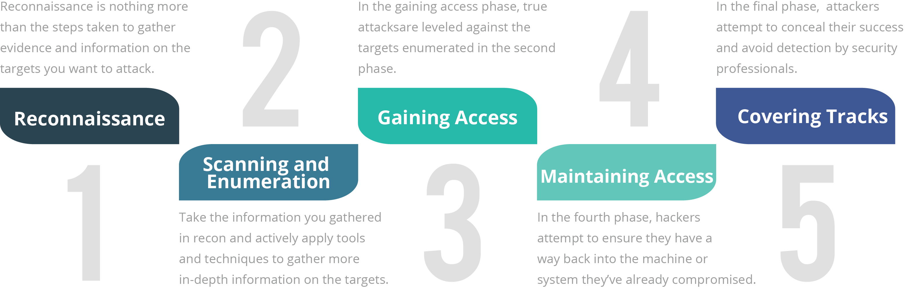

---

-   Reconnaissance: Onopvallend **informatie** verzamelen
-   Scanning and enumeration: Actief zoeken naar **zwakke punten**
-   Gaining access: De gevonden zwaktes **aanvallen**
-   Maintaining access: Zorgen voor manieren om later **opnieuw in te breken**
-   Covering tracks: Zorgen dat het doelwit **geen sporen** terugvindt

Notes:

-   Details in volgende subsecties
-   Verschil reconnaissance en scanning & enumeration: Bij reconnaissance wordt zeer breed informatie verzameld, over alles dat mogelijk nuttig kan zijn. Bij scanning & enumeration wordt zeer specifiek ingezoomd op mogelijke aanvalspistes. Hierbij worden vaak specifieke tools gebruikt die zoeken naar bepaalde zwaktes, gebaseerd op de informatie uit de reconnaissance fase.

---

-   **Cybersecurity** (dit vak):
    -   Intro fase 1 (reconnaissance)
    -   Intro fase 2 (scanning en enumeration)
    -   Oppervlakkig (nog niet genoeg technische kennis)
-   Verder uitwerken in specialisatie _System & network administration_
    -   Meer technisch
    -   2e jaar: Cybersecurity & Virtualisation
        -   Red team :aanvallen:
    -   3e jaar: Cybersecurity Advanced
        -   Blue team: verdedigen

Notes:

-   Reden: geavanceerde technieken hebben grondigere kennis (van oa. operating systems en netwerken) nodig, die we op dit moment nog niet hebben.

---

# 8.3 Fase 1: Reconnaissance

---

## Reconnaissance

-   Zo **veel** mogelijk informatie verzamelen (footprinting)
-   Zo **onopvallend** mogelijk
-   Doel:
    -   Het doelwit **begrijpen**
        -   Wie? Wat? Hoe? Waar? ...
        -   Hoe beveiligen ze zich?
        -   Waar zit de waardevolle data?
        -   ...
    -   De toekomstige aanval **accurater** maken door het **aanvalsdomein** te beperken

Notes:

-   Enkele belangrijke vragen:
    -   Waar zit de waardevolle data?
    -   Hoe is de toegang tot die data beveiligd?
-   Het aanvalsdomein kan bijvoorbeeld een IP-range zijn
-   Deze data wordt vaak in een informatiedatabank opgeslagen, zodat het red team daar makkelijk aan kan en bijvoorbeeld verbanden kan leggen tussen verschillende bevindingen.

---

## Reconnaisance: types

-   **Passief**
    -   **Geen direct contact** met het doelwit
    -   Anoniem
-   **Actief**
    -   **Wel direct contact** met het doelwit
        -   Doelwit heeft informatie over aanvaller!
        -   Maar doelwit weet (normaal gezien / nog) niet dat die data gelinkt is aan een toekomstige aanval.
-   Soms **dunne grens**: bv. website bezoeken

Notes:

-   Voorbeelden passieve reconnaisance:
    -   Publieke bronnen (overheidsdata, kranten, social media, ...)
    -   Aankomend/vertrekkend personeel in de gaten houden
-   Voorbeelden actieve reconnaisance:
    -   Helpdesk bellen
    -   Werknemer om een naamkaartje vragen
    -   Solliciteren
-   Een website bezoeken is in principe niet anoniem, de server van het doelwit heeft informatie over de aanvaller. Het is echter praktisch vaak niet mogelijk te achterhalen dat dit specifieke bezoek te maken had met een toekomstige aanval, zeker niet als de site door honderden gebruikers tegelijk bezocht wordt. Ook al doe je reconnaissance, je bent slechts een van de vele "onschuldige" bezoekers: je gaat op in de massa. We rekenen dit dus als passieve reconnaissance.
    -   Als je atypisch gedrag vertoont kan dit natuurlijk wel alarmbellen doen afgaan. SQL injectie proberen uitvoeren op een site is dus zeker geen passieve reconnaissance!

---

## Reconnaissance: Zoekmachines

Gebruik niet enkel [Google](https://google.com): **verschillende zoekmachines** hebben verschillende resultaten

-   [Bing](https://bing.com), [Yandex](https://yandex.com), [Duckduckgo](https://duckduckgo.com), ...

Gebruik **operatoren** om efficiënter te zoeken

-   https://ahrefs.com/blog/google-advanced-search-operators/
-   [Google Hacking Database](https://www.exploit-db.com/google-hacking-database)

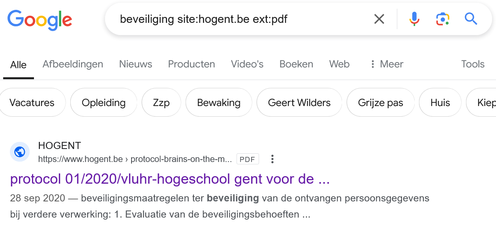

Notes:

-   Let op! Elke zoekmachine heeft eigen specifieke operatoren.

---

## Reconnaissance: Openbare databanken

Openbare databanken bevatten **publiek beschikbare**, maar soms zeer interessante, data.
Voorbeelden:

-   [Nationale Bank België](https://nbb.be)
-   [Belgisch staatsblad](https://www.ejustice.just.fgov.be/cgi/welcome.pl)
-   [Vlaamse databanken en zoeksystemen](https://www.vlaanderen.be/intern/werkplek/digitale-tools-en-digitale-veiligheid/bibliotheken-vlaamse-overheid/databanken-en-zoeksystemen)

<div class="multicolumn">
<div>
    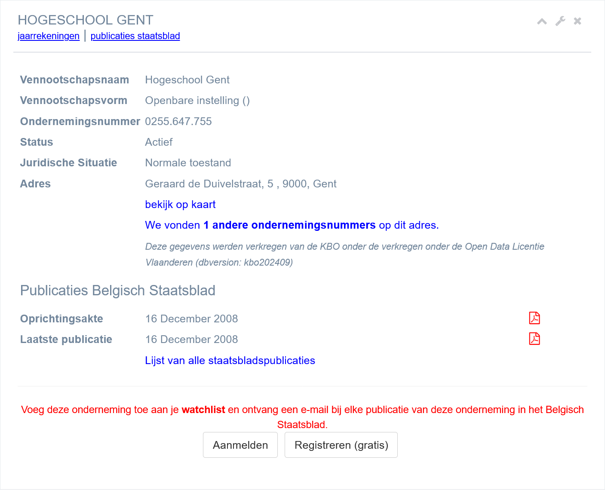
</div>
<div>
    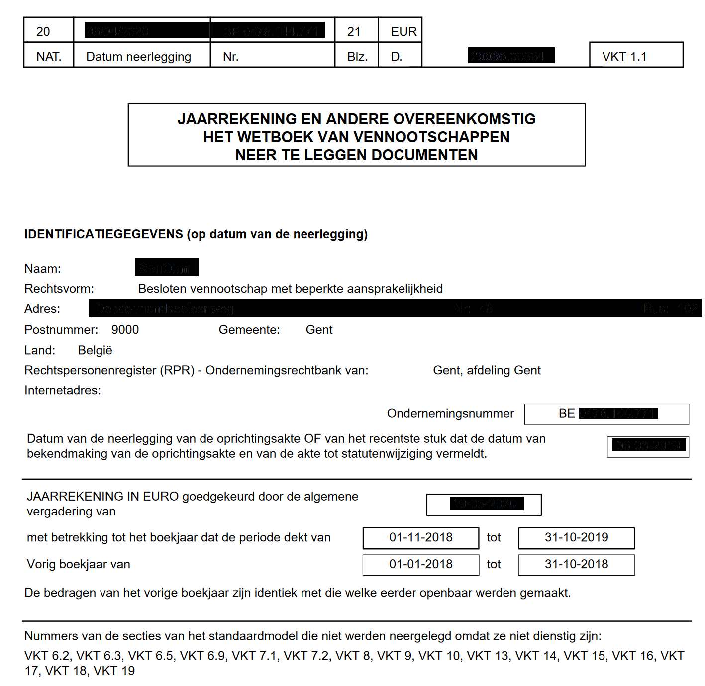
</div>
</div>

Notes:

-   Voorbeelden van interessante data die kan voorkomen in publieke documenten:
    -   Adressen (ook e-mail)
    -   Namen van belangrijke personen
    -   Financiële data
-   Ideaal voor phishing aanvallen!

---

## Reconnaissance: Vacatures

-   Informatie over belangrijke (open) **posities**
-   Informatie over gebruikte **technologieën**

<div class="multicolumn">
<div>
    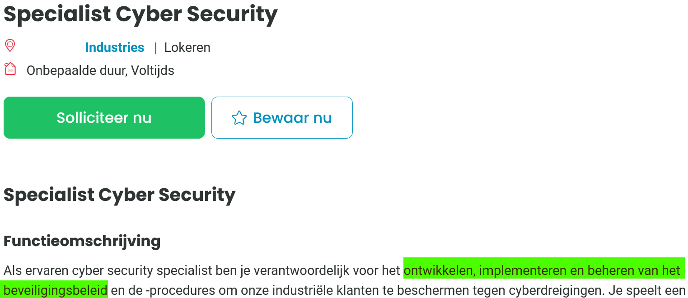
</div>
<div>
    
</div>
</div>

Notes:

-   Dit kan zowel op de site van het bedrijf zelf, als op algemene job-zoekertjes-sites zoals bv. [Indeed](https://indeed.com), [Jobat](https://jobat.be), ... .

---

## Reconnaissance: Social Media

-   Mensen **delen** vaak (onbewust) **gevoelige informatie**
    -   Locatie
    -   Afbeeldingen van beveiliginsmechanismen of sleutels
    -   Biometrische data, bijvoorbeeld in [deze studie](https://documents.trendmicro.com/assets/white_papers/wp-leaked-today-exploited-for-life.pdf)

<div class="multicolumn">
<div>
    
</div>
<div>
    
</div>
<div>
    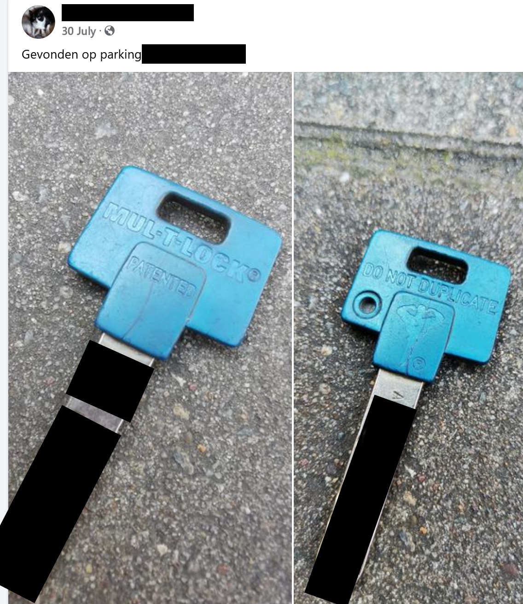
</div>
</div>

---


---

-   **Gespecialiseerde tools** om informatie van sociale media te verzamelen:
    -   Online: Pipl, Maltego, ...
    -   Commandline: bv. theHarvester, recon-ng, ...

<div class="multicolumn">
<div>
    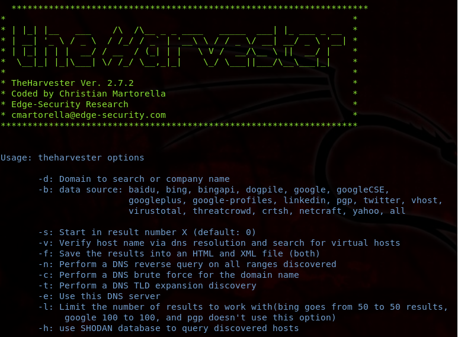
</div>
<div>
    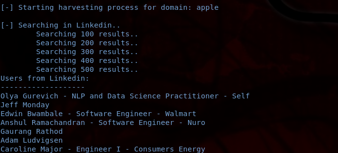
</div>
<div>
    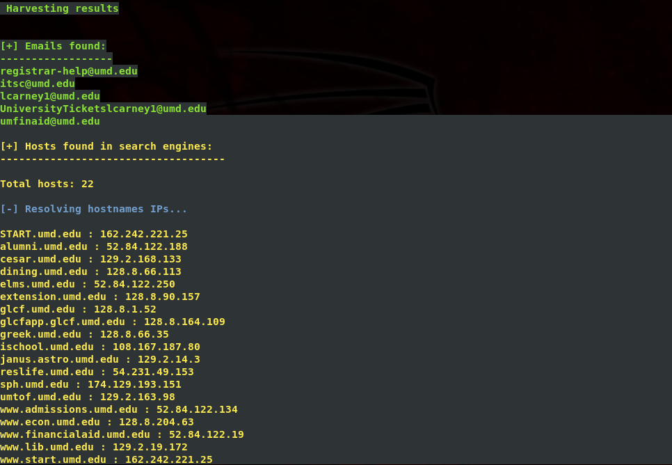
</div>
</div>

Notes:

-   Hoewel we spreken van gespecialiseerde tools, is dit nog niet per se "scanning en enumeration". We zoeken gewoon algemeen naar bruikbare informatie. Natuurlijk kunnen we tijdens de Scanning & Enumeration fase wel specifiek op zoek gaan naar, bijvoorbeeld, zichtbare vingerafdrukken als we een bepaalde scanner willen omzeilen.

---

## Reconnaissance: e-mailadressen

-   Eenvoudig met tools als bv. [hunter.io](https://hunter.io)

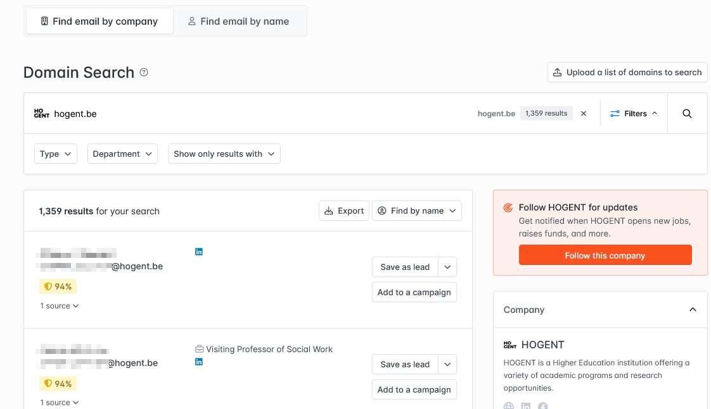

---

## Reconnaissance: Websites

-   De meeste organisaties hebben een website
-   Bevat vaak **veel informatie**
    -   Contactgegevens
    -   Foto's (personeel, gebouwen)
    -   Structuur van het bedrijf
-   Gebruikte **technologie**
    -   [Netcraft](https://www.netcraft.com/), [BuiltWith](https://builtwith.com/), [Wappalyzer](https://www.wappalyzer.com)
    -   Met development tools/plug-ins (bv. `F12`)
-   Soms beter om een **hele website te downloaden**
    -   Onopvallend experimenteren
    -   bv. met [HTTrack](https://www.httrack.com/)

---

<div class="multicolumn">
<div>
    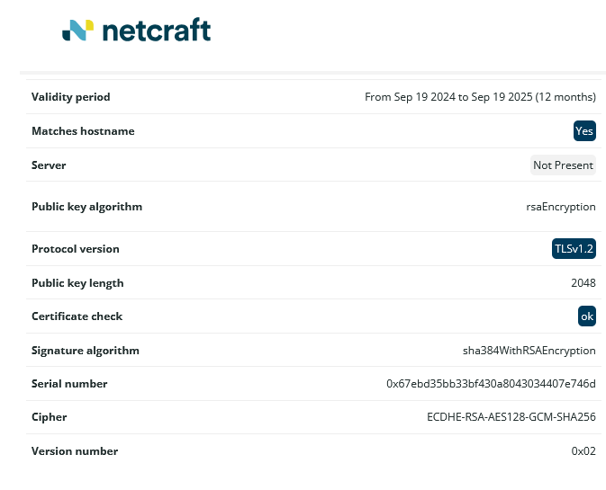
</div>
<div>
    
    
</div>
</div>

---

## Reconnaissance: Whois

-   Informatie over registratie domein
-   [whois.domaintools.com](https://whois.domaintools.com/)

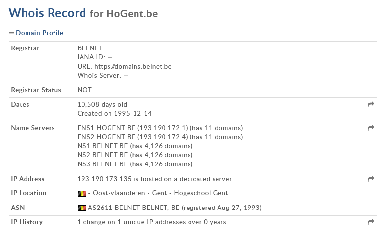

---

## Reconnaissance: DNS

-   Vertaalt een **domeinnaam** (www.hogent.be) naar een **ip-adres** (`193.190.173.135`)
-   Informatie over website, netwerk, infrastructuur
-   Soms **gevoelige informatie** in slecht beveiligde DNS-servers
-   Verschillende tools om info te achterhalen:
    -   `nslookup`, `dig`, `dnsrecon`, `dnsmap`, ...

```console
$ nslookup hogent.be
Server:         127.0.0.53
Address:        127.0.0.53#53

Non-authoritative answer:
Name:   hogent.be
Address: 193.190.173.135
```

---

```console
$ dig hogent.be

; <<>> DiG 9.18.28 <<>> hogent.be
;; global options: +cmd
;; Got answer:
;; ->>HEADER<<- opcode: QUERY, status: NOERROR, id: 36822
;; flags: qr rd ra; QUERY: 1, ANSWER: 1, AUTHORITY: 0, ADDITIONAL: 1

;; OPT PSEUDOSECTION:
; EDNS: version: 0, flags:; udp: 65494
;; QUESTION SECTION:
;hogent.be.                     IN      A

;; ANSWER SECTION:
hogent.be.              440     IN      A       193.190.173.135

;; Query time: 0 msec
;; SERVER: 127.0.0.53#53(127.0.0.53) (UDP)
;; WHEN: Sun Sep 22 12:57:47 CEST 2024
;; MSG SIZE  rcvd: 54
```

Notes:

-   Sommige DNS servers laten bijvoorbeeld [zone transfers](https://digi.ninja/projects/zonetransferme.php) toe. Op linux kan je bijvoorbeeld het commando `dig axfr @nsztm1.digi.ninja zonetransfer.me` eens uittesten, wat zie je allemaal? Dit is al wat geavanceerder en wordt in latere vakken verder uitgelegd (dit is dus nog niet te kennen).

---

## Reconnaissance: IoT

-   IoT devices zijn vaak **slecht beveiligd** en bieden zo toegang tot een bedrijf
-   Zoeken naar publiek toegankelijke devices kan via [Shodan](https://www.shodan.io/)

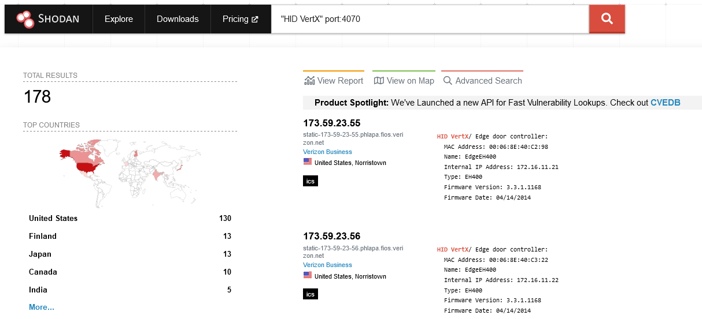

---

# 8.4 Fase 2: Scanning en enumeration

---

## Scanning en enumeration: doel

-   Zoeken naar **zwakke punten**
    -   Bedrijven houden dit zelf ook in de gaten (asset management)
-   Gebruikte technologieën en versies vinden en linken aan **gekende kwetsbaarheden**
    -   [CVE](https://www.cve.org), [exploit-db.com](https://www.exploit-db.com)
-   Technischer en actiever dan reconnaissance

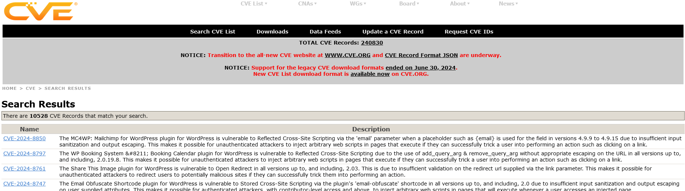

Notes:

-   Dit is ook de hoofdreden dat (vooral publiek toegankelijke) software regelmatig upgedated dient te worden. Gekende kwetsbaarheden worden vaak (hopelijk) met hoge prioriteit opgelost, maar die fix werkt natuurlijk enkel als de beheerder ook de nieuwe versie van de software installeert.

---

## **Scanning** en enumeration

-   **Port scanning**
    -   Detecteren van open poorten en services
-   **Network scanning**
    -   Netwerk in kaart brengen.
    -   Detecteren van gebruikte IP-adressen, besturingssystemen, netwerktoestellen, verbindingen, ...
-   **Vulnerability scanning**
    -   Onderzoeken of er gekende kwetsbaarheden of zwaktes in het netwerk aanwezig zijn

---

## **Scanning** en enumeration: basistools

-   **Ping**
    -   Welke toestellen zijn bereikbaar?

```console
$ ping www.cve.org
PING cve.org (18.239.208.25) 56(84) bytes of data.
64 bytes from server-18-239-208-25.bru50.r.cloudfront.net (18.239.208.25): icmp_seq=1 ttl=248 time=13.7 ms
64 bytes from server-18-239-208-25.bru50.r.cloudfront.net (18.239.208.25): icmp_seq=2 ttl=248 time=13.5 ms
64 bytes from server-18-239-208-25.bru50.r.cloudfront.net (18.239.208.25): icmp_seq=3 ttl=248 time=11.1 ms
64 bytes from server-18-239-208-25.bru50.r.cloudfront.net (18.239.208.25): icmp_seq=4 ttl=248 time=11.1 ms
^C
--- cve.org ping statistics ---
4 packets transmitted, 4 received, 0% packet loss, time 3002ms
rtt min/avg/max/mdev = 11.069/12.346/13.726/1.256 ms
```

---

-   **Traceroute/tracert**
    -   Welke route leggen berichten in het netwerk af?

```console
$ traceroute www.google.com
traceroute to www.google.com (64.233.167.104), 30 hops max, 60 byte packets
 1  _gateway (xxx.xxx.xxx.xxx)  2.106 ms  3.065 ms  3.973 ms
 2  * * *
 3  * * *
 4  * * *
 5  xxx.xxx.xxx.xxx (xxx.xxx.xxx.xxx)  35.232 ms  34.754 ms  35.585 ms
 6  * * *
 7  209.85.254.112 (209.85.254.112)  23.553 ms 209.85.255.16 (209.85.255.16)  27.798 ms 142.251.246.110 (142.251.246.110)  22.723 ms
 8  142.251.224.10 (142.251.224.10)  28.168 ms  17.845 ms 192.178.86.8 (192.178.86.8)  21.745 ms
 9  64.233.174.221 (64.233.174.221)  18.498 ms  18.465 ms 142.251.247.73 (142.251.247.73)  19.225 ms
10  64.233.175.102 (64.233.175.102)  18.457 ms  17.870 ms 142.251.68.157 (142.251.68.157)  24.147 ms
11  209.85.253.215 (209.85.253.215)  17.871 ms 216.239.40.11 (216.239.40.11)  21.413 ms 108.170.231.219 (108.170.231.219)  20.510 ms
12  wl-in-f104.1e100.net (64.233.167.104)  30.961 ms  34.893 ms *

```

---

## **Scanning** en enumeration: poortscanners

-   Scant de **netwerkpoorten** van een toestel
-   3 mogelijkheden:
    -   **Open**: een programma aanvaart connecties (interessant!)
    -   **Gesloten**: connectie wordt niet aanvaard
        -   Bv. geen programma actief op die poort
    -   **Gefilterd**: Geen antwoord
        -   _misschien_ vanwege een firewall
-   Tools: [nmap](https://nmap.org/), [masscan](https://github.com/robertdavidgraham/masscan), [megaping](https://magnetosoft.com/product-megaping/), ...

---

-   Vele tools gebruiken specifieke poorten

    | Poort | Tool  |
    | ----: | :---- |
    |    22 | SSH   |
    |    80 | HTTP  |
    |   443 | HTTPS |
    |  3306 | MySQL |

-   Een volledig overzicht: [Wikipedia](https://en.wikipedia.org/wiki/List_of_TCP_and_UDP_port_numbers).

---

## **Scanning** en enumeration: nmap

-   Zeer populaire **poortscanner**
-   Kan gokken **welk programma** en **versie** draait achter een open poort
-   Ook **netwerkscanner** functionaliteit (zie later)
-   Grafische wrapper: Zenmap

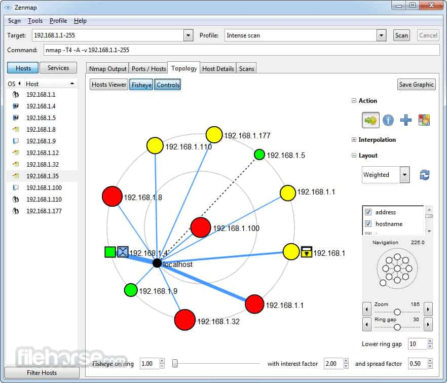

Notes:

-   Initeel een generieke port scanner, later is er veel functionaliteit bijgekomen
-   Voorbeelden van nmap features:
    -   Host discovery (ontdekken van machines op het netwerk)
    -   OS-detectie (welk besturingssysteem draait de host)
    -   Versiedetectie van applicaties
    -   Nmap scripting engine, waardoor je eigen scripts kan schrijven

---

```console
$ sudo nmap scanme.nmap.org
Starting Nmap 7.92 ( https://nmap.org ) at 2024-09-22 13:20 CEST
Nmap scan report for scanme.nmap.org (45.33.32.156)
Host is up (0.17s latency).
Other addresses for scanme.nmap.org (not scanned): 2600:3c01::f03c:91ff:fe18:bb2f
Not shown: 994 closed tcp ports (reset)
PORT      STATE    SERVICE
22/tcp    open     ssh
25/tcp    filtered smtp
80/tcp    filtered http
427/tcp   filtered svrloc
9929/tcp  open     nping-echo
31337/tcp open     Elite

Nmap done: 1 IP address (1 host up) scanned in 10.77 seconds
```

---

## **Scanning** en enumeration: netwerkscanners

-   Scant het netwerk af naar **hosts** (= toestellen) **en verbindingen**
-   Moet toegang tot het netwerk hebben
-   Verschillende opties: [LANState (Pro)](https://www.10-strike.com/lanstate/), [PRTG Network Monitor](https://www.paessler.com/prtg), [SolarWinds network topology mapper](https://www.solarwinds.com/network-topology-mapper/use-cases/network-mapping), ...

<div class="multicolumn">
<div>
    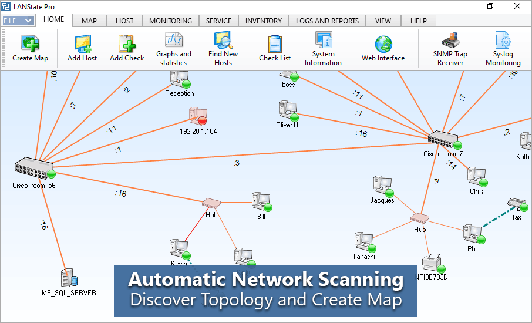
</div>
<div>
    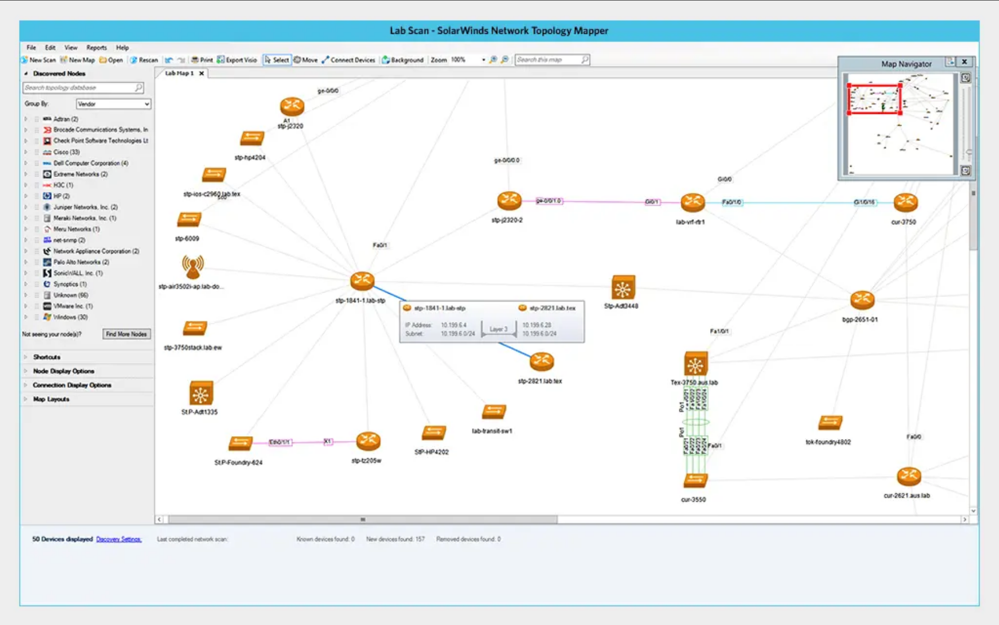
</div>
</div>

Notes:

-   Dat is inderdaad _die_ SolarWinds van misschien wel de bekendste hackaanval ooit. Zie [Wikipedia](https://en.wikipedia.org/wiki/2020_United_States_federal_government_data_breach) voor meer info (of om te zien hoe ver een supply chain attack kan gaan).

---

## **Scanning** en enumeration: vulnerability scanners

-   Scant het netwerk af naar gekende **kwetsbaarheden**
-   Moet ook toegang tot het netwerk hebben
-   Verschillende opties: [OpenVAS](https://openvas.org/), [Nessus](https://www.tenable.com/products/nessus), [Metasploit](https://www.metasploit.com/)

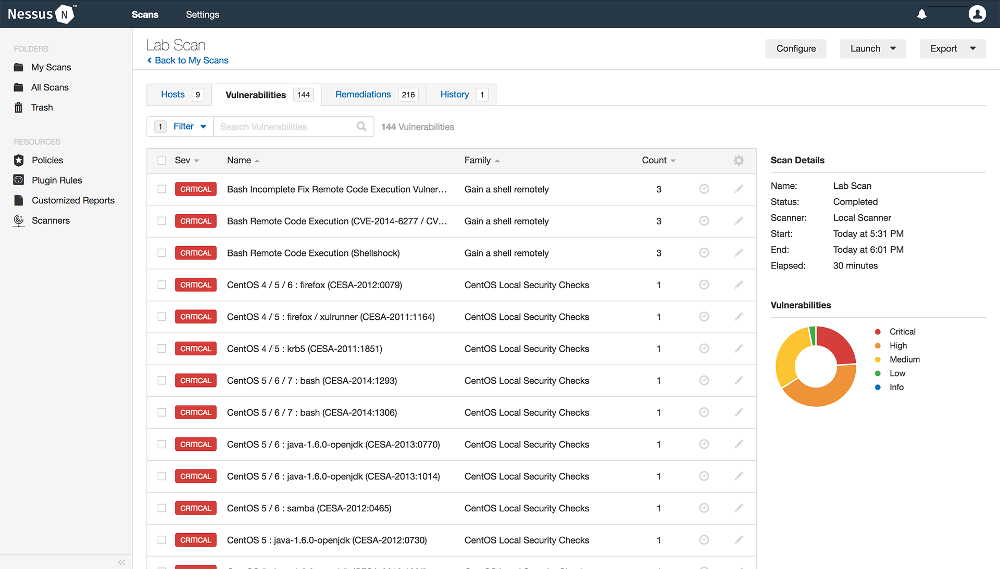

---

## Scanning en **enumeration**

-   Informatie verzamelen op **applicatie-niveau**
    -   Niet enkel toestellen, IP-adressen en poorten
-   Vervolg op scanning
-   **Netwerkprotocollen** "misbruiken" voor informatie over
    -   Netwerkschijven
    -   Loginsystemen
    -   FTP servers
    -   SMB servers
    -   ...
-   Details zijn voor vervolg-OLOD's

---

# 8.5 Fase 3-5: Gaining access, maintaining access, covering tracks

---

## Gaining access

-   Ontfutselen van logingegevens
    -   Vele hackaanvallen gebruiken ook **social engineering**!
    -   **Reconnaissance** is zeer belangrijk om kwetsbare targets te vinden
-   **Exploits**
    -   Het uitbuiten van zwaktes/foutjes in software
    -   Veel makkelijker als systemen **niet up to date** zijn
-   Password **cracking**
    -   Zie H1:
        -   Korte wachtwoorden: **brute force**
        -   Gekende wachtwoorden: **dictionary attacks**
-   Er zijn vele ander opties!

Notes:

-   Targets voor social engineering zijn idealiter mensen met veel toegangsrechten, maar geen it-specialist.
-   Dictionary attack: het gebruik van een (zeer lange) lijst kandidaat-wachtwoorden, in plaats van elke mogelijke optie te proberen zoals bij brute force.
-   Dictionaries kunnen wachtwoorden uit oudere data breaches bevatten, maar ook bijvoorbeeld veelvoorkomende woorden met enkele cijfers of speciale tekens aan toegevoegd.

---

## Maintaining access

-   Ook gekend als **persistence**
-   Bv. je breekt binnen op een toestel in het netwerk. Dat toestel wordt fysiek afgesloten. Dan kan je weer opnieuw beginnen om binnen te geraken.
-   Om dat te vermijden: verschillende opties
    -   **Malware** installeren (rootkits, backdoors, reverse shells, ...)
    -   Nieuwe **gebruiker** aanmaken
    -   **Pivoting** (naar andere toestellen springen)
-   Vaak nodig om administratorrechten (**root access**) te verkrijgen via **privilege escalation**
    -   Kan met andere exploits
-   Ondertussen zo onzichtbaar mogelijk blijven (**evasion**)

---

## Covering tracks

-   Onopgemerkt blijven: **bewijsmateriaal** wegmoffelen
    -   **Gebruikte bestanden** verwijderen of verstoppen
        -   Bijvoorbeeld in `/tmp`-map
    -   **Logs** aanpassen
        -   Log files verwijderen valt juist extra op!
    -   **Timestamps** aanpassen
    -   ...

---

## De cyber attack cycle

-   De fases zijn vaak niet mooi opeenvolgend, maar eerder **cyclisch**
-   Een interessante ontdekking in latere fasen kan zorgen voor een **nieuwe reconnaissance**, om te zien hoe deze informatie kan uitgebuit worden

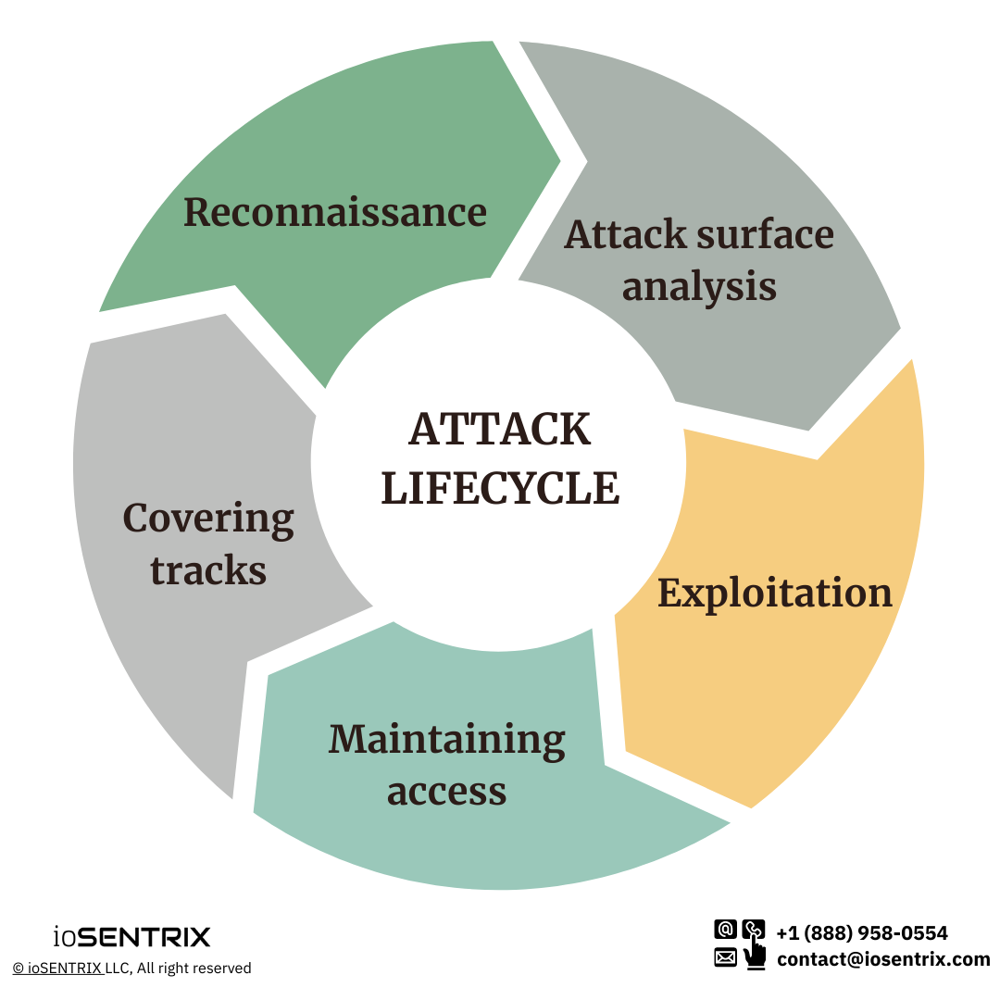

Notes:

-   Merk op dat de fases niet per se overal dezelfde naam hebben. Sommige versies hebben ook extra fases.

---

# 8.6 Pentests en audit reports

---

## Pentests

-   Van de 5 fases is enkel **passieve reconnaissance** standaard toegelaten
-   Elke andere interactie heeft **expliciete toestemming** van het doelwit nodig
    -   Vaak hoort daar een **non-disclosure agreement** (NDA) bij
        -   Gevoelige informatie
    -   Tegelijk wordt ook een **scope** afgesproken
        -   Wat mag? Wat mag niet?
-   Dit onderzoek heet dan een **pentest** (penetration test) of **security audit**

Notes:

-   NDA: om ervoor te zorgen dat informatie over de werking van het bedrijf of de beveiliging niet uitlekt
-   Scope: bijvoorbeeld, welke tools/technieken mogen gebruikt worden, welke personen/machines/netwerken/applicaties mogen getarget worden, ... .

---

## White / Grey / Black box

-   **White box**: het red team kent het systeem volledig, en zal die kennis gebruiken bij de aanval
    -   Documentatie, broncode, werknemers, ...
-   **Black box**: het red team begint zonder enige informatie, net zoals een externe hacker dat zou moeten doen
    -   Duurt vaak langer, dus ook duurder
-   **Grey box**: het red team heeft een beetje informatie
    -   Bv. welke IP range is mogelijk kwetsbaar?

---

## Audit Report

-   Vaak wordt de pentest afgesloten met een geschreven rapport, het **Audit Report**
    -   Dit rapport bevat over het algemeen:
        -   Een **conclusie** die begrijpbaar is voor niet-technisch personeel
        -   Een **gedetailleerde lijst van vulnerabilities, exploits en threats** waar het IT-team mee aan de slag kan.
    -   Dit is een **momentopname**, en is nooit compleet.
    -   [Voorbeeld](https://pentest-hub.com/PDF/EXAMPLE-Penetration_Testing_Report_v.1.0.pdf)

---

## Vulnerabilities en exploits

-   **Vulnerabilities** zijn foutjes in software of configuratie die een zwakke plek vormen
-   **Exploits** zijn manieren om vulnerabilities te misbruiken.

---

## Threats en risk

-   Een **threat** is dan het gebruik van een exploit door een aanvaller.
-   **Risk** is de maat van ernst van een bepaalde vulnerability, gebaseerd op hoe waarschijnlijk het is dat er een threat komt, en hoe ernstig het is als dat gebeurt.
-   Methodes om risk te berekenen: bv. van [NIST](https://doi.org/10.6028/NIST.SP.800-30r1)

---

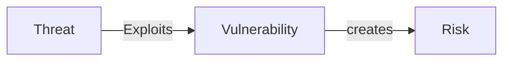
```mermaid
flowchart LR
    Threat -->|Exploits| Vulnerability --> |creates| Risk
```

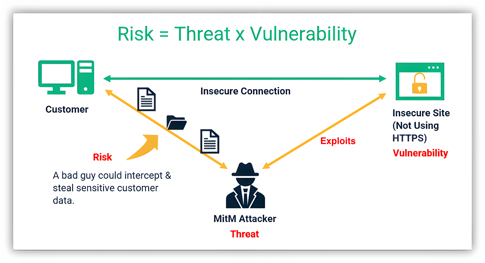

---

---

## Risk matrix

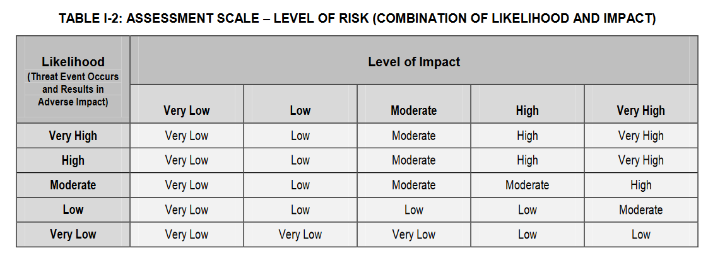

Notes:

-   Uit de gelinkte NIST publicatie.
-   Dit soort matrices wordt gebruikt om te bepalen wat de Risk is, gebaseerd op _likelihood_ (= kans op threat) en _impact_ (= ernst van threat)
-   Likelihood en Impact worden bepaald per bedrijf, ze zijn relatief
-   Voorbeeld:
    -   Een _high impact_ threat (als het gebeurt, ligt de website een dag plat) met _very low_ likelihood (bv, de vulnerability is zeer moeilijk te exploiten, de aanvaller moet een usb-stick in een specifieke servermachine steken) heeft als totale risk-score **low**. Dit is dus een lagere prioriteit dan bv. een threat die _moderate_ impact en _moderate_ likelihood heeft.

---

## Kort woordje over de verdediging

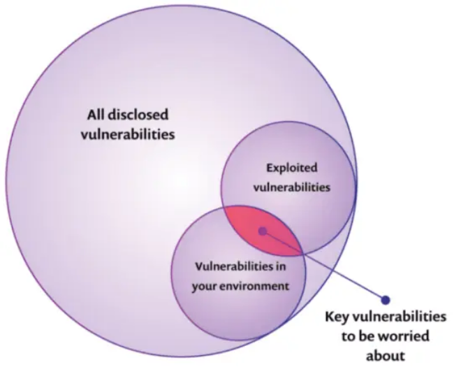

Notes:

-   Vulnerabilities die niet gekend zijn kan je ook niet in rekening brengen. Het is best altijd enkele defensieve tactieken toe te passen, maar verder is het beter te focusen op gekende vulnerabilities.
-   Niet alle vulnerabilities hebben een exploit. Vulnerabilities met exploits hebben een hogere likelihood, en dus hogere risk.
-   Natuurlijk moet je je ook afvragen of een bepaalde vulnerability uberhaupt voorkomt in jouw systeem of netwerk
-   De vulnerabilities waar je op focust zijn dus die:
    -   Die bij jou voorkomen
    -   Die gekend zijn
    -   EN die een exploit hebben
