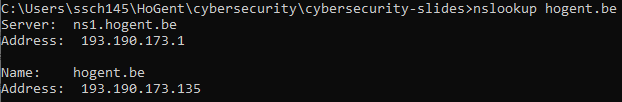

# Cybersecurity

## H8: Red Team.

---

# 8.1 Taak van het Red Team

---

## Taak van het Red Team

- Proberen inbreken
- Verdediging testen
- **Zwakke punten blootleggen**

Notes:
- Niet enkel in cyberspace: Red Team kan bijvoorbeeld in gebouwen proberen binnenraken, papieren stelen, veiligheidscamera's onschadelijk maken...
- Legaal, en in dienst van de organisatie die ze aanvallen
- De verdediging wordt het "Blue Team" genoemd

---

# 8.2 De 5 fasen

---

## De 5 fasen

- Reconnaissance: Onopvallend **informatie** verzamelen
- Scanning and enumeration: Actief zoeken naar **zwakke punten**
- Gaining access: De gevonden zwaktes **aanvallen**
- Maintaining access: Zorgen voor manieren om later **opnieuw in te breken**
- Covering tracks: Zorgen dat het doel **geen sporen** terugvindt

Notes:
- Details in volgende subsecties
- Verschil Reconnaissance en Scanning & enumeration: Bij Reconnaissance wordt zeer breed informatie verzameld, over alles dat mogelijk nuttig kan zijn. Bij s&e wordt zeer specifiek ingezoomd op mogelijke aanvalspistes. Hierbij worden vaak specifieke tools gebruikt die zoeken naar bepaalde zwaktes, gebaseerd op de informatie uit de reconnaissance fase.

---

## De 5 fasen

- **Cybersecurity** (Dit vak):
    - Intro fase 1 (reconnaissance)
    - Intro fase 2 (scanning en enumeration)
- Verder uitwerken in specialisatie _System & network administration_

Notes:
- Reden: geavanceerde technieken hebben grondigere kennis (van oa. operating systems en netwerken) nodig

---

# 8.3 Reconnaissance

---

## Reconnaissance

- Zo **veel** mogelijk informatie verzamelen
- Zo **onopvallend** mogelijk
- Doel:
    - Het doelwit **begrijpen**
    - De toekomstige aanval **accurater** maken door het **aanvalsdomein** te beperken

Notes:
- Dit proces van data verzamelen wordt ook "footprinting" genoemd
- Enkele belangrijke vragen:
    - Waar zit de waardevolle data?
    - Hoe is de toegang tot die data beveiligd?
- Het aanvalsdomein kan bijvoorbeeld een IP-range zijn
- Deze data wordt vaak in een informatiedatabank opgeslagen, zodat het Red Team daar makkelijk aan kan en bijvoorbeeld verbanden kan leggen tussen verschillende bevindingen.

---

## Reconnaisance: types
- **Passief**
    - **Geen contact** met het doelwit
    - Anoniem
- **Actief**
    - **Wel contact** met het doelwit
    - Doelwit heeft informatie over aanvaller!
    - Doelwit weet (normaalgezien) niet dat die data gelinkt is aan een toekomstige aanval.
- Soms **dunne grens**: bv. website bezoeken

Notes:
- Voorbeelden passieve recon:
    - Publieke bronnen (overheidsdata, kranten, social media, ...)
    - Aankomend/vertrekkend personeel in de gaten houden
- Voorbeelden actieve recon:
    - Helpdesk bellen
    - Werknemer om een naamkaartje vragen
    - Solliciteren
- Website bezoeken: is in principe niet anoniem, de server van het doelwit heeft informatie over de aanvaller. Het is echter praktisch vaak niet mogelijk te achterhalen dat dit specifieke bezoek te maken had met een toekomstige aanval, zeker niet als de site door honderden gebruikers tegelijk bezocht wordt. We rekenen dit dus als passieve reconnaissance.
- Als je atypisch gedrag vertoont kan dit natuurlijk wel alarmbellen doen afgaan. SQL injectie proberen uitvoeren op een site is dus zeker geen passieve reconnaissance!

---

## Reconnaissance: Zoekmachines

Gebruik niet enkel [Google](https://google.com): **verschillende zoekmachines** hebben verschillende resultaten
- [Bing](https://bing.com), [Yandex](https://yandex.com), [Duckduckgo](https://duckduckgo.com), ...

Gebruik **operatoren** om effici&#235;nter te zoeken

Notes:
- Elke zoekmachine heeft eigen operatoren.
- Voor vele voorbeelden over hoe operatoren gebruikt kunnen worden om zwakke plekken te ontdekken: de [Google Hacking Database](https://www.exploit-db.com/google-hacking-database)

---

## Reconnaissance: Openbare databanken

Openbare databanken bevatten **publiek beschikbare**, maar soms zeer interessante, data.
Voorbeelden:
- [Nationale Bank Belgi&#235;](https://nbb.be)
- [Belgisch staatsblad](https://www.ejustice.just.fgov.be/cgi/welcome.pl)
- [Vlaamse databanken en zoeksystemen](https://www.vlaanderen.be/intern/werkplek/digitale-tools-en-digitale-veiligheid/bibliotheken-vlaamse-overheid/databanken-en-zoeksystemen)

Notes:
- Voorbeelden van interessante data die kan voorkomen in publieke documenten:
    - Adressen (ook e-mail)
    - Namen van belangrijke personen
    - Financi&#235;le data

---

## Reconnaissance: Vacatures

- Informatie over belangrijke (open) **posities**
- Informatie over gebruikte **technologie&#235;n**

Notes:
- Dit kan zowel op de site van het bedrijf zelf, als op algemene job-zoekertjes-sites, bijvoorbeeld [Indeed](https://indeed.com), [Jobat](https://jobat.be), ...

---

## Reconnaissance: Social Media

- Mensen **delen** vaak (onbewust) **gevoelige informatie**
    - Locatie
    - Afbeeldingen van beveiliginsmechanismen of sleutels
    - Biometrische data, bijvoorbeeld in [deze studie](https://documents.trendmicro.com/assets/white_papers/wp-leaked-today-exploited-for-life.pdf)

---

## Reconnaissance: Social Media

- **Gespecialiseerde tools** om informatie van sociale media te verzamelen:
    - Online: Pipl, Maltego, ...
    - Commandline: bv. recon-ng, ...
- **Emailadressen verzamelen** met bv. [hunter.io](https://hunter.io)

Notes:
- Hoewel we spreken van gespecialiseerde tools, is dit nog niet per se "scanning en enumeration". We zoeken gewoon algemeen naar bruikbare informatie. Natuurlijk kunnen we tijdens de S&E fase wel specifiek op zoek gaan naar, bijvoorbeeld, zichtbare vingerafdrukken als we een bepaalde scanner willen omzeilen.

---

## Reconnaissance: Websites

- De meeste organisaties hebben een website
- Bevat vaak **veel informatie**
    - Contactgegevens
    - Foto's (personeel, gebouwen)
    - Structuur van het bedrijf
- Gebruikte **technologie**
    - [Netcraft](https://www.netcraft.com/), [BuiltWith](https://builtwith.com/), [Wappalyzer](https://www.wappalyzer.com)
    - Met development tools/plug-ins
- Soms beter om een **hele website te downloaden**
    - Onopvallend experimenteren
    - bv. met [HTTrack](https://www.httrack.com/)
---

---

## Reconnaissance: Whois

- Informatie over registratie domein
- [whois.domaintools.com](https://whois.domaintools.com/)

---

## Reconnaissance: DNS

- Vertaalt een **domeinnaam** (www.hogent.be) naar een **ip-adres** (193.190.173.135)
- Informatie over website, netwerk, infrastructuur
- Soms **gevoelige informatie** in slecht beveiligde DNS-dervers

Notes:
-  Sommige DNS servers laten bijvoorbeeld zone transfers toe (zie https://digi.ninja/projects/zonetransferme.php voor meer informatie). Op linux kan je bijvoorbeeld het commando `dig axfr @nsztm1.digi.ninja zonetransfer.me` eens uittesten, wat zie je allemaal? Dit is al wat geavanceerder en wordt in latere vakken verder uitgelegd (dit is dus nog niet te kennen).

---

## Reconnaissance: IoT

- IoT devices zijn vaak **slecht beveiligd** en bieden zo toegang tot een bedrijf
- Zoeken naar publiek toegankelijke devices via bv. [Shodan](https://www.shodan.io/)

---

# 8.4 Scanning en enumeration

---

