# H9: Het beschermen van een ICT-omgeving.

---

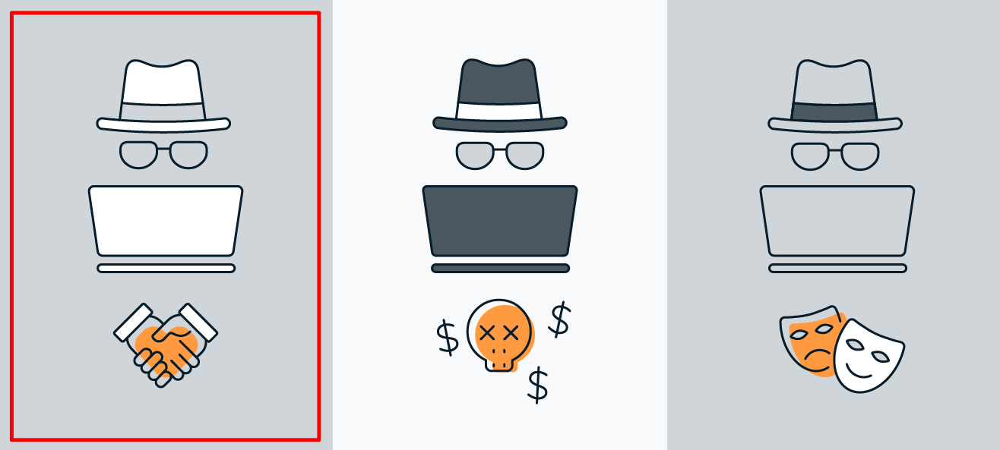

---

# 10.1 Een diepe verdediging

---

---

-   Layering (gelaagdheid)
-   Limiting (beperking)
-   Diversity (diversiteit)
-   Obscurity (verduistering)
-   Simplicity (eenvoud)

Notes:

-   Een gelaagde beveiliging zorgt voor de meest omvangrijke beveiliging. Als cybercriminelen de eerste laag kunnen binnendringen, is er nog altijd een tweede (en evt. volgende) laag die ze moeten binnendringen. Beveiligen in lagen betekent dat je meerdere barrières gaat maken.
-   Het beperken van toegang tot informatie vermindert de kans op een aanval. Een organisatie beperkt best de toegang om er voor te zorgen dat werknemers alleen toegang hebben tot de informatie die zij nodig hebben om hun job uit te voeren.
-   Diversiteit: varieer in manieren van beveiliging. Wanneer men zich de toegang heeft verschaft tot de ene laag, mag dit niet de andere lagen in gevaar brengen. Zorg dus voor afwisseling: gebruik in de andere lagen bvb. een ander encryptie algoritme.
-   Obscuring of verduisteren van informatie kan deze ook beschermen. Een organisatie hoeft bv. niet prijs te geven welke OS versie men gebruikt of welke type firewall men gebruikt. Security through obscurity can een handige extra zijn, maar maak hiervan nooit de hoeksteen van jouw beveiliging!
-   Simplicity of eenvoud leidt meestal tot een hogere beschikbaarheid. Als de beveiliging te complex wordt, wordt de kans op fouten ook alsmaar groter.

---

-   Steun nooit op slechts een enkel concept!
    -   Bv. security by obscurity op zich alleen is een bad practice!
-   Streef steeds naar een **gevarieerde combinatie**!

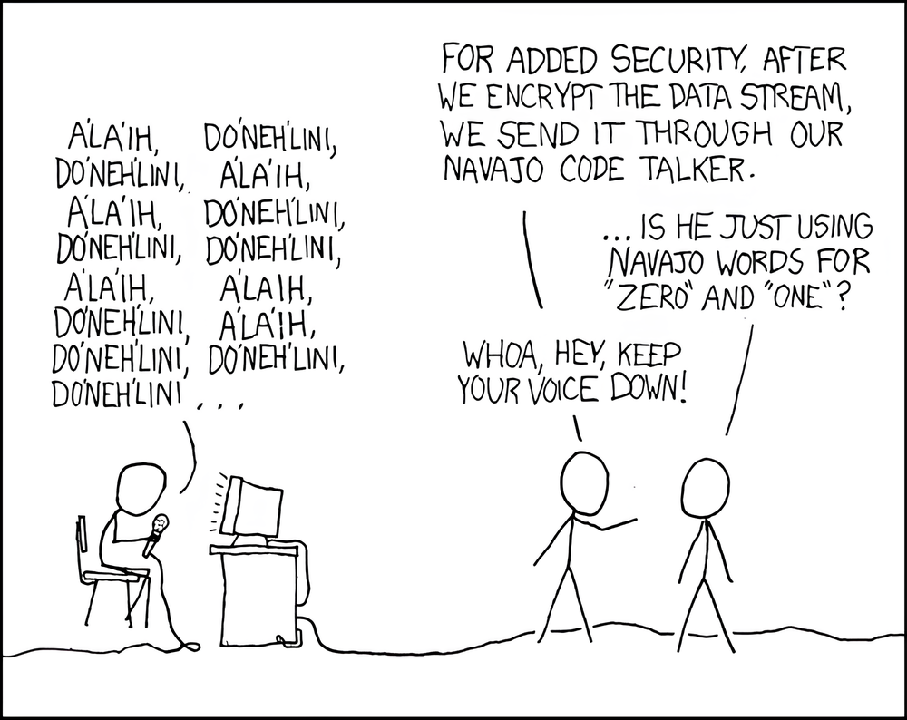

Notes:

-   https://xkcd.com/257/
-   https://thecyberpatch.com/security-through-obscurity-the-good-the-bad-the-ugly/

---

# 10.2 Systemen en apparaten beschermen

---

-   Er zijn verschillende aspecten aan het beheren van een ICT-omgevingen die we moeten **beschermen**:
    -   Fysieke toegang
    -   Gebruikersbeheer
    -   Hosts (individuele gebruikerstoestellen)
        -   Laptops, smartphones, ...
    -   Servers
    -   Netwerk(apparaten)

---

# 10.2.1 Fysieke bescherming

---

-   Mag je niet vergeten!
-   Kan enorm schadelijk zijn
    -   Diefstal
    -   Rogue device planten
    -   Vandalisme

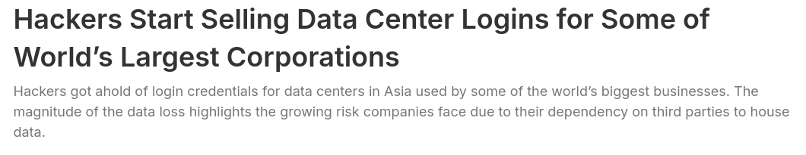

Notes:

-   https://www.datacenterknowledge.com/business/hackers-start-selling-data-center-logins-for-some-of-world-s-largest-corporations

---

## Diefstal

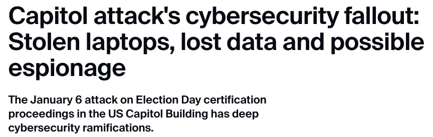

---

## Rogue device

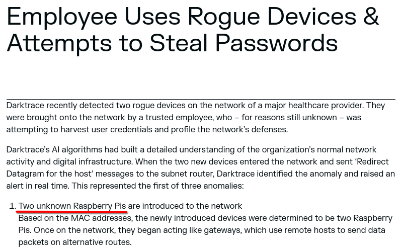

Notes:

-   https://darktrace.com/es/blog/smuggled-raspberry-pis-attempt-to-steal-passwords

---

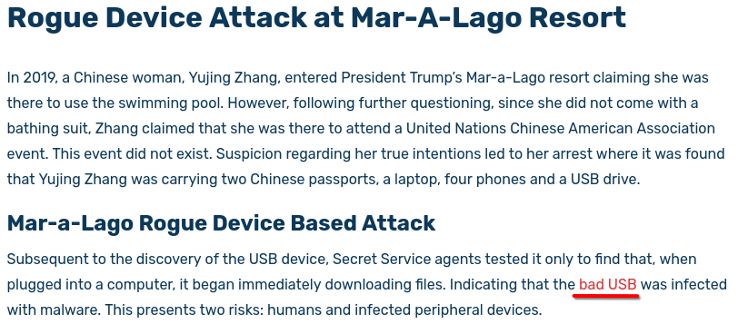
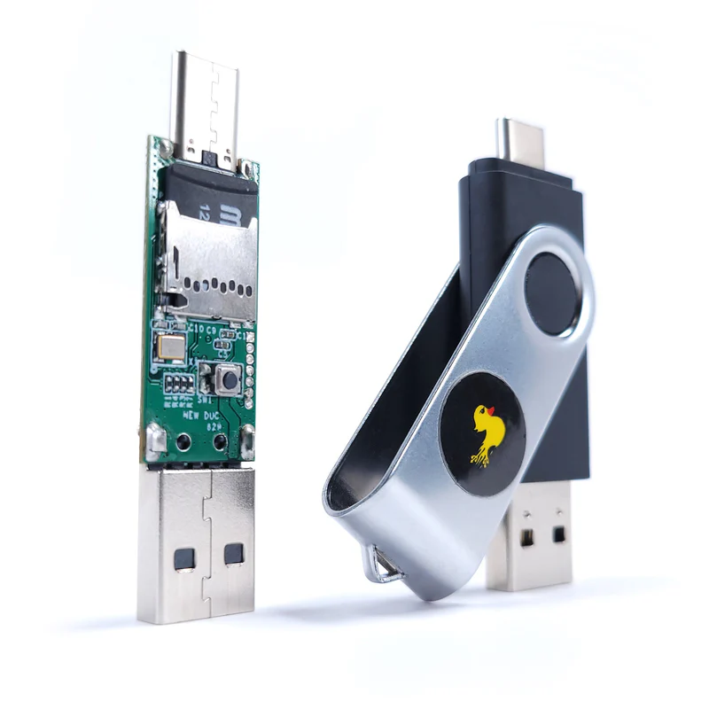

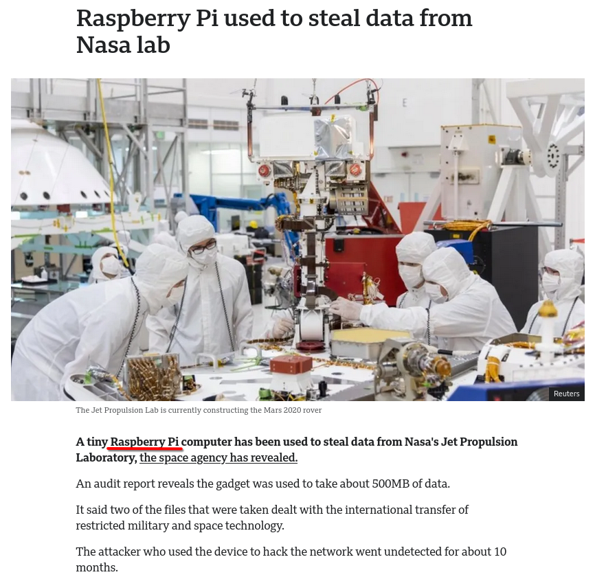

Notes:

-   https://sepiocyber.com/resources/case-studies/security-breach-at-mar-a-lago/
-   Do NOT Plug This USB In! - Hak5 Rubber Ducky: https://www.youtube.com/watch?v=kfaHJwcG2mg
-   https://shop.hak5.org/products/usb-rubber-ducky
-   https://www.bbc.com/news/technology-48743043

---

## Vandalisme

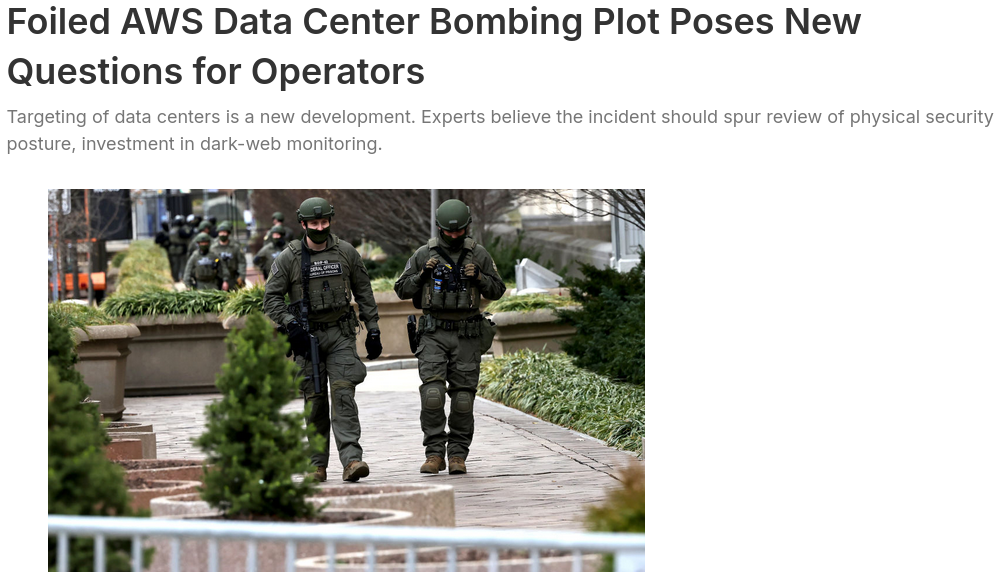

Notes:

-   https://www.datacenterknowledge.com/hyperscalers/foiled-aws-data-center-bombing-plot-poses-new-questions-for-operators

---

## Hoe voorkomen?

-   Sluit toegang af
    -   Omheining, barricades, bewaking, ...
    -   Beperk toegangstijden
-   Dwing identificatie af
    -   Biometrie
    -   Badge
-   Beveilig toestellen
    -   Kabelsloten
    -   Veiligheidskooien
    -   Logout timers (automatisch vergrendelen na periode van inactiviteit)

Notes:

-   https://www.isunshare.com/windows-10/4-tips-to-change-lock-screen-timeout-in-windows-10-11.html

---

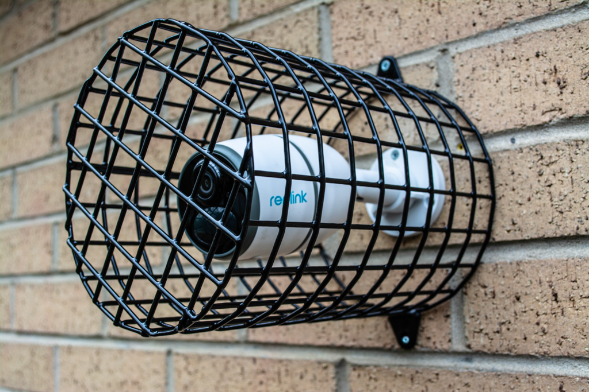

---

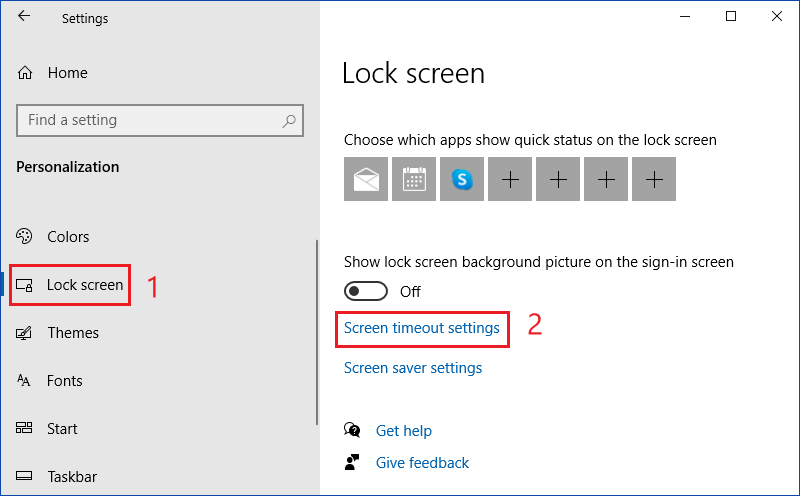

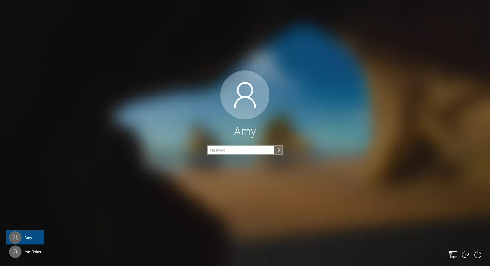

---

## Wat bij diefstal

-   Hou logboeken bij
    -   Wie had het laatst toegang?
-   GPS tracking

---

## Hou je toestellen blij

-   Redundante en voldoende stroomvoorziening
-   HVAC
    -   Verwarming, ventilatie, airco
    -   Regelt de omgeving (temperatuur, vochtigheid, luchtstroom en luchtfiltering)
-   Monitor de hardware
    -   Alerts als er iets foutgaat

---

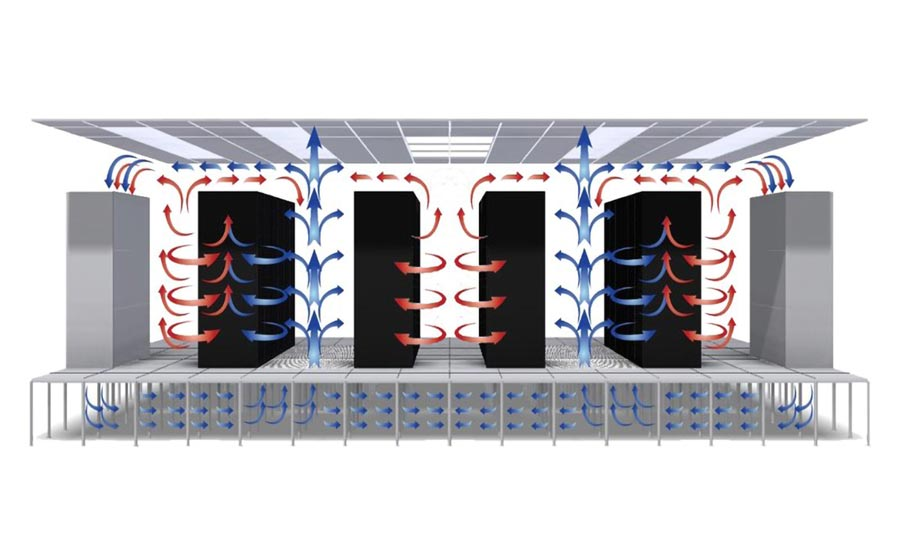

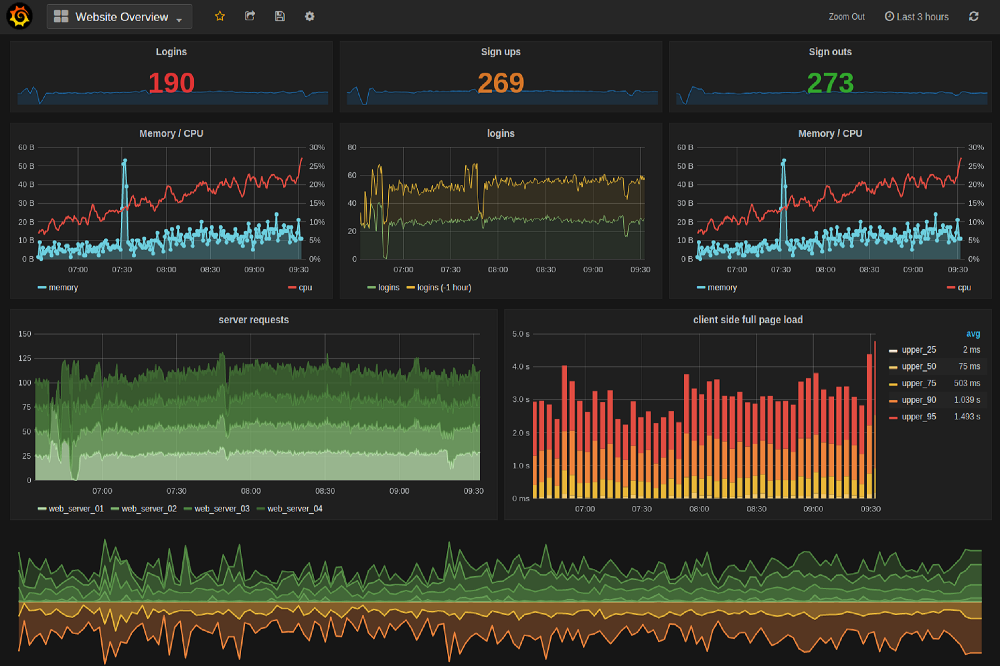

---

# 10.2.2 Gebruikersbeheer

---

## De zwakste schakel

> The user's going to pick dancing pigs over security every time  
> ~ Edward Felten

-   Gebruikers (klanten, werknemers, IT-personeel, ...) zijn **onvoorspelbaar**
    -   Hebben soms slechte bedoelingen
    -   Maken fouten
    -   ...
    -   Je kan het zo gek niet bedenken
-   **Limiteer** de rechten van een gebruiker zoveel mogelijk!
    -   "_Principle of least privilege_"

---

## AAA framework

-   **A**uthentication (authenticatie)
    -   Wie mag iets doen?
-   **A**uthorisation (autorisatie)
    -   Wat mag iemand wel/niet doen?
-   **A**ccounting (boekhouding)
    -   Wie heeft wat gedaan?

---

-   Voorbeeld 1: Bankautomaat
    -   Authentication (authenticatie)
        -   Enkel iemand met de juiste bankkaart en pincode heeft toegang tot de bankrekening
    -   Authorisation (autorisatie)
        -   Iemand kan niet meer geld afhalen dan hij heeft
        -   Er is een maximum bedrag dat afgehaald kan worden per dag
    -   Accounting (boekhouding)
        -   Op de rekeninguitreksels staat er welk bedrag er wanneer is gestort op of afgehaald van de rekening

---

-   Voorbeeld 2: Forum
    -   Authentication (authenticatie)
        -   Je moet je aanmelden met een username en paswoord
    -   Authorisation (autorisatie)
        -   Een gewone gebruiker kan berichten lezen en zelf berichten aanmaken
        -   Administratoren kunnen ook topics beheren of afsluiten, berichten van andere gebruikers bewerken en verwijderen en hebben toegang tot administrator topics die niet voor gewone gebruikers zichtbaar zijn.
    -   Accounting (boekhouding)
        -   Er zijn logs die bijhouden wanneer wie welke actie op het forum heeft uitgevoerd (bv. op 25/09/2020 heeft administrator Alice het bericht met id 68132 van Bob verwijderd)

---

## Hulpmiddel voor authenticatie

-   Multi-Factor Authentication (**MFA**/**2FA**)
    -   What you **know** 
        -   Wachtwoorden, wachtwoordzinnen, pincodes, ...
    -   What you **have**
        -   Smartcards, beveiligingssleutelhangers, toegang tot GSM (authenticator app of SMS), toegang tot e-mailaccount (verificatie e-mail), ...
    -   Who you **are**
        -   Biometrie: een uniek fysiek kenmerk zoals vingerafdruk, netvlies, stem, ...
    -   **Minstens 2 van de 3** nodig

---

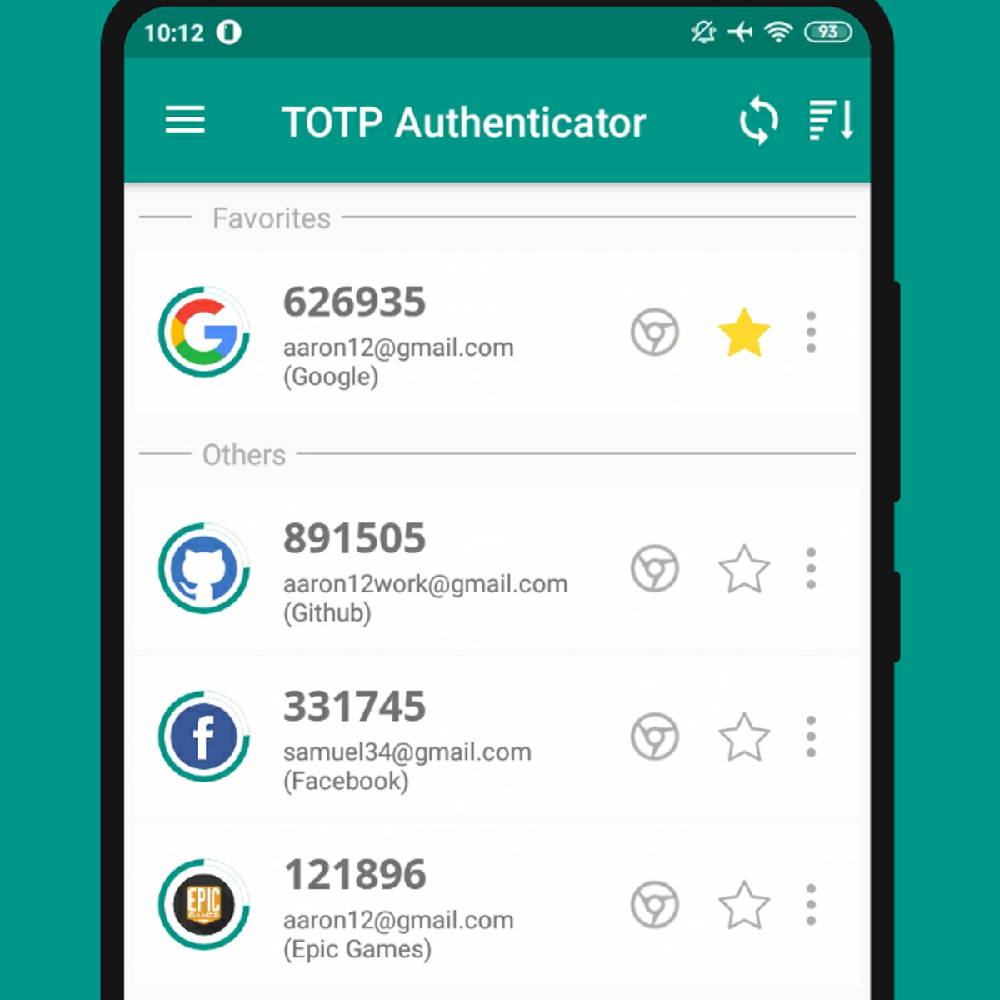

Notes:

-   https://www.yubico.com/products/

---

## Hulpmiddel voor autorisatie

-   Rechten
    -   Op basis van **niveau**'s
        -   Bv. "unclassified" > "confidential" > "secret" > "top secret" niveau’s in het leger
    -   Op basis van rechten toegekend door **eigenaar**
        -   Bv. `rwxrwxrwx` bij Linux bestanden
    -   Op basis van **functie**
        -   Bv. Enkel dokters mogen patiëntendossier zien
    -   ...

---

## Hulpmiddel voor accounting

-   Logfiles
    -   Inlogtijd
    -   Succesvol aangemeld?
    -   Welke bronnengebruikt?
    -   ...

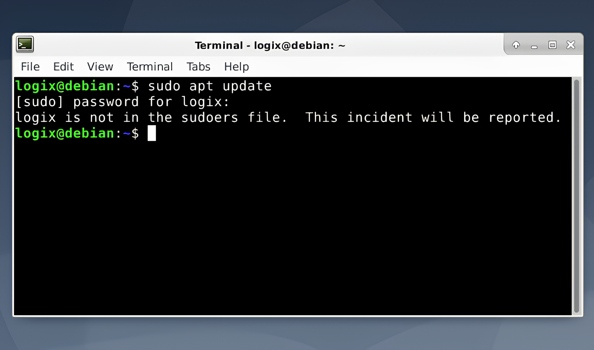

---

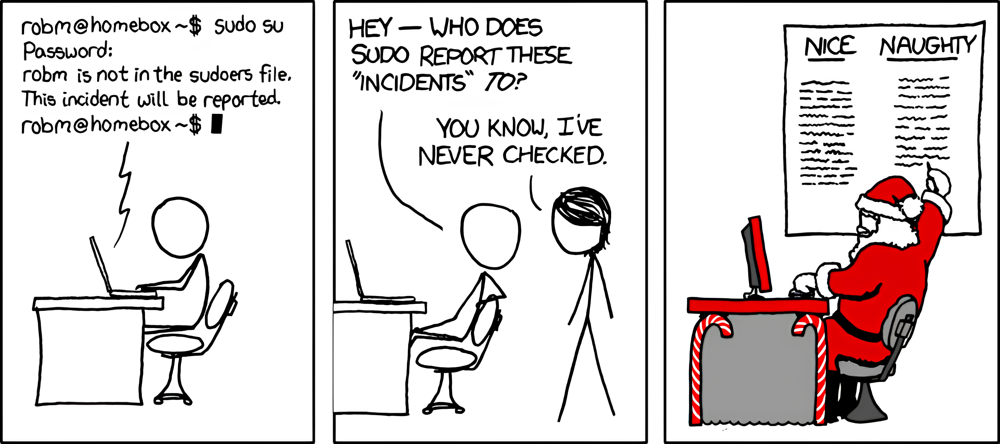

Notes:

-   https://xkcd.com/838/

---

# 10.2.3 Host Hardening

---

---

-   Beveiliging van het **besturingssysteem**
    -   Standaardconfiguratie aanpassen
    -   Verwijderen onnodige software
    -   Beveiligingspatches en updates
-   Installeren **anti-malware**
    -   Bescherming tegen virussen, worms, keyloggers, spyware, ...
    -   Mobiele apparaten zijn ook kwetsbaar!
    -   **Let op met gratis software!**
        -   Frauduleuze anti-malware kan zelf malware bevatten

Notes:

Het besturingssysteem speelt een cruciale rol bij de werking van een computersysteem en is het doelwit van veel aanvallen.

-   Een beheerder versterkt een besturingssysteem door de standaardconfiguratie aan te passen om het beter te beveiligen tegen bedreigingen van buitenaf.
-   Dit proces omvat het verwijderen van onnodige programma's en services.
-   Een andere essentiële vereiste voor het versterken van besturingssystemen is de toepassing van beveiligingspatches en updates.

Daarnaast kan je op elk systeem antimalware installeren. Malware omvat virussen, wormen, Trojaanse paarden, keyloggers, spyware en adware.

-   Ze schenden allemaal de privacy, stelen informatie, beschadigen het systeem of verwijderen en corrumperen gegevens.
-   Het is belangrijk om computers en ook mobiele apparaten te beschermen met behulp van betrouwbare antimalwaresoftware.

---

-   Beheer van **patches**
    -   Kunnen centraal beheerd worden
        -   Automatisch
        -   Eventueel verplicht
-   Host-gebaseerde **firewall**
    -   Regelt inkomend en uitgaand netwerkverkeer op het eigen toestel
-   Host **Intrusion Detection System** (HIDS)
    -   Controleert verdachte activiteiten op het eigen toestel

Notes:

-   Beheer van patches: Patches zijn code-updates die fabrikanten bieden om te voorkomen dat een nieuw ontdekt virus of worm een succesvolle aanval uitvoert. Fabrikanten combineren patches en upgrades tot een uitgebreide update-applicatie, een servicepack genaamd.
-   Host-gebaseerde firewalls: Een softwarefirewall is een programma dat op een computer wordt uitgevoerd om verkeer tussen de computer en andere aangesloten computers toe te staan of te weigeren. De softwarefirewall past een reeks regels toe op datatransmissies door inspectie en filtering van datapakketten.
-   Host Intrusion Detection Systems: Een host inbraakdetectiesysteem (HIDS) is software die wordt uitgevoerd op een hostcomputer die verdachte activiteiten controleert.

---

## Draadloze en mobiele apparaten

-   Wired Equivalent Privacy (**WEP**)
    -   Basisbescherming Wi-Fi
    -   10 tot 26 hexadecimale karakters (40 - 104 bits)
    -   **Niet (meer) veilig!**
-   Wi-Fi Protected Access (**WPA** / **WPA2**)
    -   Grote verbetering ten opzichte van WEP
    -   Gebaseerd op AES
    -   Tegenwoordig is WPA2 de standaard
-   Toevoegen **wederzijdse authenticatie**:
    -   voorkomt man-in-the-middle aanval (rogue access point)
    -   Authenticatie tussen beide entiteiten

Notes:

-   WEP: Eén van de belangrijkste componenten van moderne computers zijn mobiele apparaten. De meeste apparaten die in de huidige netwerken worden aangetroffen, zijn laptops, tablets, smartphones en andere draadloze apparaten. WEP is een van de eerste veelgebruikte Wi-Fi-beveiligingsstandaarden. De WEP-standaard biedt authenticatie- en coderingsbeveiliging. WEP is tegenwoordig te kraken binnen enkele minuten. Je kan dit doen met tools als aircrack-ng (bv. https://www.youtube.com/watch?v=rJXQYmG5uNY ). Let op: het kraken van een netwerk dat niet van jou is **strafbaar**! Als je dit wil proberen doe dit enkel op jouw eigen netwerk, anders kan je gerechtelijk vervolgd worden.
-   WPA / WPA2: De volgende grote verbetering van draadloze beveiliging was de introductie van WPA en WPA2. Wi-Fi Protected Access (WPA) was het antwoord van de computerindustrie op de zwakte van de WEP-standaard. De WPA-standaard zorgde voor verschillende beveiligingsverbeteringen.
-   Wederzijdse authenticatie: Een aanvaller kan een man-in-the-middle-aanval lanceren die erg moeilijk te detecteren is en kan resulteren in gestolen inloggegevens en verzonden gegevens. Om malafide toegangspunten te voorkomen, ontwikkelde de computerindustrie wederzijdse authenticatie. Wederzijdse authenticatie, ook wel tweerichtingsauthenticatie genoemd, is een proces of technologie waarbij beide entiteiten in een communicatieverbinding met elkaar authenticeren.

---

## Bescherming van (host) data

-   **Bestandstoegangscontrole**
    -   Machtigingen op bestanden en mappen
    -   Ingesteld per gebruiker of groep gebruikers
-   **File encryption**
    -   Encrypteren van gevoelige data
    -   Kan op individuele bestanden of op hele harde schijf
        -   Bv. BitLocker op Windows of LUKS op Linux
-   Systeem- en gegevens**back-ups**
    -   Reservekopie van gevoelige data
    -   Typisch op verwijderbare media (bv. tape drive)

Notes:

-   Bestandstoegangscontrole: Dit bestaat uit machtigingen die de toegang tot mappen of bestanden beperken voor een individu of voor een groep gebruikers.
-   File encryption: File encryption of bestandscodering is een hulpmiddel dat wordt gebruikt om gegevens te beschermen die zijn opgeslagen in de vorm van bestanden. Versleuteling transformeert gegevens met behulp van een gecompliceerd algoritme om ze onleesbaar te maken. Softwareprogramma's kunnen bestanden, mappen en zelfs hele schijven versleutelen.
-   Systeem- en gegevensback-ups: Een gegevensback-up slaat een kopie op van de informatie van een computer op verwijderbare back-upmedia. Een back-up maken van gegevens is één van de meest effectieve manieren om gegevensverlies te voorkomen. Als de computerhardware uitvalt, kan de gebruiker de gegevens van de back-up herstellen nadat het systeem weer functioneel is. Een goede basisregel voor backups is de 3-2-1 regel: je hebt minstens 3 kopieën van jouw data, waarvan minstens 2 op verschillende apparaten en ten minste 1 daarvan bevindt zich op een andere locatie (Ook al heb je 3 harde schijven, als ze allemaal in jouw huis liggen en het huis brand af ben je alles toch kwijt). Zie https://www.backblaze.com/blog/the-3-2-1-backup-strategy/ voor meer informatie.

---

## Content control

-   Content screening en blokkering
    -   Beperkt de inhoud waartoe een gebruiker toegang heeft met een webbrowser via internet.
    -   Kan bepaalde sites blokkeren:
        -   Pornografie
        -   Controversiële religieuze of politieke inhoud
        -   Social media (nuttig in bedrijfsomgevingen)
        -   Torrents
        -   ...

Notes:

Content control software beperkt de inhoud waartoe een gebruiker toegang heeft met een webbrowser via internet. Content control software kan sites blokkeren die bepaalde soorten materiaal bevatten, zoals pornografie of controversiële religieuze of politieke inhoud.

---

## Disk cloning, deep freeze

-   Software om besturingssysteem en configuratiebestanden te beschermen.
-   **Disk clone**
    -   Image (bv. ISO) van volledige harde schijf
-   **Deep freeze**
    -   "Bevriest" de partitie van de harde schijf
    -   Alle wijzigingen door gebruiker verloren bij herstarten
    -   Vooral nuttig voor publieke toestellen
        -   bv. internetcafé

Notes:

Er zijn veel third-party toepassingen beschikbaar om een systeem terug te zetten naar een standaardstatus. Hierdoor kan de beheerder het besturingssysteem en configuratiebestanden voor een systeem beschermen.

-   Met het klonen van schijven (disk cloning) wordt de inhoud van de harde schijf van de computer naar een afbeeldingsbestand (image file) gekopieerd. Indien nodig kan dit later teruggezet worden alsof er niets gebeurd is.
-   Deep freeze "bevriest" de partitie van de harde schijf. Wanneer een gebruiker het systeem opnieuw opstart, keert het systeem terug naar de bevroren configuratie. Het systeem slaat geen wijzigingen op die de gebruiker aanbrengt, dus alle geïnstalleerde applicaties of opgeslagen bestanden gaan verloren wanneer het systeem opnieuw wordt opgestart.

---

## Kiosk mode

-   Afgesloten omgeving waar je niet zomaar uit kan
-   Heeft niets te maken met de harde schijf of partities, het is meer een software matige gevangenis
-   Meer preventief t.o.v. disk clone en deep freeze
-   Vooral nuttig voor publieke toestellen
    -   Bv. bibliotheek, zelfscan-kassa, bestelkassa fastfoodrestaurant, ...

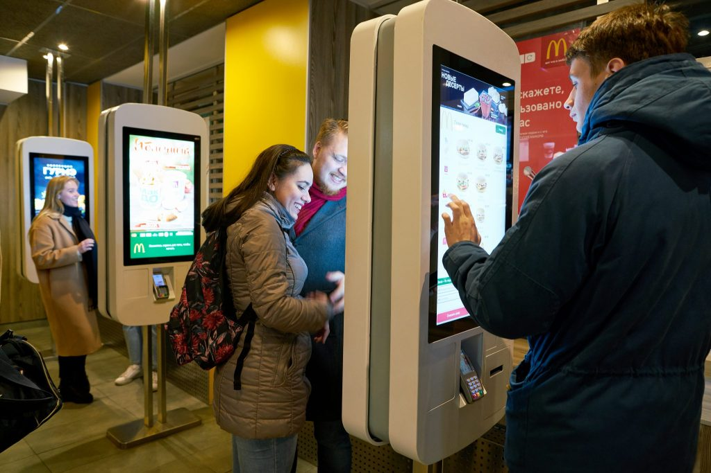

Notes:

Kiosk mode zorgt ervoor dat de functionaliteit van het systeem sterk beperkt wordt. Terwijl disk clone en deep freeze het systeem vooral herstellen na gebruik, verhindert kiosk mode ervoor dat de gebruiker niets kan aanpassen dat niet is gewenst. Bv. in de bibliotheek kan je op computers de databank van de bibliotheek raadplegen, maar je kan geen browser openen om te surfen op het internet of het startscherm openen om andere programma's te gebruiken. Ook het gebruik van schermen voor het tonen van informatie / slideshows/ ,,, op publieke ruimtes maken gebruik van dergelijke maatregelen: het systeem dient enkel om de informatie te tonen, niet om gebruikt te worden. De naam "kiosk mode" is van deze situatie afgeleid.

---

## Virtualisatie / sandboxing

-   Programma's worden uitgevoerd in een virtuele omgeving (ook soms een sandbox genoemd)
-   Programma's hebben niet door dat ze in een virtuele omgeving draaien
-   Als hackers via de software zich een weg naar binnen hacken, zitten ze nog steeds vast in de virtuele omgeving en niet direct op het besturingssysteem van het toestel
-   Soms lukt het daders echter om deze sandbox te omzeilen en zo toch code uit te voeren op het besturingssysteem van het slachtoffer

Notes:

Een gelijkaardig voorbeeld van virtualisatie / sandboxing is webhosting. Het is economisch niet rendabel om voor elke website een server te kopen die dan uiteindelijk slechts 10% van zijn CPU staat te verbruiken. Vaak wordt er op 1 server meerdere virtuele servers geïnstalleerd, waardoor de server 90% gebruikt wordt en tegelijkertijd meerdere websites host. Dankzij die virtualisatie kunnen gebruikers op de ene virtuele machine niet aan de andere. Het is dus een vorm van sandboxing. Natuurlijk, als de virtualisatie niet waterdicht is, kan men toch inbreken in een van de virtuele machines, er uitbreken en schade aanrichten in de andere virtuele machines. Docker bijvoorbeeld, een veelgebruikte virtualisatiesoftware, heeft op dit vlak veel problemen gekend.

---

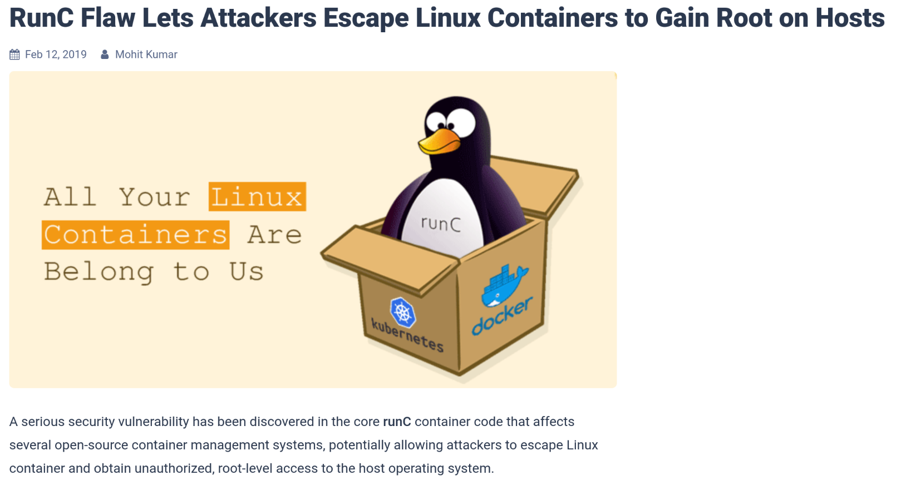

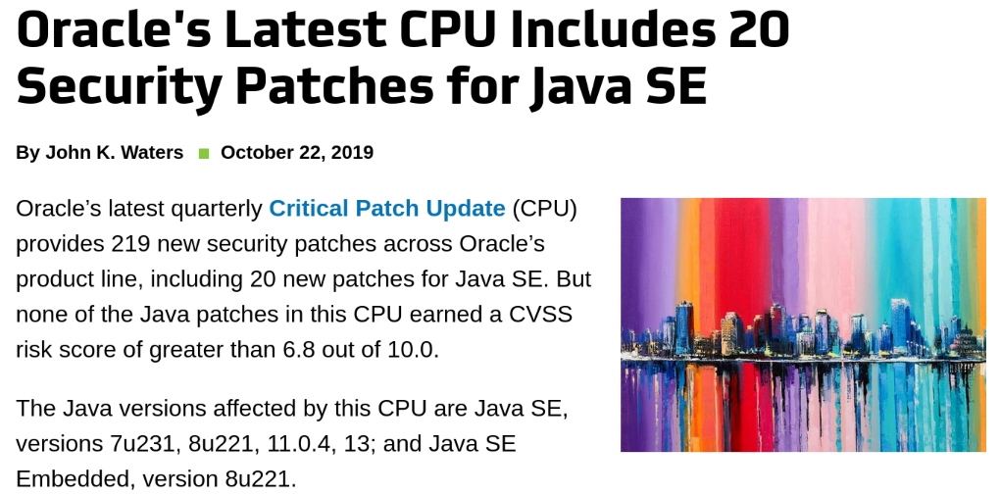

Notes:

-   https://thehackernews.com/2019/02/linux-container-runc-docker.html
-   https://adtmag.com/articles/2019/10/22/oracle-cpu.aspx

---

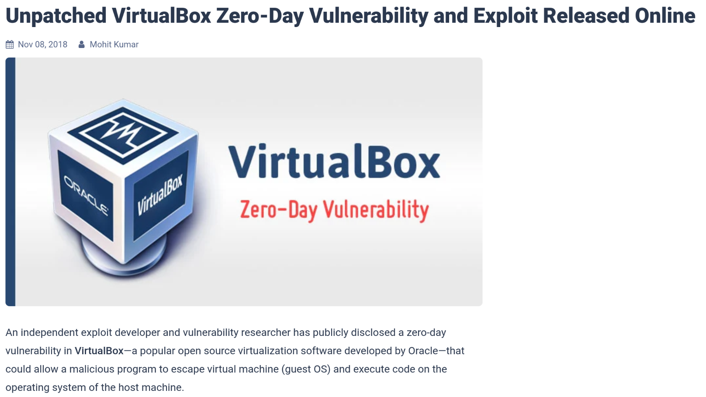

<iframe src="https://player.vimeo.com/video/299325088?badge=0&amp;autopause=0&amp;player_id=0&amp;app_id=58479" width="1280" height="720" frameborder="0" allow="autoplay; fullscreen; picture-in-picture; clipboard-write" title="VirtualBox E1000 Guest-to-Host Escape"></iframe>

Notes:

-   https://thehackernews.com/2018/11/virtualbox-zero-day-exploit.html

---

# 10.2.4 Server Hardening

---

## Beveiligde toegang op afstand

-   Inloggen op een toestel en commando's uitvoeren (CLI op afstand):
    -   **Telnet**
        -   Verouderd
        -   Data verzonden in plaintext
            -   o.a. login en wachtwoord
            -   :warning: **Niet veilig!**
    -   **SSH** (Secure SHell)
        -   Opvolger Telnet
        -   Encryptie van data tijdens verzending

---

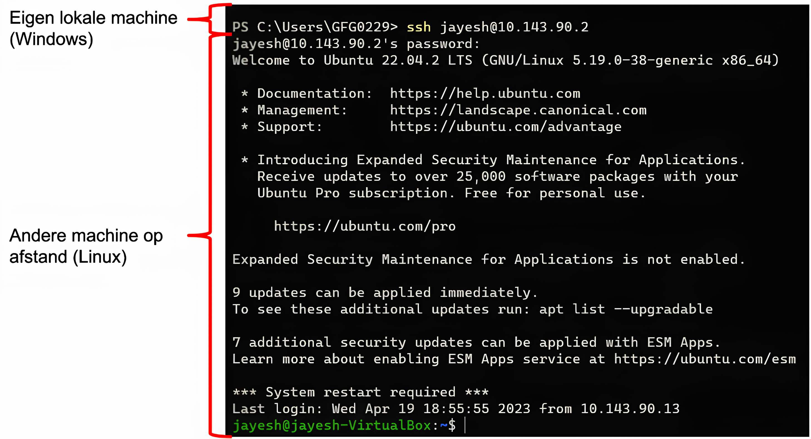

SSH

---

-   Bestanden overzetten tussen toestellen:
    -   **SCP** (Secure Copy Protocol)
        -   Maakt onderliggend gebruik van **SSH**
            -   Authenticatie + bescherming van data tijdens verzending
    -   **SFTP** (SSH File Transfer Protocol)
        -   Gelijkaardig aan SCP
        -   Maakt ook onderliggend gebruik van SSH
        -   Makkelijker in gebruik met visuele programma's

---

SCP

---

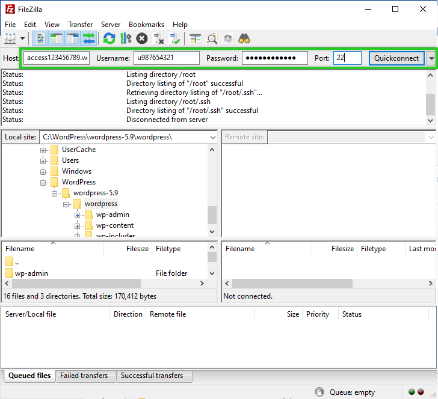

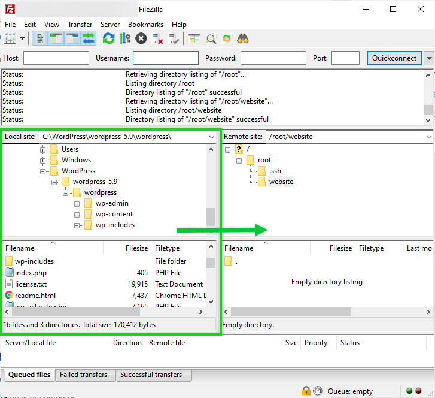

SFTP

---

-   Vanop een publiek netwerk veilig verbinden met een privaat netwerk
    -   **VPN**
        -   Geëncrypteerde "tunnel" opzetten
            -   Authenticatie + bescherming van data in beweging
        -   Meer mogelijk dan CLI of overdracht bestanden

---

## Administratieve maatregelen

-   Poorten en services beveiligen
    -   Via open **poorten** kunnen cybercriminelen achterhalen welke **services** er draaien op een host
    -   Op veel systemen draaien meer services dan nodig
    -   Beheerder moet elke service bekijken en nagaan of deze noodzakelijk is, alsook de mogelijke risico's inschatten

Notes:

Cybercriminelen maken gebruik van de services die op een systeem worden uitgevoerd, omdat ze weten dat de meeste apparaten meer services of programma's uitvoeren dan ze nodig hebben. Een beheerder moet elke service bekijken om de noodzaak ervan te verifiëren en het risico ervan te evalueren. Verwijder onnodige services.

---

-   Geprivilegieerde accounts
    -   Bv. `root`, `admin`, `superuser`, ...
    -   **Krachtigste** accounts op een systeem
    -   Hebben vaak verhoogde of zelfs onbeperkte toegang
    -   Beheerder moet deze accounts voldoende beveiligen of eventueel verwijderen om risico's te beperken

Notes:

Cybercriminelen maken misbruik van geprivilegieerde accounts omdat dit de krachtigste accounts in de organisatie zijn. Bevoorrechte accounts hebben de inloggegevens om toegang te krijgen tot systemen en bieden verhoogde, onbeperkte toegang. Beheerders gebruiken deze accounts om besturingssystemen, applicaties en netwerkapparaten te implementeren en te beheren. Deze account moet worden beveiligd of verwijderd om deze risico's te beperken.

---

-   Group Policies
    -   Onderdeel van Active Directory
    -   Voor gebruik in **Windows** omgeving
        -   Zie Windows Server I en II (2e en 3e bachelor)
    -   Laat toe om bepaalde **veiligheidsmaatregelen** in te stellen voor een groep gebruikers
        -   Bv. password policy, vergrendelingsbeleid, toegang tot bronnen, ...

Notes:

In de meeste netwerken die Windows-computers gebruiken, configureert een beheerder Active Directory met domeinen op een Windows Server. Een beheerder configureert gebruikersaccountbeleid, zoals wachtwoordbeleid en vergrendelingsbeleid door gebruikers aan groepen toe te voegen en beleid op groepsniveau in te stellen.

---

-   Logboeken en waarschuwingen
    -   Een logboek registreert **gebeurtenissen** op een systeem
    -   Bevatten uitgebreide **informatie** voor elke gebeurtenis
    -   Belangrijk voor computerbeveiliging (AA**A**: accounting)

Notes:

Een logboek registreert gebeurtenissen zoals ze zich voordoen op een systeem. Logboekvermeldingen vormen een logboekbestand en een logboekvermelding bevat alle informatie met betrekking tot een specifieke gebeurtenis. Logboeken die betrekking hebben op computerbeveiliging zijn steeds belangrijker geworden.

---

---

# 10.2.5 Network Hardening

---

## Netwerkapparaten beschermen

-   Network Operations Centers (NOC)
    -   Op één of meerdere locaties
    -   Bieden gedetailleerde **status van netwerk**
    -   Ground zero voor oplossen van netwerkproblemen, prestatiebewaking, softwaredistributie en updates, communicatiebeheer en apparaatbeheer

---

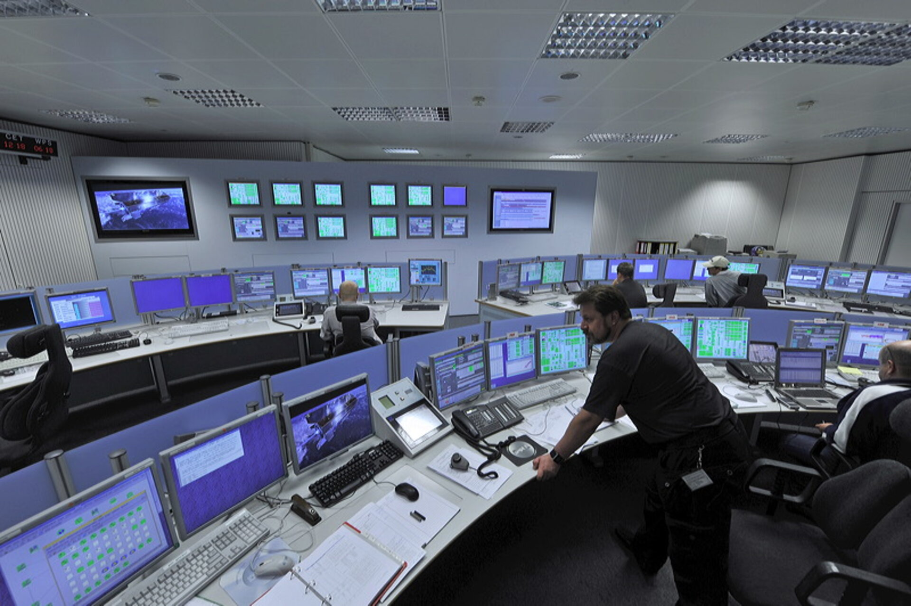

---

-   Netwerkapparaten: switches, routers, ...
    -   Hart van het moderne netwerk
    -   Kwetsbaar voor diefstal, hacking en toegang op afstand
    -   Doelwit voor aanvallen op netwerkprotocollen of DOS aanvallen

---

-   Firewalls
    -   hardware- of software die het netwerk beveiligen
    -   Voorkomt dat ongeautoriseerd of potentieel gevaarlijk verkeer het netwerk binnenkomt
    -   Zorgt ervoor dat alleen de noodzakelijke poorten zichtbaar en beschikbaar zijn

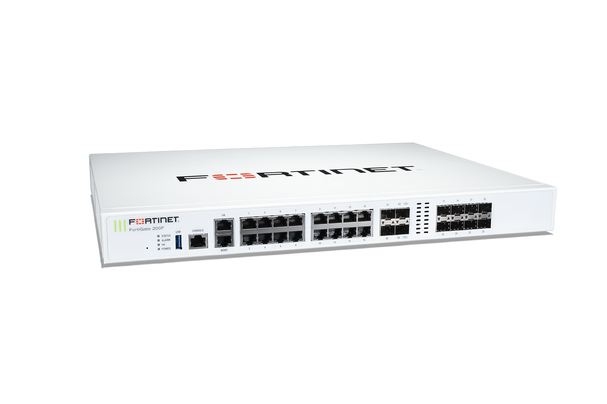

---

-   IDS (Intrusion Detection System)

-   IPS (Intrusion Prevention System)

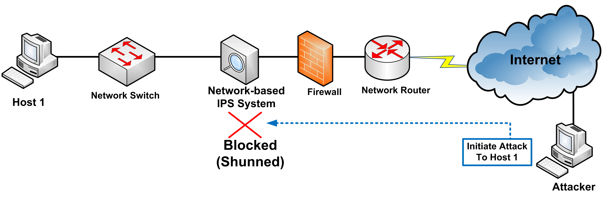

---

## Een modern beveiligingsoperatiecentrum

-   Security Operations Centers zijn gelijkaardig aan NOC's, maar dan voor **security**.
-   SOC's bieden een aantal diensten aan zoals monitoring, beheer, oplossingen voor bedreigingen, gehoste beveiliging, ...
-   Als bedrijf kun je zelf een SOC opzetten of die uitbesteden aan gespecialiseerde firma's.

Notes:

NOC's en SOC's lijken sterk op elkaar en overlappen elkaar in functionaliteit, maar hebben elk een ander uitgangspunt: functionaliteit vs. beveiliging. Meer info over het verschil kan je vinden op https://www.splunk.com/en_us/blog/learn/noc-vs-soc.html .

---

## Security Information and Event Management (SIEM) systemen

-   Software gebruikt in SOC's:
    -   Verzamel en filter gegevens.
    -   Detecteer en classificeer bedreigingen.
    -   Analyseren en onderzoeken van bedreigingen.
    -   Uitvoeren van preventieve maatregelen.
    -   Pak toekomstige bedreigingen aan.

---

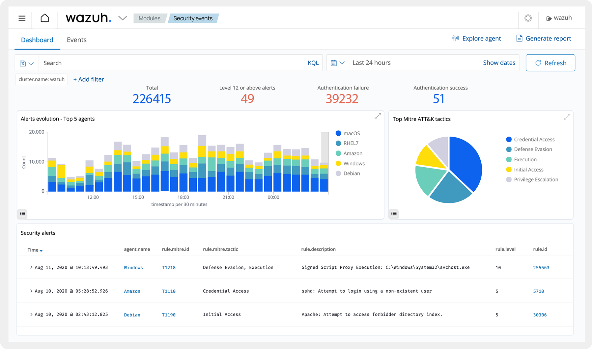

---

# 10.3 Assets management

---

## Assets management

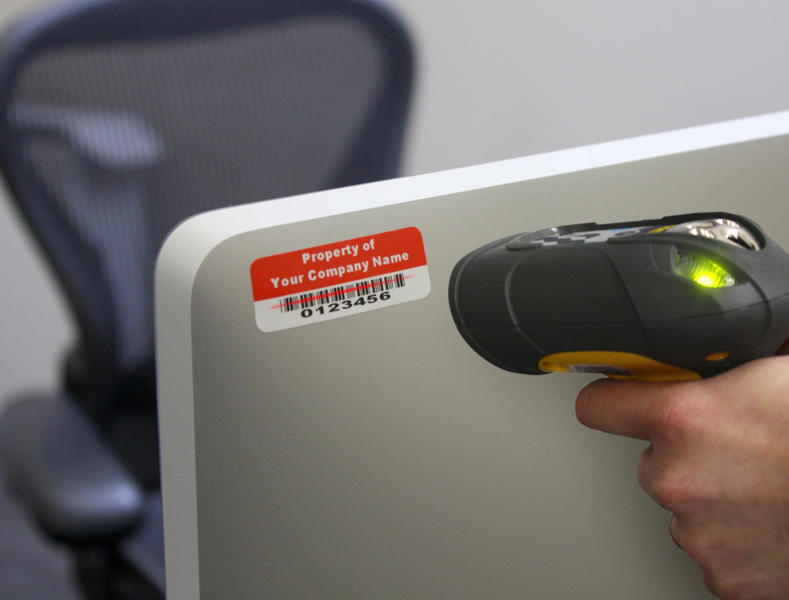

---

-   Bedrijven moeten weten **welke hardware- en software assets** in het bedrijf **aanwezig** zijn. Deze assets moeten immers beveiligd worden.
-   Assets management
    -   omvat het **beheren** van al deze assets
    -   Een volledig overzicht (**inventaris**) te zijn van alle hard- en software
-   Het bedrijf kan zo een **inschatting** maken welke **beveiligingsgevaren** er zouden kunnen zijn.

---

-   Moet minstens het volgende in de gaten houden:
    -   Elk hardware systeem
    -   Elk besturingssysteem
    -   Elk hardware netwerk toestel
    -   Elk network device operating system
    -   Elke software applicatie
    -   Elke firmware
    -   Alle language runtime environments (Java, C#, Python, ...)
-   Sommige bedrijven kiezen voor software die automatisch deze zaken bijhoudt

---

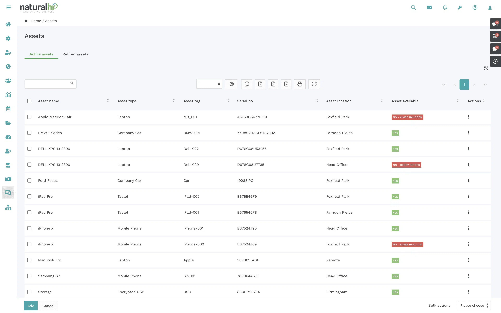

---

-   Voordelen:
    -   Beveiliging
    -   Updatebeleid
        -   Welke hard- of software is (binnenkort) verouderd?
    -   Helpdesk
        -   Log van vorige problemen
        -   Weet alle specs van klant/toestel met probleem

---

# 10.4 Nood aan experten

---

## Hoe word je een cybersecurity expert?

-   Wees een levenslange leerling
-   Behaal certificeringen
-   Stages
-   Professionele organisaties, conferenties, CTF's, ...

Notes:

Cybersecurity-specialisten moeten kunnen reageren op dreigingen zodra ze zich voordoen. Dit betekent dat de werktijden wat onconventioneel kunnen zijn. Cybersecurity-specialisten analyseren ook beleid, trends en intelligentie om te begrijpen hoe cybercriminelen denken. Vaak kan dit veel speurwerk met zich meebrengen. Hier is een goed advies om een cybersecurity-specialist te worden:

-   **Wees een levenslange leerling**: leer de basis door IT cursussen te volgen en blijf up-to-date. Cybersecurity is een vak dat voortdurend verandert, en cybersecurity-specialisten moeten bijblijven.

-   **Behaal certificeringen**: certificeringen van organisaties zoals Microsoft en Cisco bewijzen dat je over de kennis beschikt die nodig is om werk te zoeken als cybersecurity-specialist.

-   **Stages**: Het zoeken naar een stage binnen het gebied van cybersecurity kan leiden tot opportuniteiten in de toekomst.

-   **Professionele organisaties**: word lid van computerbeveiligingsorganisaties, woon vergaderingen en conferenties bij en sluit je aan bij forums en blogs om kennis op te doen van andere experten.

---

## Certificeringen

-   De IT-industrie heeft **standaarden** opgesteld voor cybersecurity-specialisten om professionele certificeringen te verkrijgen die het **bewijs** leveren van **vaardigheden en kennisniveau**.
-   Enkele bekende certificaten:
    -   CompTIA Security+
    -   Certified Ethical Hacker (CEH)
    -   SANS GIAC Security Essentials (GSEC)
    -   ISC2 Certified Information Systems Security Professional (CISSP)
    -   ISACA Certified Information Security Manager (CISM)
    -   Cisco Certified Network Associate Security (CCNA Security)

Notes:

-   **CompTIA Security+** is een door CompTIA gesponsord testprogramma dat de competentie van IT-beheerders op het gebied van informatieborging certificeert.
-   EC-Council **Certified Ethical Hacker (CEH)** is een certificering op gemiddeld niveau die beweert dat cybersecurity-specialisten met deze referentie over de vaardigheden en kennis beschikken voor verschillende hackpraktijken.
-   **SANS GIAC Security Essentials (GSEC)** is een goede keuze als instapmodel voor cybersecurity-specialisten die kunnen aantonen dat ze de beveiligingsterminologie en -concepten begrijpen en over de vaardigheden en expertise beschikken die nodig zijn voor 'hands-on' beveiligingsrollen. Het SANS GIAC-programma biedt een aantal aanvullende certificeringen op het gebied van beveiligingsadministratie, forensisch onderzoek en auditing.
-   **ISC^2 Certified Information Systems Security Professional (CISSP)** is een leverancier-neutrale certificering voor die cybersecurity-specialisten met veel technische en managementervaring. Het is ook formeel goedgekeurd door het Amerikaanse ministerie van Defensie (DoD) en is een wereldwijd erkende branchecertificering op het gebied van beveiliging.
-   **ISACA Certified Information Security Manager (CISM)**: Cybersecurity-specialisten die verantwoordelijk zijn voor het beheren, ontwikkelen en toezicht houden op informatiebeveiligingssystemen op bedrijfsniveau of voor degenen die de beste beveiligingspraktijken ontwikkelen, kunnen in aanmerking komen voor CISM.
-   **Cisco Certified Network Associate Security (CCNA Security)** valideert dat een cyberbeveiligingsspecialist over de kennis en vaardigheden beschikt die nodig zijn om Cisco-netwerken te beveiligen.

---

## Websites van cybersecurity organisaties

<<<<<<< HEAD
-   National Vulnerability Database (NVD)
    -   https://nvd.nist.gov
-   Computer Emergency Response Team (CERT)
    -   https://sei.cmu.edu/about/divisions/cert
    -   https://cert.be
-   Internet Storm Center (ISC)
    -   https://isc.sans.edu
-   The Advanced Cyber Security Center (ACSC)
    -   https://www.acscenter.org
-   ...
||||||| 95ea3df
-   National Vulnerability Database (NVD)​
    -   https://nvd.nist.gov ​
-   Computer Emergency Response Team (CERT)​
    -   https://sei.cmu.edu/about/divisions/cert ​
    -   https://cert.be ​
-   Internet Storm Center (ISC)​
    -   https://isc.sans.edu ​
-   The Advanced Cyber Security Center (ACSC)​
    -   https://www.acscenter.org ​
-   ...​
=======
-   National Vulnerability Database (NVD)
    -   https://nvd.nist.gov 
-   Computer Emergency Response Team (CERT)
    -   https://sei.cmu.edu/about/divisions/cert 
    -   https://cert.be 
-   Internet Storm Center (ISC)
    -   https://isc.sans.edu 
-   The Advanced Cyber Security Center (ACSC)
    -   https://www.acscenter.org 
-   ...
>>>>>>> rework-chapter-7-9-10

---

## Websites over cybersecurity nieuws

**Het is enorm belangrijk om op de hoogte te blijven van de laatste bedreigingen en verdedigingen!**

-   https://www.reddit.com/user/goretsky/m/security
    -   (verzameling van reddit threads i.v.m. cybersecurity)
-   https://www.csoonline.com
-   https://www.darkreading.com
-   https://www.bleepingcomputer.com
-   https://news.ycombinator.com

---

-   https://nakedsecurity.sophos.com
-   https://threatpost.com
-   https://blog.erratasec.com
-   https://krebsonsecurity.com
-   https://medium.com/mitre-attack
-   https://risky.biz
-   https://latesthackingnews.com
-   ...

---
