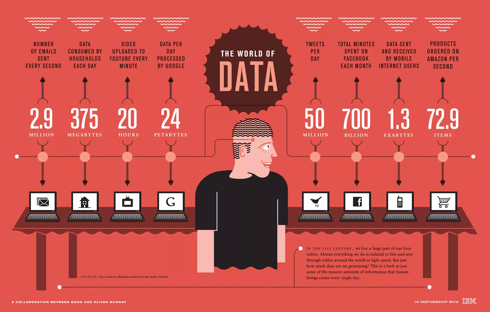
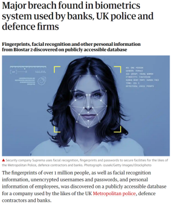
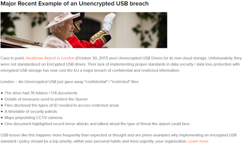
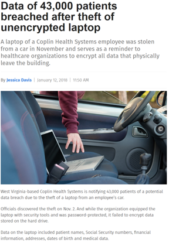
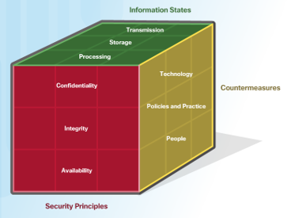

# Cybersecurity

## H1: data, het virtuele goud.

---

Stel:

> Bob en Alice zijn beiden aanwezig op een feestje. ​Bob is vrij extravert en valt overal op, zo ook op het feestje: hij wil absoluut iedereen laten weten hoe snel zijn nieuwe Tesla wel niet optrekt van 0 tot 120 km/h. Alice is eerder introvert, en wordt vaak omschreven als een muurbloem. Op het feestje blijft ze dan ook eerder aan de kant staan.​

Wie ga je de volgende dag vragen hoe het feestje was?​

---

Note: Wie ooit Kali Linux installeert (een Linux distributie met veel vooraf geïnstalleerde cybersecurity tools, populair bij hackers en cybersecurity experten), zal merken dat deze boodschap terugkomt in veel van de ingebouwde wallpapers. Een goede hacker is immers stil en onzichtbaar, en wacht geduldig af tot het juiste moment om toe te slaan.

---

# 1.1: Data, het virtuele goud

---

-   Net zoals overvallers in het wilde westen banken, postkoetsen en treinen overvielen voor goud, proberen cybercriminelen data te ontfutselen of te manipuleren bij bedrijven, gebruikers, ... .​
-   Dit doen ze voor om geld te verdienen, uit politieke redenen, vanwege verveling, voor aanzien, uit wraak ... .​

---

-   Grote en kleine bedrijven hebben de kracht van big data en data-analyse ingezien.​
-   Organisaties zoals Google, LinkedIn en Amazon bieden belangrijke diensten en kansen voor hun klanten.​
-   Innovatieve bedrijven zoals Facebook zijn ontstaan door de kracht van data en data-analyse te verzamelen en te benutten.​
-   De groei van data heeft kansen gecreëerd voor cybercriminelen en cybersecurity-specialisten.​

---

-   Deze bedrijven hebben de verantwoordelijkheid om deze gegevens te beschermen tegen misbruik en ongeoorloofde toegang.​
-   De groei in gegevensverzameling en -analyse brengt grote risico's met zich mee voor individuen en het moderne leven als er geen voorzorgsmaatregelen worden genomen om gevoelige gegevens te beschermen tegen criminelen of anderen die van plan zijn schade te berokkenen.

---

---

## Jouw data

---

## Meer dan persoonlijke data

-   Hackers zijn niet enkel geïnteresseerd in jouw data, maar ook in industriële data.
    -   Vaak voor losgeld of (bedrijfs)spionage
-   Een industriëel netwerk is anders dan een thuisnetwerk
    -   Meer dan enkel computers, bv. SCADA

 

---

# 1.2: Staten van data

---

-   Alles in de cyberwereld draait rond data. Cybersecurity specialisten focussen zich op het beveiligen van die data​
-   Data heeft 3 mogelijke staten:​
    -   Data in rust/opslag​
    -   Data tijdens het verzenden​
    -   Data tijdens het verwerken

---

## Data in rust

-   Data opgeslagen op opslagapparaten (harde schijven, USB-sticks, databanken, …) dat niet wordt gebruikt door personen of processen.​
-   Opslagapparaten kunnen lokaal (harde schijf, USB-stick, …) of gecentraliseerd op afstand aangesloten zijn (Dropbox, Google drive, NAS, …)​
-   Data kan zo verloren of gestolen worden​
    -   Harde schijf kapot​
    -   Laptop vergeten op trein​
    -   Smartphone gestolen

---

https://www.theguardian.com/technology/2019/aug/14/major-breach-found-in-biometrics-system-used-by-banks-uk-police-and-defence-firms​

---

https://www.kingston.com/belgium/us/community/articledetail/articleid/49705

---

http://www.healthcarebusinesstech.com/data-breach-lost-usb-drive/​

---

https://www.healthcareitnews.com/news/data-43000-patients-breached-after-theft-unencrypted-laptop

---

https://tweakers.net/nieuws/166742/hacker-achterhaalt-plaintext-wachtwoorden-uit-tweedehandscomputers-van-teslas.html

---

## Data tijdens verzenden

-   Verschillende manieren:​
    -   Sneaker net: gebruikt opslagapparaten om data tussen computers over te zetten (USB-stick, draagbare harde schijf, …)​
    -   Bedraad netwerk: gebruikt koperkabels​
    -   Draadloos netwerk: gebruikt elektromagnetische golven (kan door iedereen in de buurt "gehoord" worden)​

---

## Data tijdens verzenden

-   Een van de grootste uitdagingen voor cybersecurity personeel om te beveiligen.
-   Enkele uitdagingen:​ cybercriminelen kunnen data tijdens het verzenden ...
    -   afluisteren, kopiëren of stelen (vertrouwelijkheid)​
    -   aanpassen (integriteit)​
    -   verhinderen of verstoren (beschikbaarheid)

---

https://www.reuters.com/article/us-un-whatsapp/u-n-says-officials-barred-from-using-whatsapp-since-june-2019-over-security-idUSKBN1ZM32P ​

---

https://securityaffairs.co/wordpress/89890/hacking/bluetooth-knob-attack.html

---

## Data tijdens het verwerken

-   Dit omvat data tijdens de invoer, aanpassing, berekening of uitvoer​
-   Organisaties gebruiken verschillende methodes om data te verzamelen: manuele invoer, het uploaden van bestanden, dataverzameling van sensoren, … . Elk van deze input-methode is een mogelijke bedreiging voor integriteit​

---

-   Data kan aangepast worden door manuele verandering door gebruikers, programma’s die de data wijzigen, defecte apparaten, … . Bijvoorbeeld encoderen/decoderen, compressie/decompressie, encryptie/decryptie zijn voorbeelden van data aanpassingen.​
-   Data dat zodanig wordt aangepast dat het fouten bevat of onbruikbaar wordt, noemt men corrupte data

---

https://genomebiology.biomedcentral.com/articles/10.1186/s13059-016-1044-7​

---

https://datatechnologytoday.wordpress.com/2018/04/25/sql-injection-still-causing-trouble/​

​Note:

-   Extra​
    -   https://tweakers.net/nieuws/163166/onderzoekers-lezen-data-van-computers-door-schermhelderheid-te-manipuleren.html ​
    -   https://tweakers.net/nieuws/166806/wetenschappers-luisteren-pc-af-door-frequentie-van-voedingen-te-manipuleren.html ​

​---

https://tweakers.net/nieuws/165340/zoom-liet-e-mailadressen-uitlekken.html

Zoom heeft een slechte reputatie qua beveiliging (en privacy)

---

-   https://heartbleed.com/​
-   https://blog.malwarebytes.com/exploits-and-vulnerabilities/2019/09/everything-you-need-to-know-about-the-heartbleed-vulnerability/​

---

# 1.3: De 4 wetten

TODO

---

# 1.4: De CIA-driehoek

---

-   Niet _die_ CIA ...
-   3 principes:
    -   Confidentiality (vertrouwelijkheid)
    -   Integrity (integriteit)​
    -   Availability (beschikbaarheid​)

---

-   Confidentiality (vertrouwelijkheid)
    -   Wie mag dit zien?​
    -   Bv. chatgesprekken, bedrijfsgeheimen, medische informatie, ...​
-   Integrity (integriteit)​
    -   Klopt dit wel?​ Is de informatie juist? Komt deze van de juiste persoon?
    -   Bv. financiële transacties, contracten, ...​
-   Availability (beschikbaarheid​)
    -   Kan ik er aan wanneer ik het nodig heb?​
    -   Bv. 112-noodcentrale, chamilo.hogent.be tijdens online examen, e-mail servers, internet-toegang, ...

---

## Confidentiality (vertrouwelijkheid)

-   Verhindert de bekendmaking van informatie aan onbevoegde personen, bronnen en processen.
-   Organisaties moeten hun personeel opleiden om zo goed mogelijk om te gaan met gevoelige informatie om zichzelf en hun organisaties te beschermen tegen aanvallen.
-   Vertrouwelijkheid kan verkregen worden door encryptie, authenticatie en toegangscontrole.
    – Dit wordt uitgebreid behandeld in H4.

---

-   Organisaties verzamelen enorme hoeveelheden data
    -   Sommige data is publiek beschikbaar en niet gevoelig
        -   Bv. telefoonnummers, namen, ...
    -   Andere data is wel gevoelig en wordt beschermd om personen of organisaties te beschermen
        -   Bv. medische patientgeschiedenis, financiële toestand, ...

---

https://www.bbc.com/news/world-europe-46757009

---

https://www.anandtech.com/show/15962/intel-data-breach-20gb-of-ip-leaked

---

---

## Integrity (integriteit)

-   Integriteit is de nauwkeurigheid, consistentie en betrouwbaarheid van data zolang die data bestaat. Een andere term is de kwaliteit.
-   Methodes om integriteit te garanderen omvatten hashing, data validatie checks, data consistentie checks en toegangscontroles.
-   De nood aan integriteit hangt af van de aard van de data.
    -   Bv.:
        -   Facebook verifieert de data in een gebruikerspost niet
        -   Transacties en bedragen bij een bank moeten steeds 100% correct zijn

---

-   Verlies van integriteit kan enorme schade brengen aan personen en organisaties, en kan databronnen onbruikbaar of onbetrouwbaar maken
-   Een integriteitscontrole is een manier om te bekijken of gegevens (bestanden, foto’s, transacties, ...) nog steeds correct zijn (niet corrupt of beschadigd). Hiervoor wordt vaak een hash functie gebruikt.
-   Dit wordt uitgebreid behandeld in H5.

---

https://en.wikipedia.org/wiki/Stuxnet is een mooi voorbeeld! (vermoedelijke US/Israelische staatshackers pasten machine waarden aan om nucleaire machines in Iraanse faciliteiten te vernielen)
https://tweakers.net/nieuws/170598/onderzoekers-kunnen-nederlandse-verkeerslichten-van-afstand-op-groen-zetten.html
https://www.independent.co.uk/us-election-2020/2020-election-trump-online-voting-hack-russia-mail-a9553811.html
https://www.usnews.com/news/world/articles/2020-09-10/thai-hospitals-and-companies-hit-by-ransomware-attacks
https://www.zdnet.com/article/chilean-bank-shuts-down-all-branches-following-ransomware-attack/
https://www.infosecurity-magazine.com/magazine-features/financial-markets-a-playground-for/
https://www.defenseone.com/threats/2015/09/next-wave-cyberattacks-wont-steal-data-theyll-change-it/120701/

---

## Availability (beschikbaarheid​)

-   Informatiesystemen moeten op elk moment beschikbaar
    zijn.
-   Aanvallen en fouten kunnen toegang tot systemen in
    gevaar brengen.
-   Maatregelen voor beschikbaarheid: redundantie,
    backups, verhoogde weerstand, onderhoud, up-to-date
    software en OS, noodplannen om terug online te komen
    na een onvoorziene omstandigheid, gebruik van nieuwe
    technologieën, detecteer ongebruikelijke activiteit en
    beschikbaarheidstesten.
-   Dit wordt uitgebreid behandeld in H6.

---

https://tweakers.net/nieuws/171896/kaspersky-leeromgevingen-zijn-vaker-doelwit-van-ddos-aanvallen.html
https://datanews.knack.be/ict/nieuws/ddos-aanval-treft-edpnet/article-news-1635675.html?cookie_check=1600001131
https://tweakers.net/nieuws/171594/belgische-provider-edpnet-heeft-al-vier-dagen-te-maken-met-ddos-aanvallen.html
https://issues.edpnet.be/?p=3099

Je kan zelf kijken waar en wanneer er DDoS-aanvallen plaats vonden. Neem gerust een kijkje op https://www.digitalattackmap.com/ voor DDos-aanvallen, of https://cybermap.kaspersky.com/ voor allerlei soorten aanvallen.

---

# 1.5 De cybersecurity kubus

---

-   Cybersecurityspecialisten proberen data in al zijn staten beschermen voor elk aspect van de CIA-driehoek.
-   Dit doen ze aan de hand van verschillende beveiligingsmaatregelen op vlak via technologie, beleid en personeel.

|                 | In rust | Tijdens verzenden | Tijdens verwerking |
| --------------- | ------- | ----------------- | ------------------ |
| Confidentiality | ?       | ?                 | ?                  |
| Integrity       | ?       | ?                 | ?                  |
| Availability    | ?       | ?                 | ?                  |

---

-   Om bij het ontwerpen van een beveiligsplan niets te vergeten, wordt dit vaak gevisualiseerd als een kubus met 3 zijden:
    -   Beveiligingsprincipes (dit is de CIA-driehoek)
    -   De staten van data
    -   Beveiligingsmaatregelen
-   De kubus staat ook bekend als de McCumber Cube.

